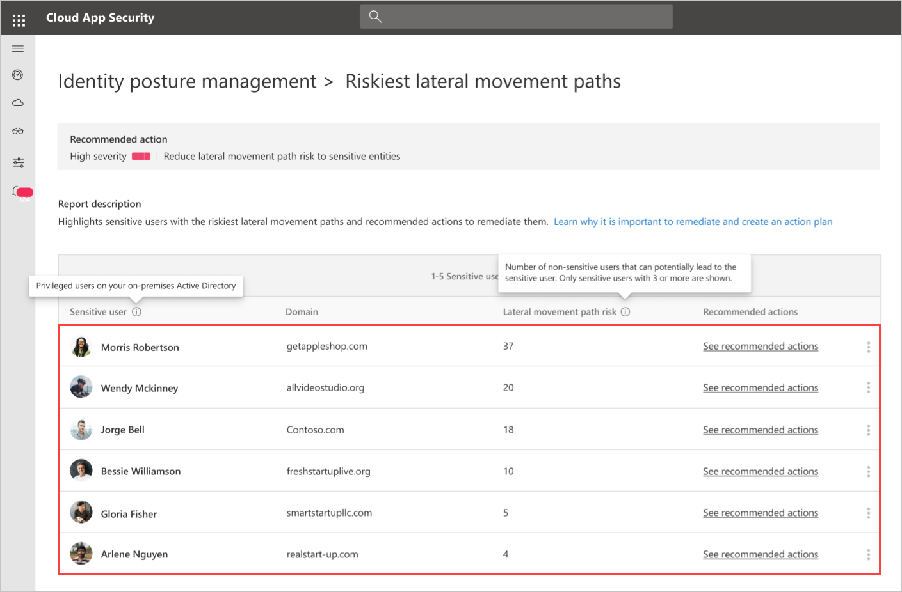

---
# required metadata

title: Azure Advanced Threat Protection riskiest lateral movement paths assessments
description: This article provides an overview of Azure ATP's sensitive entities with the riskiest lateral movement paths identity security posture assessment report.
keywords:

author: shsagir
ms.author: shsagir
manager: rkarlin
ms.date: 04/30/2020
ms.topic: conceptual
ms.collection: M365-security-compliance
ms.service: azure-advanced-threat-protection
ms.assetid: 2fe62047-75ef-4b2e-b4aa-72860e39b4e4

# optional metadata

#ROBOTS:
#audience:
#ms.devlang:
ms.reviewer: itargoet
ms.suite: ems
#ms.tgt_pltfrm:
#ms.custom:

---

# Security assessment: Riskiest lateral movement paths (LMP)

## What are Risky lateral movement paths?

Azure ATP continuously monitors your environment to identify **sensitive** accounts with the riskiest lateral movement paths that expose a security risk, and reports on these accounts to assist you in managing your environment. Paths a considered risky of they have three or more non-sensitive accounts that can expose the **sensitive** account to credential theft by malicious actors.

Learn more about LMP:

- [Azure ATP Lateral Movement Paths (LMPs)](use-case-lateral-movement-path.md)
- [MITRE ATT&CK Lateral Movement](https://attack.mitre.org/tactics/TA0008/)

## What risk do risky lateral movement paths pose?

Organizations that fail to secure their **sensitive** accounts leave the door unlocked for malicious actors.

Malicious actors, much like thieves, often look for the easiest and quietest way into any environment. Sensitive accounts with risky lateral movement paths are windows of opportunities for attackers and can expose risks.

For example, the riskiest paths are more readily visible to attackers and, if compromised, can give an attacker access to your organization's most sensitive entities.

## How do I use this security assessment?

1. Use the report table to discover which of your **sensitive** accounts have risky LMPs.
    
1. Take appropriate action:
    - Remove the entity from the group as specified in the recommendation.
    - Remove the local administrator permissions for the entity from the device specified in the recommendation.

    > [!NOTE]
    > Wait 24 hours and then check that the recommendation no longer appears in the list.

## See Also

- [Azure ATP activities filtering in Cloud App Security](atp-activities-filtering-mcas.md)
- [Check out the Azure ATP forum!](https://aka.ms/azureatpcommunity)
