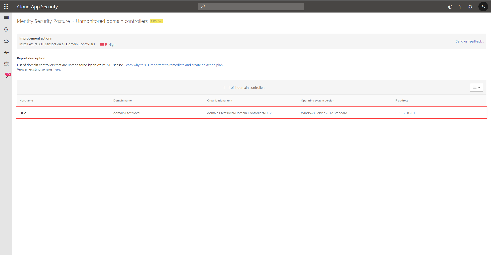

---
# required metadata

title: Azure Advanced Threat Protection unmonitored domain controllers assessments
description: This article provides an overview of Azure ATP's unmonitored domain controllers identity security posture assessment report.
keywords:
author: shsagir
ms.author: shsagir
manager: rkarlin
ms.date: 02/17/2020
ms.topic: conceptual
ms.collection: M365-security-compliance
ms.service: azure-advanced-threat-protection
ms.assetid: 2fe62047-75ef-4b2e-b4aa-72860e39b4e4

# optional metadata

#ROBOTS:
#audience:
#ms.devlang:
ms.reviewer: itargoet
ms.suite: ems
#ms.tgt_pltfrm:
#ms.custom:

---

# Security assessment: Unmonitored domain controllers

## What are unmonitored domain controllers?

An essential part of the Azure ATP solution requires that its sensors are deployed on all organizational domain controllers, providing a comprehensive view for all user activities from every device.

For this reason, Azure ATP continuously monitors your environment to identify domain controllers without an installed Azure ATP sensor, and reports on these unmonitored servers to assist you in managing full coverage of your environment.

## What risk do unmonitored domain controllers pose to an organization?

In order to operate at maximum efficiency, all domain controllers must be monitored with Azure ATP sensors. Organizations that fail to remediate unmonitored domain controllers, reduce visibility into their environment and potentially expose their assets to malicious actors.

## How do I use this security assessment?

1. Use the report table to discover which of your domain controllers are unmonitored.
    
1. Take appropriate action on those domain controllers by [installing and configuring monitoring sensors](atp-sensor-monitoring.md#domain-controller-status).

## See Also

- [Monitoring your domain controller coverage](atp-sensor-monitoring.md)
- [Check out the Azure ATP forum!](https://aka.ms/azureatpcommunity)
