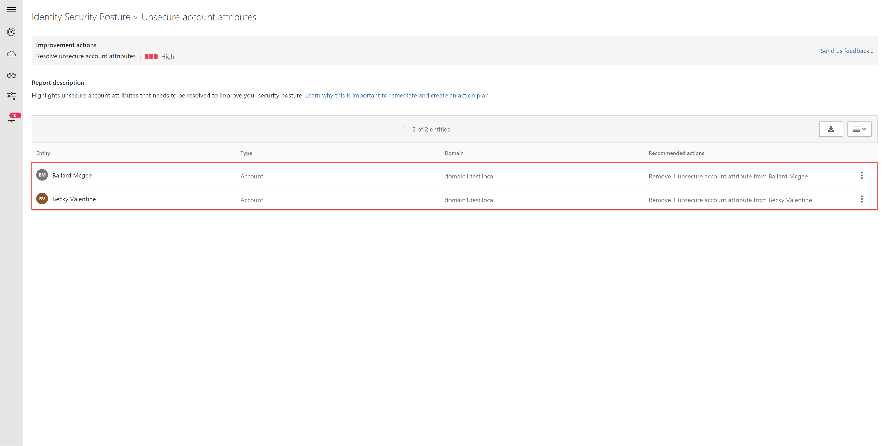

---
# required metadata

title: Azure Advanced Threat Protection unsecure account attributes assessments
description: This article provides an overview of Azure ATP's entities with unsecure attributes identity security posture assessment report.
keywords:
author: shsagir
ms.author: shsagir
manager: rkarlin
ms.date: 04/30/2020
ms.topic: conceptual
ms.collection: M365-security-compliance
ms.service: azure-advanced-threat-protection
ms.assetid: 2fe62047-75ef-4b2e-b4aa-72860e39b4e4

# optional metadata

#ROBOTS:
#audience:
#ms.devlang:
ms.reviewer: itargoet
ms.suite: ems
#ms.tgt_pltfrm:
#ms.custom:

---

# Security assessment: Unsecure account attributes

## What are unsecure account attributes?

Azure ATP continuously monitors your environment to identify accounts with attribute values that expose a security risk, and reports on these accounts to assist you in protecting your environment.

## What risk do unsecure account attributes pose?

Organizations that fail to secure their account attributes leave the door unlocked for malicious actors.

Malicious actors, much like thieves, often look for the easiest and quietest way into any environment. Accounts configured with unsecure attributes are windows of opportunities for attackers and can expose risks.

For example, if the attribute *PasswordNotRequired* is enabled, an attacker can easy access to the account. This is especially risky if the account has privileged access to other resources.

## How do I use this security assessment?

1. Use the report table to discover which of your accounts have unsecure attributes.
    
1. Take appropriate action on those user accounts by modifying or removing the relevant attributes.

## Remediation

Use the remediation appropriate to the relevant attribute as described in the following table.

| Attribute | Remediation | Reason |
| --- | --- | --- |
| *DontRequirePreauthentication* | Remove this setting from account properties in Active Directory (AD) | Removing this setting requires a Kerberos pre-authentication for the account resulting in improved security. |
| *PasswordNotRequired* | Remove this setting from account properties in AD | Removing this setting requires a password to be used with the account and helps prevent unauthorized access to resources. |
| *UseDesKeyOnly* | Remove this setting from account properties in AD | Removing this setting enables the use of stronger encryption algorithms for the account's password. |
| *EncryptedTextPasswordAllowed* | Remove this setting from account properties in AD | Removing this setting prevents easy decryption of the account's password. |
| *SmartCardRequiredRemovalTime* | Reset the account password | Changing the account's password enables stronger encryption algorithms to be used for its protection. |
| *SupportedEncryptionTypes* | Enable AES features on the account properties in AD | Enabling AES128_CTS_HMAC_SHA1_96 or AES256_CTS_HMAC_SHA1_96 on the account helps prevent the use of weaker encryption ciphers for Kerberos authentication. |

## See Also

- [Azure ATP activities filtering in Cloud App Security](atp-activities-filtering-mcas.md)
- [Check out the Azure ATP forum!](https://aka.ms/azureatpcommunity)
