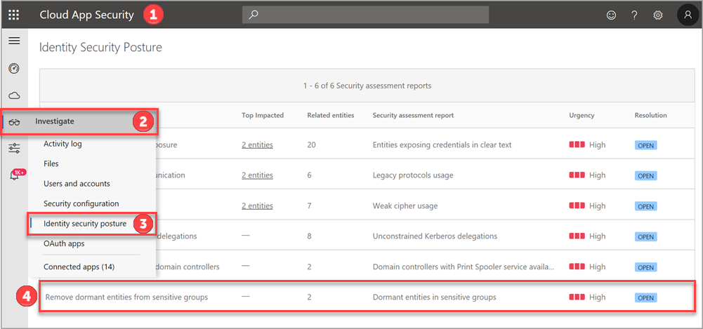

---
# required metadata

title: Azure Advanced Threat Protection identity security posture assessments | Microsoft Docs
description: This article provides an overview of Azure ATP's identity security posture assessment reports.
keywords:
author: mlottner
ms.author: mlottner
manager: rkarlin
ms.date: 09/16/2019
ms.topic: conceptual
ms.collection: M365-security-compliance
ms.service: azure-advanced-threat-protection
ms.assetid: 71b15bd9-3183-4e24-b18a-705023ccc313

# optional metadata

#ROBOTS:
#audience:
#ms.devlang:
ms.reviewer: itargoet
ms.suite: ems
#ms.tgt_pltfrm:
#ms.custom:

---

# Azure ATP's identity security posture assessments
 
Typically, organizations of all sizes have limited visibility into whether or not their on-premises apps and services could introduce a security vulnerability to their organization. The problem of limited visibility is especially true with regards to use of unsupported or outdated components. 

While your company may invest significant time and effort on hardening identities and identity infrastructure (such as Active Directory, Active Directory Connect) as an on-going project, it is easy to remain unaware of common misconfigurations and use of legacy components that represent one of the greatest threat risks to your organization. Microsoft security research reveals that most identity attacks utilize common misconfigurations in Active Directory and continued use of legacy components (such as NTLMv1 protocol) to compromise identities and successfully breach your organization. To combat this effectively, Azure ATP now offers proactive identity security posture assessments to detect and suggest improvement actions across your on-premise Active Directory configurations. 

## What do Azure ATP identity security posture assessments provide?  
- Detections and contextual data on known exploitable components and misconfigurations, along with relevant paths for remediation.
- Azure ATP detects not only suspicious activities, but also actively monitors your on-premise identities and identity infrastructure for weak spots, using the existing Azure ATP sensor. 
- Accurate assessment reports of your current organization security posture, enabling quick response and effect monitoring in a continuous cycle. 

## How do I get started? 

### Access

Azure ATP security assessments are available using the Microsoft Cloud App Security portal after turning on the Azure ATP integration. To learn how to integrate Azure ATP into Cloud App Security, see [Azure ATP integration](https://docs.microsoft.com/cloud-app-security/aatp-integration). 

### Licensing

Accessing Azure ATP security assessment reports in Cloud App Security do not require a Cloud App Security license, only an Azure ATP license is required. 

## Access Azure ATP using Cloud App Security 

See the [Cloud App Security quick start](https://docs.microsoft.com/cloud-app-security/getting-started-with-cloud-app-security) to familiarize yourself with the basics of using the Cloud App Security portal. 

**Identity security posture assessments**

Azure ATP offers the following identity security posture assessments. Each assessment is a downloadable report with instructions for use and tools for building an action plan to remediate or resolve. 

**Assessment reports**
- Prevent [entities exposing credentials in clear text](atp-cas-isp-clear-text.md)
- Prevent [legacy protocols usage](atp-cas-isp-legacy-protocols.md)
- Prevent [weak cipher usage](atp-cas-isp-weak-cipher.md)
- Prevent [unsecure Kerberos delegations](atp-cas-isp-unconstrained-kerberos.md)
- Disable [Print spooler service on domain controllers](atp-cas-isp-print-spooler.md)
- Remove [dormant entities from sensitive groups](atp-cas-isp-dormant-entities.md)

To access identity security posture assessments:
1. Open the **Microsoft Cloud App Security** portal. 
    
1. Select **Investigate** from the left menu, then click **Identity security posture** from the drop-down menu. 
1. Click the identity security posture assessment you wish to review from the **Security assessment reports** list that opens.  

## Next steps
- [Learn more about using Cloud App Security with Azure ATP](atp-activities-filtering-mcas.md)
- [Check out the Azure ATP forum!](https://aka.ms/azureatpcommunity)

