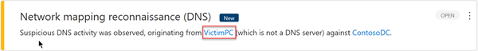
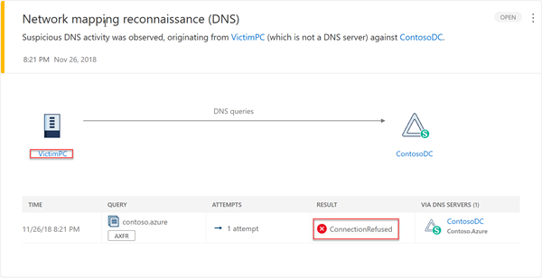
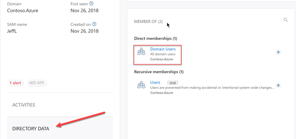
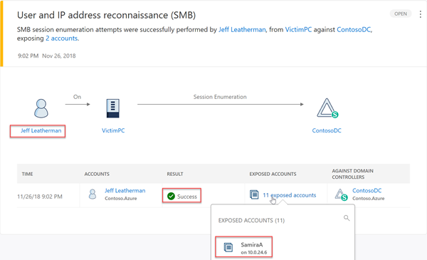

---
# required metadata

title: Azure ATP Reconnaissance playbook tutorial | Microsoft Docs
description: The Azure ATP Reconnaissance playbook tutorial describes how to simulate Reconnaissance threats for detection by Azure ATP.
ms.service: azure-advanced-threat-protection
ms.topic: tutorial
author: mlottner
ms.author: mlottner
ms.date: 02/07/2019

# optional metadata

# ms.custom
ms.reviewer: itargoet
# ms.subservice
# ROBOTS
# Customer intent: As an Azure ATP user, I want to simulate reconnaissance threats in a lab so I can see some of Azure ATP's capabilities.

---

# Tutorial: Reconnaissance playbook

The second tutorial in this four part series for Azure ATP security alerts is a reconnaissance playbook. The purpose of the Azure ATP security alert lab is to illustrate **Azure ATP**'s capabilities in identifying and detecting suspicious activities and potential attacks against your network. The playbook explains how to test against some of Azure ATP's *discrete* detections, and focuses on Azure ATP’s *signature*-based capabilities. This playbook does not include alerts or detections based on advanced machine-learning, or user/entity based behavioral detections, as they require a learning period with real network traffic for up to 30 days. For more information about each tutorial in this series, see the [ATP security alert lab overview](atp-playbook-lab-overview.md). 

This playbook explains the process of how to use real-world, publicly available hacking and attack tools against threat detections and security alerts services of Azure ATP.

In this tutorial you will:
> [!div class="checklist"]
> * Perform network mapping reconnaissance
> * Perform Directory Service reconnaissance
> * Perform user and IP address (SMB) reconnaissance
> * Review the security alerts from the reconnaissance in Azure ATP


## Prerequisites

[A completed ATP security alert lab](atp-playbook-setup-lab.md) 
  - We recommend following the lab setup instructions as closely as possible. The closer your lab is to the suggested lab setup, the easier it will be to follow the Azure ATP testing procedures.

## Executing a Reconnaissance attack

Once an adversary gains presence in your environment, their reconnaissance campaign begins. At this phase, the adversary will typically spend time researching, attempting to discover computers of interest, enumerate users and groups, gather important IPs, and map your organization's assets and weaknesses. Reconnaissance activities allow attackers to gain a thorough understanding and complete mapping of your environment for later use.

Reconnaissance attack testing methods:

* Network mapping reconnaissance
* Directory Service reconnaissance
* User and IP Address (SMB) reconnaissance


## Network mapping reconnaissance (DNS)

One of the first things an attacker will attempt is to try to get a dump of all DNS information. When successful, the attacker gains extensive information about your environment that potentially includes similar information about your other environments or networks.

### Run nslookup from VictimPC

To test DNS reconnaissance, we'll use the native Microsoft binary, *nslookup*. DNS servers with correct configuration will refuse queries of this type and won't allow the zone transfer attempt.

Sign into **VictimPC**, using the compromised JeffL credentials. Run the following command:

``` cmd
nslookup
ls -d contoso.azure
```


### Network mapping reconnaissance (DNS) Detected in Azure ATP

Getting visibility of this type of attempt (failed or successful) is vital for domain threat protection. Azure ATP detects this type of reconnaissance against your DNS and issues the following security alert:



Click on the security alert issued by Azure ATP to see additional details and evidence:



If your security analyst determined this activity originated from a security scanner, the specific device can be excluded from further alerts for the detection. On the top right area of the alert, click on the three dots and select **Close and exclude MySecurityScanner**. Ensuring this alert doesn't show up again when detected from "MySecurityScanner".

Detecting failures can be just as insightful as detecting successful attacks against an environment. The Azure ATP portal allows us to see the exact result of the actions performed by the possible attacker. In our simulated DNS reconnaissance attack story, we, as attackers, were stopped from dumping the DNS records of the domain. Your SecOps team became aware of our attempted attack and which machine we used in our attempt from the Azure ATP security alert.

## Directory Service Reconnaissance

As the attacker, the next reconnaissance goal is an attempt to enumerate all users and groups in the Forest. Azure ATP suppresses Directory Service enumeration activity from your Suspicious Activity timeline until a 30 day learning period is completed. In the learning period, Azure ATP learns what is normal and abnormal for your network. After the 30 day learning period, abnormal Directory Service enumeration events invoke a security alert. However, during the 30 day learning period you can see Azure ATP detections of these types of activities using the activity timeline of any entity in your network. The Azure ATP detections of these activities are shown in this lab.

To demonstrate the Directory Service reconnaissance method, we'll use the native Microsoft binary, *net*. After our attempt, examining the Activity timeline of JeffL, our compromised user, will show Azure ATP detecting this activity.

### Directory Service Enumeration via *net* from VictimPC

Any authenticated user or computer can potentially enumerate other users and groups in a domain. This enumeration ability is required for most applications to function properly. Our compromised user, JeffL, is an unprivileged domain account. In this attack, we'll see exactly how even an unprivileged domain account can still provide valuable data points to an attacker.

1. From **VictimPC**, execute the following command:

    ``` cmd
    net user /domain
    ```

   The output shows all users in the Contoso.Azure domain.

   

2. Let's try to enumerate all groups in the domain. Execute the following command:

    ``` cmd
    net group /domain
    ```

   The output shows all groups in the Contoso.Azure domain. Notice the one Security Group that isn't a default group: **Helpdesk**.

   

3. Now, let's try to enumerate only the Domain Admins group. Execute the following command:

    ``` cmd
    net group "Domain Admins" /domain
    ```

   

    As the attacker, we've just learned there are two members of the Domain Admins group: **SamiraA** and **ContosoAdmin** (built-in Administrator for the Domain Controller). Knowing no security boundary exists between our Domain and Forest, our next leap is to try to enumerate the Enterprise Admins.

4. To attempt to enumerate the Enterprise Admins, execute the following command:

    ``` cmd
   net group "Enterprise Admins" /domain
   ```

   We learned that there is only one Enterprise Admin, ContosoAdmin. This wasn't particularly important since we already knew there is no security boundary between our Domain and the Forest.

   

With the information gathered in our reconnaissance, we now know about the Helpdesk Security Group. Although, that information isn't particularly interesting *yet*. We also know that **SamiraA** is a member of the Domain Admins group. If we can harvest SamiraA's credential we can gain access the Domain Controller itself!

### Directory Service Enumeration Detected in Azure ATP

If our lab had *real live activity for 30 days with Azure ATP installed*, the activity we just performed as JeffL would potentially be classified as abnormal. Abnormal activity would show up in the Suspicious Activity timeline. However, since we just installed the environment, we will need to go to the Logical Activities timeline.

In the Azure ATP Search, let's see what JeffL's Logical Activity timeline looks like:


We can see when JeffL signed onto the VictimPC, using the Kerberos protocol. In addition, we see that JeffL, from VictimPC, enumerated all the users in the domain.


Many activities are logged in the Logical Activity timeline making it a major capability to performing Digital Forensics and Incident Response (DFIR). You can even see activities when the initial detection wasn't from Azure ATP but from Windows Defender ATP, Office 365, and others.

Taking a look at **ContosoDC's page**, we can also see the computers he logged into.


We can also get Directory Data, including his Memberships and Access Controls, all from within Azure ATP.



Now, our attention will be shift towards SMB Session Enumeration.

## User and IP Address reconnaissance (SMB)

Active Directory’s SYSVOL is one of the, if not *the*, most important network share in the environment. Every computer and user must be able to access this particular network share to pull down Group Policies. An attacker can get a goldmine of information from enumerating who has active sessions with the sysvol folder.

Let’s perform SMB Session Enumeration against the ContosoDC resource so we can learn who else has sessions with the SMB Share, and *from what IP*.

### Use JoeWare’s NetSess.exe from VictimPC

Run JoeWare’s **NetSess** tool against ContosoDC in context of an authenticated user, in this case, ContosoDC:

``` cmd
NetSess.exe ContosoDC
```


We already know that SamiraA is a Domain Admin. This attack gave us SamiraA's IP address as 10.0.24.6. As the attacker, we learned exactly who we need to compromise, and got the network location where that credential is logged in.

### User and IP Address reconnaissance (SMB) Detected in Azure ATP

Now we can see what Azure ATP detected for us:



Not only are we alerted on this activity, we are also alerted on the exposed accounts and their respective IP addresses *at that point in time*. As the Security Operations Center (SOC), we don't just have the attempt and its status, but also what was sent back to the attacker. We could use this information to aid our investigation.


## Next steps

The next phase in the attack kill chain is typically an attempt at lateral movement.

> [!div class="nextstepaction"]
> [Azure ATP Lateral Movement playbook](atp-playbook-lateral-movement.md)

## Join the Community

Have more questions, or an interest in discussing Azure ATP and related security with others? Join the [Azure ATP Community](https://techcommunity.microsoft.com/t5/Azure-Advanced-Threat-Protection/bd-p/AzureAdvancedThreatProtection) today!

