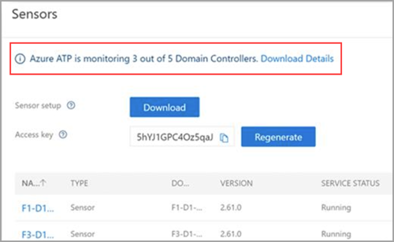

---
# required metadata

title: Monitoring domain controllers and installed sensors installed on your domain controllers using Azure Advanced Threat Protection
description: Describes how to monitor Azure ATP sensors and sensor coverage using Azure ATP
keywords:
author: shsagir
ms.author: shsagir

manager: rkarlin
ms.date: 09/23/2019
ms.topic: conceptual
ms.collection: M365-security-compliance
ms.service: azure-advanced-threat-protection
ms.assetid: 92decce8-b3ae-4d32-8407-a95314a66863

# optional metadata

#ROBOTS:
#audience:
#ms.devlang:
ms.reviewer: itargoet
ms.suite: ems
#ms.tgt_pltfrm:
#ms.custom:

---

# Monitoring your domain controller coverage

As soon as the first Azure ATP sensor is installed and configured on any domain controller in your network, Azure ATP begins monitoring your environment for domain controllers. 

During setup, it is recommended to select at least one Azure ATP sensor domain controller as the domain synchronizer candidate per domain. One of the jobs of the domain synchronizer sensor is to ensure that domain controllers are actively being searched for by that specific sensor. Domain controllers can be switched to and from domain synchronizer candidate status after initial configuration. When no domain controller is selected as the domain synchronizer candidate, only passive monitoring of the network activity on your domain controllers is occurring. See [Azure ATP sensor configuration](install-atp-step5.md) for more information about configuring an Azure sensor and setting it as a **domain synchronizer candidate**. 

Once an Azure ATP sensor is installed and configured on a domain controller in your network, the sensor communicates with the Azure ATP service on a constant basis sending sensor status, health and version information, and collected Active Directory events and changes.  

### Domain controller status

Azure ATP continuously monitors your environment for unmonitored domain controllers introduced into your environment, and reports on them to assist you in managing full coverage of your environment. 

1. To check the status of your detected monitored and unmonitored domain controllers and their status, go to the **Configuration** area of the Azure ATP portal, under the **System** section, select **Sensors**.
   
    

2. Your currently monitored and unmonitored domain controllers are displayed at the top of the screen. To download the monitoring status details of your domain controllers, select **Download Details**. 

The domain controller coverage Excel download provides the following information for all detected domain controllers in your organization:

|Title|Description|
|----|----|
|Hostname|Computer name|
|Domain name|Domain name|
|Monitored|Azure ATP monitoring status|
|Sensor type|Azure ATP sensor or Azure ATP standalone sensor|
|Organizational unit|Location inside of Active Directory |
|Operating system version| Version of operating system detected|
|IP address|Detected IP address| 

### Search domain controllers

Managing your fleet of sensors and domain controllers can be challenging. To make it easier to find and identify, domain controllers can be searched using the search feature in Azure ATP Sensors list. 

1. To search your domain controllers, go to the **Configuration** area of the Azure ATP portal, under the **System** section, select **Sensors**.
1. Select the filter option on the **domain controller** column in the domain controller table list. 
1. Enter the name you wish to search. Wildcards are not currently supported in the search field. 

    

> [!NOTE]
> Azure ATP portal configuration pages can be modified by Azure ATP admins only.

## See Also

- [Azure ATP Architecture](atp-architecture.md)
- [Configuring Azure ATP sensors](install-atp-step5.md)
- [Multi-forest support](atp-multi-forest.md)
- [Check out the Azure ATP forum!](https://aka.ms/azureatpcommunity)
