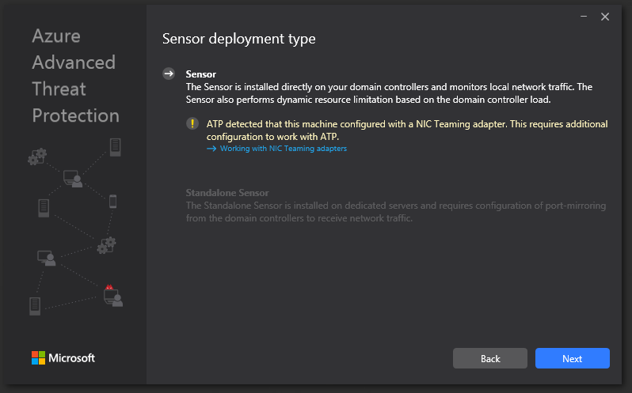
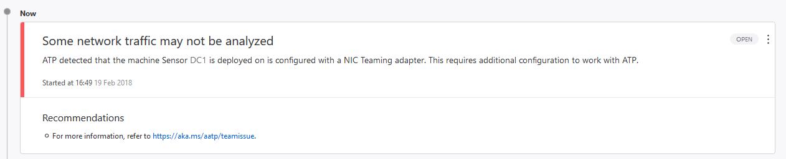

---
# required metadata

title: Using the sensor with NIC teaming | Microsoft Docs
description: Describes how to set up NIC teaming for the Azure ATP sensor
keywords:
author: rkarlin
ms.author: rkarlin
manager: mbaldwin
ms.date: 2/20/2018
ms.topic: article
ms.prod:
ms.service: azure-advanced-threat-protection
ms.technology:
ms.assetid: d106bc32-7f79-4d2a-b1fe-78591d1c5ccc

# optional metadata

#ROBOTS:
#audience:
#ms.devlang:
ms.reviewer: bennyl
ms.suite: ems
#ms.tgt_pltfrm:
#ms.custom:

---

*Applies to: Azure Advanced Threat Protection*

# Using the sensor with adapter teaming

This article describes the requirements for successful deployment of the Azure ATP Sensor in your environment when NIC teaming is enabled on your domain controller. 

If you attempt to install the ATP sensor on a machine configured with a NIC Teaming adapter, you will receive the following error:

And in the ATP workspace portal you might see this error:

NIC Teaming is a solution commonly employed to solve network availability and performance challenges. NIC Teaming (aka NIC bonding, network adapter teaming, load balancing and failover) is the ability to operate multiple NICs as a single interface from the perspective of the service. In Windows Server 2012, NIC Teaming provides two key capabilities:

- Protects against NIC failures by automatically moving the traffic to remaining operational members of the team, including failover.
- Increases throughput by combining the bandwidth of the team members as though they were a single larger bandwidth interface, also known as bandwidth aggregation.

The Azure ATP sensor is installed directly on the domain controller, and analyzes the network traffic coming in and out of the domain controller.

The Sensor uses WinPcap driver to capture the traffic, which does not support NIC Teaming, so some of the network traffic will not be parsed by the sensor.

In order to support NIC Teaming, download the latest version of Npcap driver from https://nmap.org/npcap/.

## See Also
[Check out the Azure ATP forum!](https://social.technet.microsoft.com/Forums/security/home?forum=mata)
