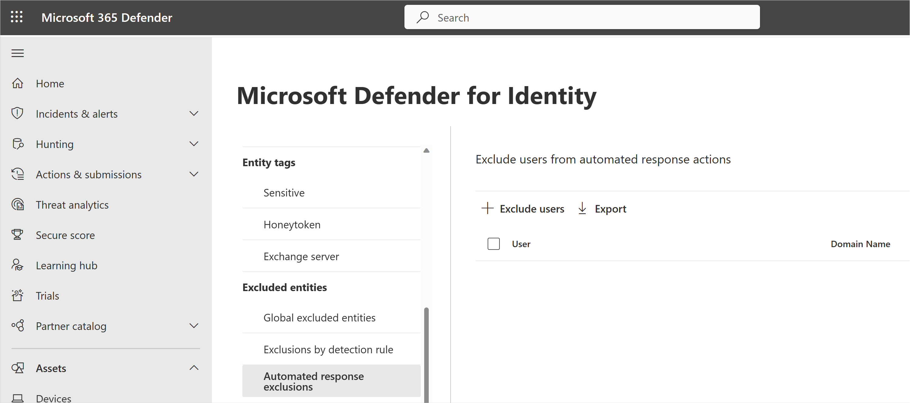

# Configure Defender for Identity automated response exclusions

> [!NOTE]
> The experience described in this page can be accessed at <https://security.microsoft.com> as part of Microsoft 365 Defender.

This article explains how to configure [Microsoft Defender for Identity](/defender-for-identity) automated response exclusions in [Microsoft 365 Defender](/microsoft-365/security/defender/overview-security-center).

Microsoft Defender for Identity enables the exclusion of Active Directory accounts from automated response actions, used in [Automatic Attack Disruption](https://techcommunity.microsoft.com/t5/microsoft-365-defender-blog/what-s-new-in-xdr-at-microsoft-ignite/ba-p/3648872).

For example, an incident involving Attack Disruption, where response actions are taken automatically, wouldn't disable a specified excluded account. This could be used, for example, to exclude sensitive accounts from automated actions.

## How to add automated response exclusions

1. In [Microsoft 365 Defender](https://security.microsoft.com/), go to **Settings** and then **Identities**.

    

1. You'll then see **Automated response exclusions** in the left-hand menu.

    

1. To exclude specific users, select **Exclude Users**.

    :::image type="content" source="media/exclude-users.png" alt-text="Exclude specific users.":::

1. Search for the users to exclude and select the **Exclude Users** button.

    :::image type="content" source="media/exclude-specific-users.png" alt-text="Choose which users to exclude.":::

1. To remove excluded users, select the relevant users from the list and select the **Remove** button.

    :::image type="content" source="media/remove-excluded-users.png" alt-text="Remove excluded users.":::

## Next steps

- [Configure event collection](deploy/configure-event-collection.md)
- [Check out the Defender for Identity forum!](<https://aka.ms/MDIcommunity>)
