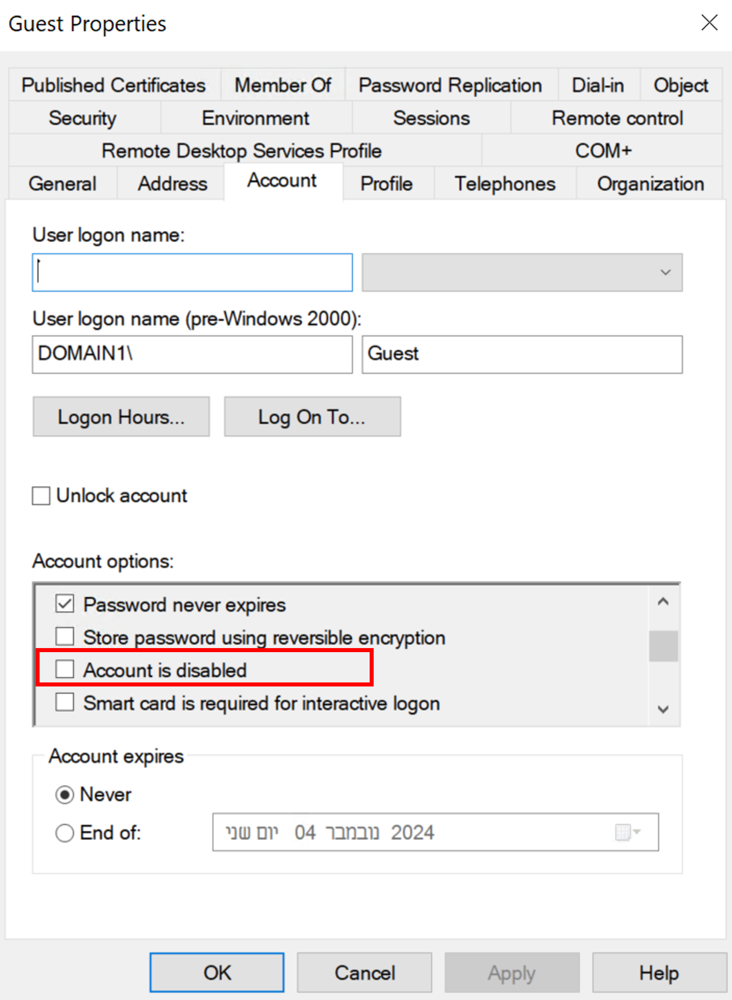
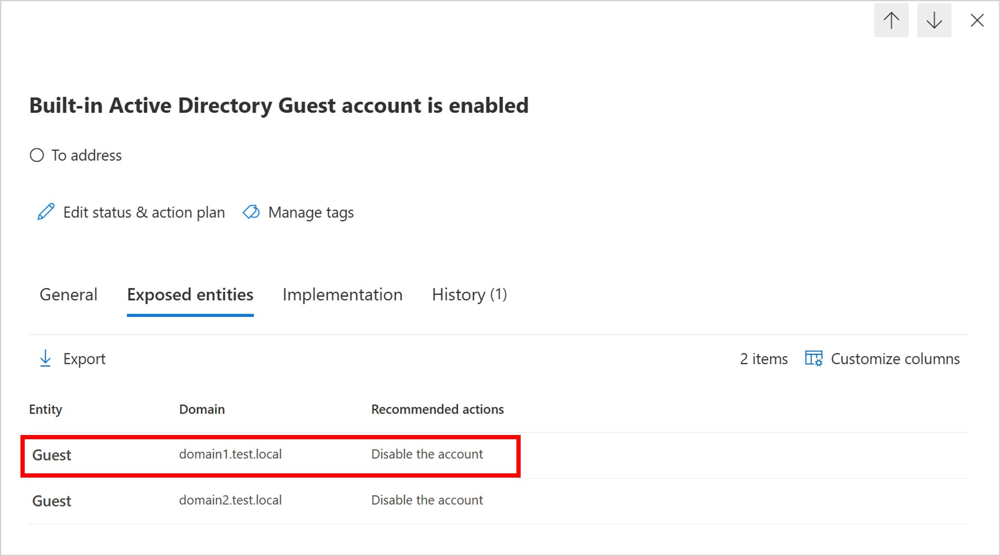

---
# Required metadata
# For more information, see https://review.learn.microsoft.com/en-us/help/platform/learn-editor-add-metadata?branch=main
# For valid values of ms.service, ms.prod, and ms.topic, see https://review.learn.microsoft.com/en-us/help/platform/metadata-taxonomies?branch=main

title: 'Security Assessment: Built-in Active Directory Guest account is enabled'
description: 'This recommendation indicates whether an AD Guest account is enabled in your environment. The goal is to ensure that the Guest account of the domain is not enabled. '
author:      LiorShapiraa # GitHub alias
ms.author: liorshapira
ms.service: microsoft-defender-for-identity
ms.topic: article
ms.date:     10/05/2024
---

# Security Assessment: Built-in Active Directory Guest account is enabled

This recommendation indicates whether an AD Guest account is enabled in your environment.   
The goal is to **ensure** that the Guest account of the domain is **not enabled**. 

## Organization risk

The on-premises Guest account is a built-in, non-nominative account that allows anonymous access to Active Directory. Enabling this account permits access to the domain without requiring a password, potentially posing a security threat.

## Remediation steps

1. Review the list of exposed entities to discover if there is a Guest account which is enabled.  

1. Take appropriate action on those accounts by **disabling** the account.

For example:

## Next steps

[Learn more about Microsoft Secure Score](/microsoft-365/security/defender/microsoft-secure-score)

