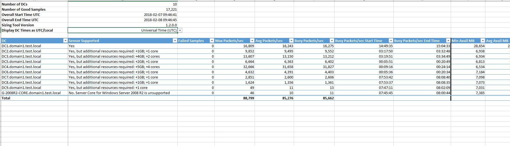
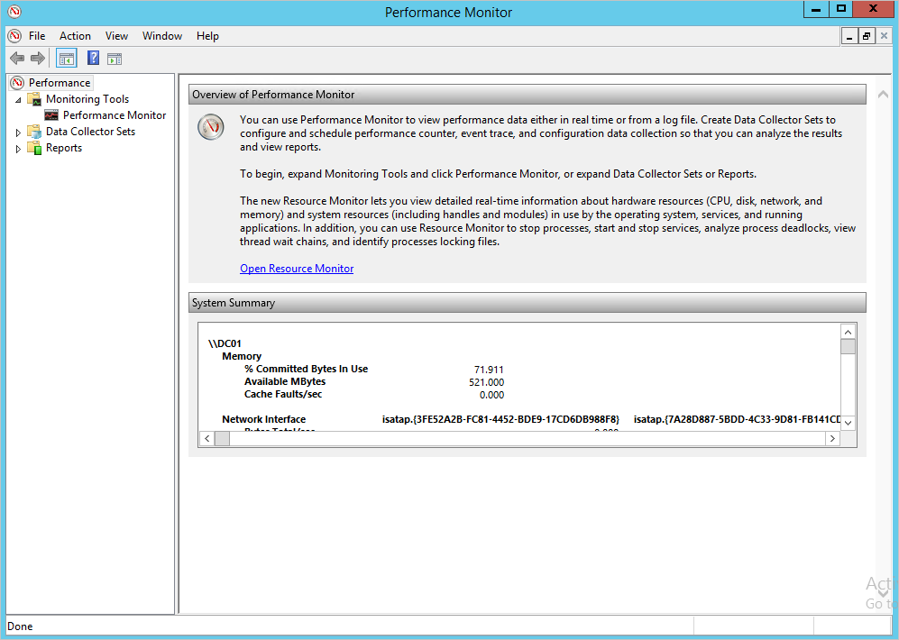
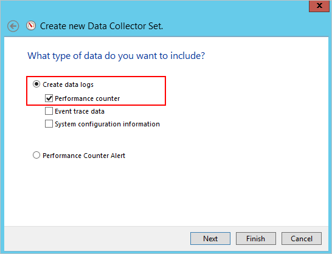
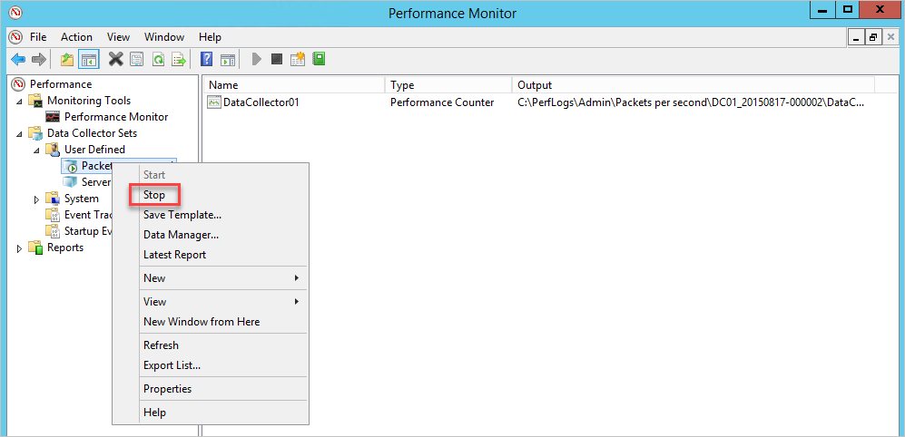
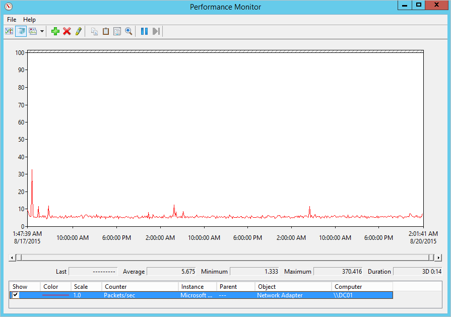

# Plan capacity for Microsoft Defender for Identity deployment

In this guide, you determine what resources you need for your Microsoft Defender for Identity sensors.

## Prerequisites

- Download the [Defender for Identity Sizing Tool](<https://aka.ms/mdi/sizingtool>).
- Review the [Defender for Identity architecture](architecture.md) article.
- Review the [Defender for Identity prerequisites](prerequisites.md) article.

## Use the sizing tool

The recommended and simplest way to determine capacity for your Defender for Identity deployment is to use the Defender for Identity Sizing Tool. If you're unable to use the tool, you can manually gather traffic information. For more information the manual method, see the [Domain controller traffic estimator](#manual-sizing) section at the bottom of this article.

1. Run the Defender for Identity Sizing Tool, **TriSizingTool.exe**, from the zip file you downloaded.
1. When the tool finishes running, open the Excel file results.
1. In the Excel file, locate and select the **Azure ATP Summary** sheet. The other sheet isn't needed since it's for ATA planning.
    

1. Locate the **Busy Packets/sec** field in the Azure ATP sensor table in the results Excel file and make a note of it.
1. Match your **Busy Packets/sec** field to the **PACKETS PER SECOND** field in the [Defender for Identity sensor table](#sizing) section of this article. Use the fields to determine the memory and CPU that will be used by the sensor.

> [!NOTE]
> To ensure accurate results, only run the sizing tool before you've installed any Defender for Identity sensors in your environment.
> The Sizing Tool measures the capacity needed for domain controllers only. There is no need to run it against AD FS servers, as the performance impact on AD FS servers is extremely minimal to not existent.

## Defender for Identity sensor sizing

A Defender for Identity sensor can support the monitoring of a domain controller based on the amount of network traffic the domain controller generates. The following table is an estimate. The final amount that the sensor parses is dependent on the amount of traffic and the distribution of traffic.

The following CPU and Random Access Memory (RAM) capacity refers to the **sensor's own consumption**, not the domain controller capacity.

|Packets per second|CPU (cores)\*|Memory\*\* (GB)|
|----|----|-----|
|0-1k|0.25|2.50|
|1k-5k|0.75|6.00|
|5k-10k|1.00|6.50|
|10k-20k|2.00|9.00|
|20k-50k|3.50|9.50|
|50k-75k |5.50|11.50|
|75k-100k|7.50|13.50|

\* This includes physical cores, not hyper-threaded cores.  
\*\* Random-access memory (RAM)

When determining sizing, note the following items:

- Total number of cores that the sensor service will use.  
It's recommended that you don't work with hyper-threaded cores. Working with hyper-threaded cores can result in Defender for Identity sensor health issues.
- Total amount of memory that the sensor service will use.
- If the domain controller doesn't have the resources required by the Defender for Identity sensor, domain controller performance isn't affected. However, the Defender for Identity sensor might not operate as expected.
- When running as a virtual machine, all memory is required to be allocated to the virtual machine at all times.
- For optimal performance, set the **Power Option** of the Defender for Identity sensor to **High Performance**.
- A minimum of 2 cores is required.
- A minimum of 6 GB of hard drive space is required, 10 GB is recommended, including space needed for the Defender for Identity binaries and logs.

### Dynamic memory

> [!NOTE]
> When running as a virtual machine, all memory is required to be allocated to the virtual machine at all times.

|VM running on|Description|
|------------|-------------|
|Hyper-V|Ensure that **Enable Dynamic Memory** isn't enabled for the VM.|
|VMware|Ensure that the amount of memory configured and the reserved memory are the same, or select the following option in the VM setting – **Reserve all guest memory (All locked)**.|
|Other virtualization host|Refer to the vendor supplied documentation on how to ensure that memory is fully allocated to the VM at all times. |

## Domain controller traffic estimation

If for some reason you can't use the Defender for Identity Sizing Tool, manually gather the packet/sec counter information from all your domain controllers. Gather the information for 24 hours with a low collection interval, approximately 5 seconds. Then, for each domain controller, calculate the daily average and the busiest period (15 minutes) average. The following sections present the instruction for how to collect the packets/sec counter from one domain controller.

There are various tools that you can use to discover the average packets per second of your domain controllers. If you don't have any tools that track this counter, you can use Performance Monitor to gather the required information.

To determine packets per second, do the following steps on each domain controller:

1. Open Performance Monitor.

    

1. Expand **Data Collector Sets**.

    

1. Right-click **User Defined** and select **New** &gt; **Data Collector Set**.

    

1. Enter a name for the collector set and select **Create Manually (Advanced)**.

1. Under **What type of data do you want to include?** select  **Create data logs, and Performance counter**.

    

1. Under **Which performance counters would you like to log**, select **Add**.

1. Expand **Network Adapter** and select **Packets/sec** and select the proper workspace. If you aren't sure, you can select **&lt;All workspaces&gt;** and select **Add** and **OK**.

    > [!NOTE]
    > To perform this operation in a command line, run `ipconfig /all` to see the name of the adapter and configuration.

    

1. Change the **Sample interval** to **five seconds**.

1. Set the location where you want the data to be saved.

1. Under **Create the data collector set**,  select **Start this data collector set now**, and select **Finish**.

    You should now see the data collector set you created with a green triangle indicating that it's working.

1. After 24 hours, stop the data collector set, by right-clicking the data collector set and selecting **Stop**.

    

1. In File Explorer, browse to the folder where the .blg file was saved and double-click it to open it in Performance Monitor.

1. Select the Packets/sec counter, and record the average and maximum values.

    

> [!NOTE]
> By default, Defender for Identity supports up to 350 sensors. If you want to install more sensors, contact Defender for Identity support.

## Next steps

> [!div class="step-by-step"]
> [« Prerequisites](prerequisites.md)
> [Configure Windows Event collection »](configure-windows-event-collection.md)
