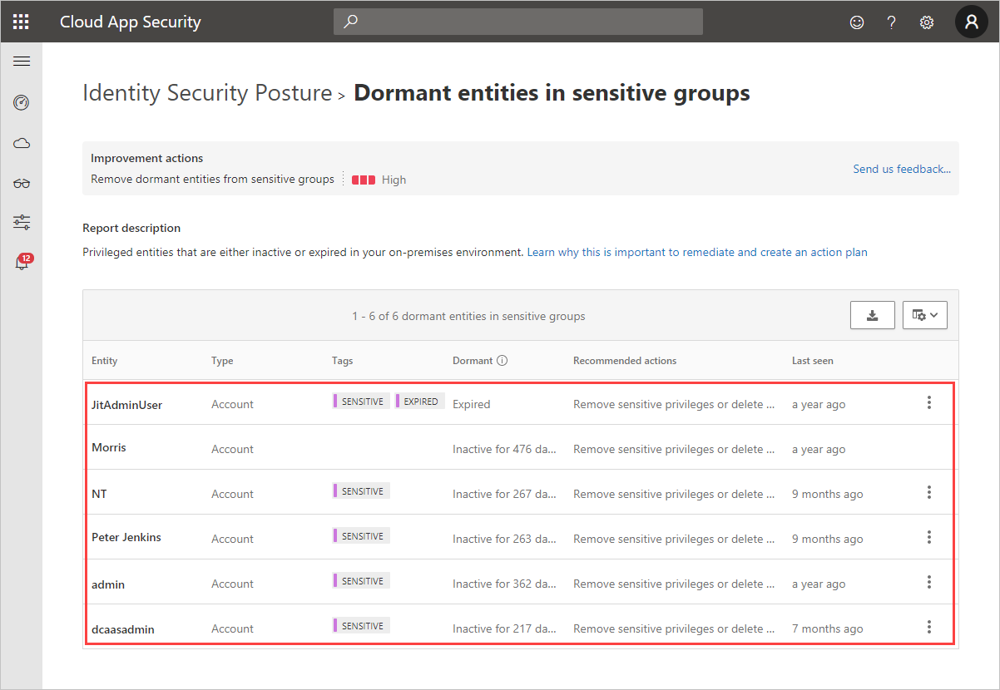

# Security assessment: Dormant entities in **sensitive** groups

## What are **sensitive** dormant entities?

[!INCLUDE [Product long](includes/product-long.md)] discovers if particular users are **sensitive** along with providing attributes that surface if they are inactive, disabled, or expired.

However, **Sensitive** accounts can also become *dormant* if they are not used for a period of 180 days. Dormant [sensitive entities](manage-sensitive-honeytoken-accounts.md) are targets of opportunity for malicious actors to gain sensitive access to your organization.

## What risk do dormant entities create in **sensitive** groups?

Organizations that fail to secure their dormant user accounts leave the door unlocked to their sensitive data safe.

Malicious actors, much like thieves, often look for the easiest and quietest way into any environment. An easy and quiet path deep into your organization is through **sensitive** user and service accounts that are no longer in use.

It doesn't matter if the cause is employee turnover or resource mismanagement -skipping this step leaves your organization's most sensitive entities vulnerable and exposed.

## How do I use this security assessment?

1. Review the suggested improvement action to discover which of your sensitive accounts are dormant.
    
1. Take appropriate action on those user accounts by removing their privileged access rights or by deleting the account.

> [!NOTE]
> This assessment is updated in near real time.

## See Also

- [Learn more about Microsoft Secure Score](/microsoft-365/security/defender/microsoft-secure-score)
- [Check out the [!INCLUDE [Product short](includes/product-short.md)] forum!](<https://aka.ms/MDIcommunity>)
