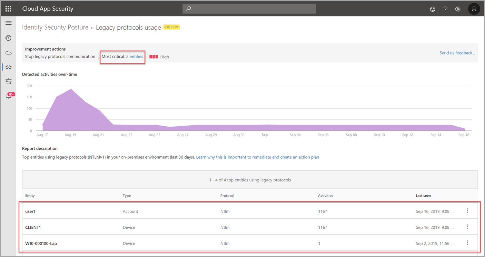

# Security assessment: Legacy protocols usage

## What are legacy protocols?

With all of the standard work enterprises perform to protect their infrastructure using patching and server hardening, one area that often remains overlooked is legacy protocol retirement. Without reducing legacy protocol exposure, credential theft remains relatively easy to accomplish.

Most legacy protocols were drafted and created before today's security needs existed, and built before modern enterprise security requirements became clear. However, legacy protocols remain unchanged, and are easily transformed into vulnerable access points in every modern organization.

>[!NOTE]
>This assessment currently focuses on on-premises Active Directory legacy protocols. For information about legacy protocols in Azure Active Directory, see [How to block legacy authentication to Azure Active Directory with Conditional Access](/azure/active-directory/conditional-access/block-legacy-authentication).

## What risks do retained legacy protocols introduce?

Modern cyber-attacks methods often make specific use of legacy protocols in their attack and often utilize them to target organizations that have yet to implement the proper mitigation.

Attack Surface Reduction can be achieved by disabling support for insecure legacy protocols such as:

- TLS 1.0 & 1.1 (As well as all versions of SSL)
- Server Message Block v1 (SMBv1)
- LanMan (LM) / NTLMv1
- Digest Authentication

To retire the use of legacy protocols, your organization must first discover which internal entities and applications rely on them. The **Legacy protocols usage** assessment report table surfaces the top discovered entities using legacy protocols (for now, NTLMv1). Using the report, you can immediately review any top impacted entities and take action on them, stopping use of these protocols and eventually, disabling them altogether. To learn more about the dangers of using legacy protocols, see [Stop using LAN manager and NTLMv1!](/archive/blogs/miriamxyra/stop-using-lan-manager-and-ntlmv1).

## How do I use this security assessment?

1. Use the report table to discover which of your top discovered entities are using legacy protocols.

    
1. Take appropriate action on those entities to discover dependencies.
1. Stop legacy protocol use and eventually, [disable the protocols completely](/archive/blogs/miriamxyra/stop-using-lan-manager-and-ntlmv1).

    >[!IMPORTANT]
    >[!INCLUDE [Product long](includes/product-long.md)] may not detect every instance of legacy protocols. So, as with any modifications to your environment, it's recommended to test any changes before pushing them into production. Disabling those protocols without testing might cause legacy apps to break.

> [!NOTE]
> This assessment is updated in near real time.

## Next steps

- [[!INCLUDE [Product short](includes/product-short.md)] activities filtering in Defender for Cloud Apps](activities-filtering-mcas.md)
- [Check out the [!INCLUDE [Product short](includes/product-short.md)] forum!](<https://aka.ms/MDIcommunity>)
