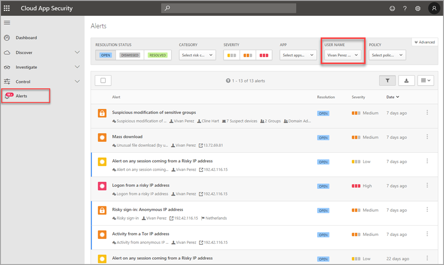
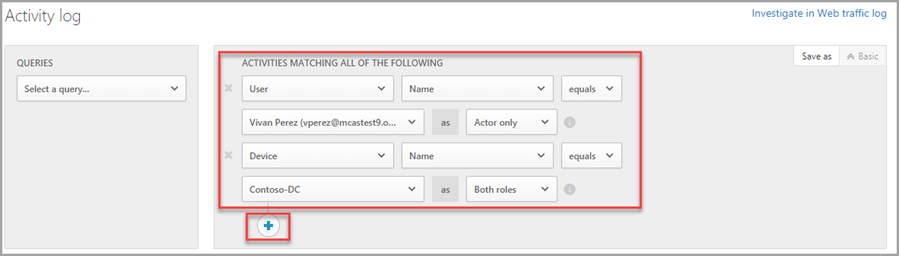
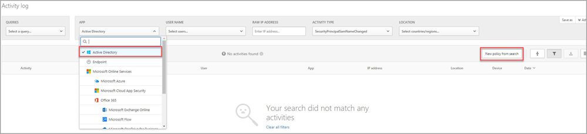
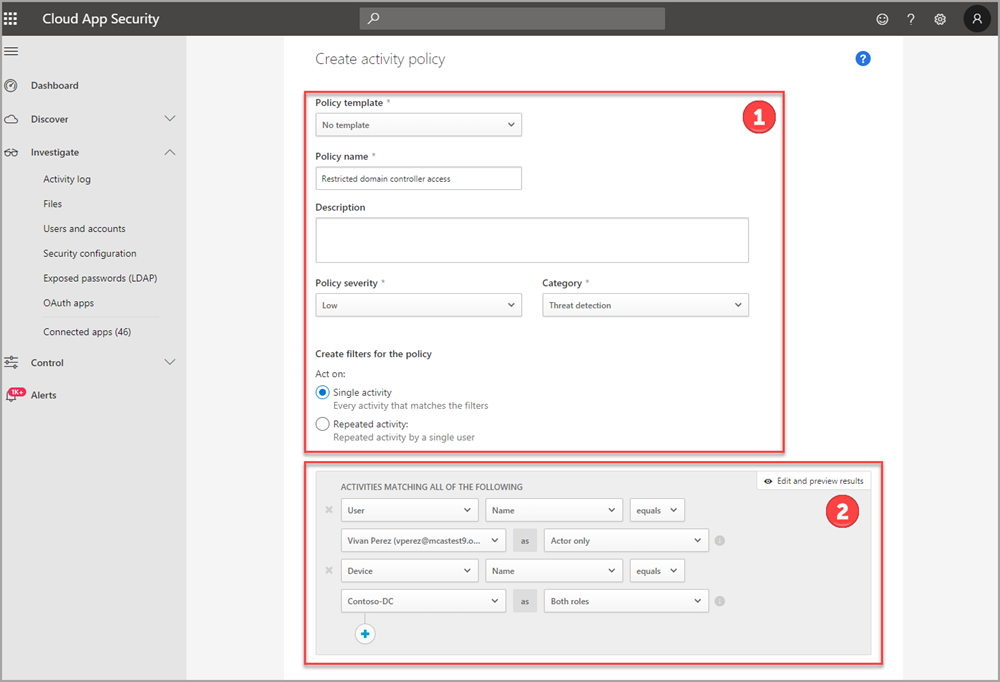

# Use activity filters and create action policies with Microsoft Defender for Identity in Microsoft Defender for Cloud Apps

[!INCLUDE [automatic-redirect](../includes/automatic-redirect.md)]

This article is designed to help you understand how to filter and create action policies for Defender for Identity activities using Microsoft Defender for Cloud Apps.

For more information about how to complete your integration, see [Defender for Identity integration with Defender for Cloud Apps](/cloud-app-security/mdi-integration).

Core Defender for Identity functionality can be represented in the Microsoft Defender for Cloud Apps portal. This provides a singular administration experience around investigating risky users in your enterprise, and the ability to filter activity based on both on-premises and cloud identity events.

## Prerequisites

For complete user investigation features across the hybrid environment, you must have:

- A valid license for Microsoft Defender for Cloud Apps
- A valid license for Microsoft Defender for Identity connected to your Active Directory instance

>[!NOTE]
>If you don't have a subscription for Defender for Cloud Apps, you can use the Defender for Cloud Apps portal to investigate Defender for Identity alerts and deep dive on users and their on-premises managed activities however insights related to your cloud applications will remain unavailable.

## Filter Defender for Identity activities in Defender for Cloud Apps

Defender for Identity activities can be accessed from the main Defender for Cloud Apps **Investigate** menu by selecting the **Activity log** submenu, or from the **Alerts** menu by status, category, severity, application, user name, or policy.

To access Defender for Identity activities by user:

1. Filter the **Alerts** queue using the USER NAME field.
    
1. Select the user name on any of the alerts in the resulting list to open the **User page** of the user you wish to investigate.

1. Filter activities of the user using the available fields, or add a new filter rule using the + button.
    

## Create activity policies in Defender for Cloud Apps

After filtering activities and identifying activity policies you'd like to implement, or noncompliance within your organization, use the **Create new activity policy** option from the filter menu to immediately create a new customized policy per user, device, or tenant.

To create a new activity policy:

1. From any **Activity log** page, apply a filter (such as APP, User Name, Activity type).
    - To filter to activities from Defender for Identity select the **Active Directory** option in the APP filter.
    
1. Select the **New policy from search** button.
1. Add a **Policy name**.
    
1. Add a policy **Description**.
1. Assign the **severity** of the policy.
1. Select a **category** for the policy.
1. Choose or modify filters to create and assign for the policy.
1. Refine or add more filters.
1. Save and apply the new policy.

## Next steps

Learn more about Investigation priority scoring and additional features of [Microsoft Defender for Cloud Apps](/cloud-app-security/) functionality.

## Join the Community

Do you have more questions, or an interest in discussing Defender for Identity and related security with others? Join the [Defender for Identity Community](<https://techcommunity.microsoft.com/t5/Azure-Advanced-Threat-Protection/bd-p/AzureAdvancedThreatProtection>) today!
