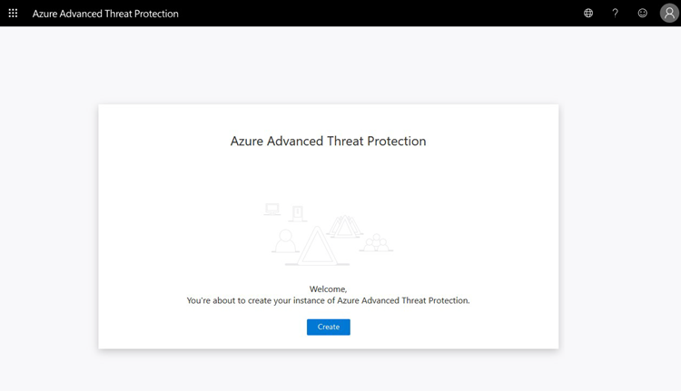
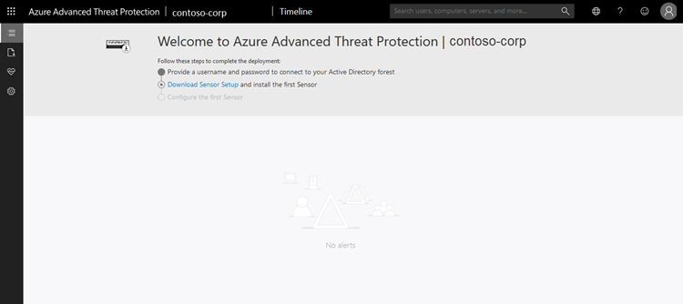
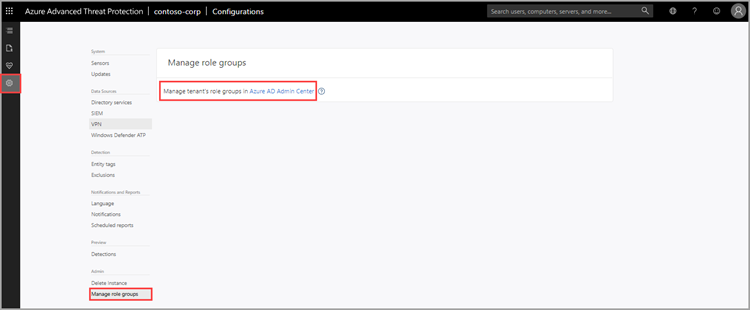

# Classic portal: Quickstart -Create your Microsoft Defender for Identity instance

[!INCLUDE [automatic-redirect](../includes/automatic-redirect.md)]

In this quickstart, you'll create your Microsoft Defender for Identity instance in the Defender for Identity portal. In Defender for Identity, you'll have a single instance, previously called a workspace. A single instance enables you to manage multiple forests from a single pane of glass.

Currently, Defender for Identity data centers are deployed in Europe, UK, North America/Central America/Caribbean and Asia. Your instance is created automatically in the data center that is geographically closest to your Azure Active Directory (Azure AD). Once created, Defender for Identity instances aren't movable.

## Prerequisites

- A [Microsoft Defender for Identity license](/defender-for-identity/technical-faq#licensing-and-privacy).
- You need to be a [global administrator or security administrator on the tenant](/azure/active-directory/users-groups-roles/directory-assign-admin-roles#available-roles) to access the Defender for Identity portal.
- Review the [Defender for Identity architecture](architecture.md) article.
- Review the [Defender for Identity prerequisites](deploy/prerequisites.md) article.

## Sign in to the Defender for Identity portal

After you verified that your network meets the sensor requirements, start the creation of your Defender for Identity instance.

1. Go to [the Defender for Identity portal](<https://portal.atp.azure.com>)*.

1. Sign in with your Azure Active Directory user account.

\* GCC High customers must use the [Defender for Identity GCC High](<https://portal.atp.azure.us>) portal.

## Create your instance

1. Select **Create instance**.

    

1. Your Defender for Identity instance is automatically named with the Azure AD fully qualified domain name and created in the data center located closest to your Azure AD.

    

    > [!NOTE]
    > To sign in to Defender for Identity, you'll need to sign in with a user assigned a Defender for Identity role with rights to access the Defender for Identity portal. For more information about role-based access control (RBAC) in Defender for Identity, see [Working with Defender for Identity role groups](deploy/role-groups.md).

1. Select **Configuration**, **Manage role groups**, and use the [Azure AD Admin Center](/azure/active-directory/active-directory-assign-admin-roles-azure-portal) link to manage your role groups.

    

- Data retention – previously deleted Defender for Identity instances don't appear in the UI. For more information on Defender for Identity data retention, see [Defender for Identity data security and privacy](privacy-compliance.md).

## Next steps

> [!div class="step-by-step"]
> [« Prerequisites](deploy/prerequisites.md)
> [Step 2 - Connect to Active Directory »](/defender-for-identity/classic-install-step2)

## Join the Community

Have more questions, or an interest in discussing Defender for Identity and related security with others? Join the [Defender for Identity Community](<https://aka.ms/MDIcommunity>) today!
