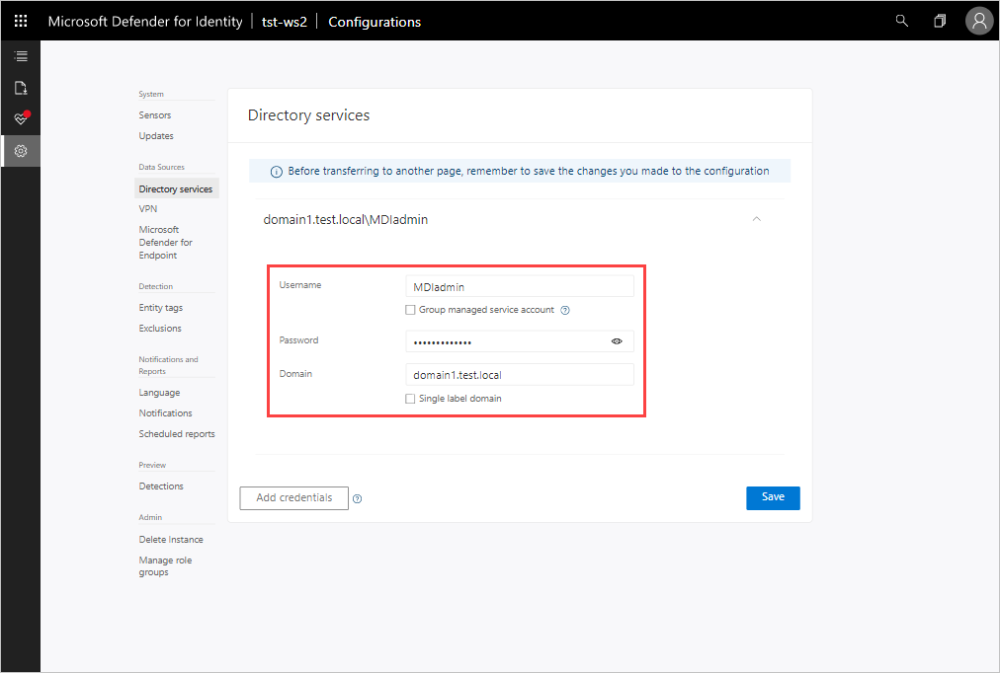

# Classic portal: Quickstart - Connect to your Active Directory Forest

[!INCLUDE [automatic-redirect](../includes/automatic-redirect.md)]

In this quickstart, you'll connect Microsoft Defender for Identity to Active Directory (AD) to retrieve data about users and computers. If you're connecting multiple forests, see the [Multi-forest support](multi-forest.md) article.

## Prerequisites

- A [Defender for Identity instance](/defender-for-identity/classic-install-step1).
- Review the [Defender for Identity prerequisites](prerequisites.md) article.
- At least one Directory Service account with read access to all objects in the monitored domains. For instructions on how to create the Directory Service account, see [Directory Service account recommendations](directory-service-accounts.md).

## Provide a username and password to connect to your Active Directory Forest

The first time you open the Defender for Identity portal, the following screen appears:

1. Enter the following information and select **Save**:

    |Field|Comments|
    |---|---|
    |**Username** (required)|Enter the read-only AD username. For example: **DefenderForIdentityUser**. You must use a **standard** AD user or gMSA account. **Don't** use the UPN format for your username. When using a gMSA, the user string should end with the '$' sign. For example: mdisvc$ **NOTE:** We recommend that you avoid using accounts assigned to specific users.|
    |**Password** (required for standard AD user account)|For AD user account only, enter the password for the read-only user. For example: *Pencil1*.|
    |**Group managed service account** (required for gMSA account)|For gMSA account only, select **Group managed service account**.|
    |**Domain** (required)|Enter the domain for the read-only user. For example: **contoso.com**. It's important that you enter the complete FQDN of the domain where the user is located. For example, if the user's account is in domain corp.contoso.com, you need to enter `corp.contoso.com` not contoso.com|

1. In the Defender for Identity portal, click **Download sensor setup and install the first sensor** to continue.

## Next steps

> [!div class="step-by-step"]
> [« Step 1 - Create Defender for Identity instance](/defender-for-identity/classic-install-step1)
> [Step 3 - Download the sensor setup »](/defender-for-identity/classic-install-step3)

## Join the Community

Have more questions, or an interest in discussing Defender for Identity and related security with others? Join the [Defender for Identity Community](<https://aka.ms/MDIcommunity>) today!
