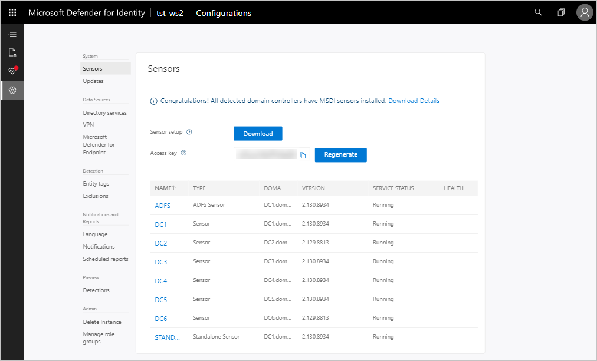

# Classic portal: Quickstart - Download the Microsoft Defender for Identity sensor setup package

[!INCLUDE [automatic-redirect](../includes/automatic-redirect.md)]

In this quickstart, you'll download the Microsoft Defender for Identity sensor setup package from the portal.

## Prerequisites

- An [Defender for Identity instance](classic-install-step1.md) that's [connected to Active Directory](/defender-for-identity/classic-install-step2).

## Download the setup package

After configuring the domain connectivity settings, you can download the Defender for Identity sensor setup package. For more information on the Defender for Identity sensor, see [Defender for Identity Architecture](architecture.md).

Select **Download** in the list of steps at the top of the page to go to the **Sensors** page.

To reach the sensor configuration screen later, select **Configuration**, and then under **System**, select **Sensors**.  

1. Select **Download** to save the package locally.
1. Copy the **Access** **key**. The access key is required for the Defender for Identity sensor to connect to your Defender for Identity instance. The access key is a one-time-password for sensor deployment, after which all communication is performed using certificates for authentication and TLS encryption. Use the **Regenerate** button if you ever need to regenerate the new access key, you can, and it won't affect any previously deployed sensors, because it's only used for initial registration of the sensor.
1. Copy the package to the dedicated server or domain controller onto which you're installing the Defender for Identity sensor. Alternatively, you can open the Defender for Identity portal from the dedicated server or domain controller and skip this step.

The zip file includes the following files:

- Defender for Identity sensor installer

- Configuration setting file with the required information to connect to the Defender for Identity cloud service

- [The Npcap driver](/defender-for-identity/technical-faq#winpcap-and-npcap-drivers) that you'll need to install in the next step before installing the sensor

## Next steps

> [!div class="step-by-step"]
> [« Step 2 - Connect to Active Directory](/defender-for-identity/classic-install-step2)
> [Step 4 - Install the Defender for Identity sensor »](/defender-for-identity/install-sensor)

## Join the Community

Have more questions, or an interest in discussing Defender for Identity and related security with others? Join the [Defender for Identity Community](<https://aka.ms/MDIcommunity>) today!
