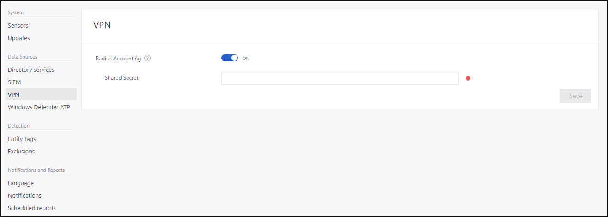

# Classic portal: Integrate VPN

[!INCLUDE [automatic-redirect](../includes/automatic-redirect.md)]

Microsoft Defender for Identity can collect accounting information from VPN solutions. When configured, the user's profile page includes information from the VPN connections, such as the IP addresses and locations where connections originated. This complements the investigation process by providing additional information on user activity as well as a new detection for abnormal VPN connections. The call to resolve an external IP address to a location is anonymous. No personal identifier is sent in this call.

Defender for Identity integrates with your VPN solution by listening to RADIUS accounting events forwarded to the Defender for Identity sensors. This mechanism is based on standard RADIUS Accounting ([RFC 2866](https://tools.ietf.org/html/rfc2866)), and the following VPN vendors are supported:

- Microsoft
- F5
- Check Point
- Cisco ASA

## Prerequisites

To enable VPN integration, make sure you set the following parameters:

- Open port UDP 1813 on your Defender for Identity sensors and/or Defender for Identity standalone sensors.

> [!NOTE]
>
> - By enabling **Radius Accounting**, the Defender for Identity sensor will enable a pre-provisioned Windows firewall policy called **Microsoft Defender for Identity Sensor** to allow incoming RADIUS Accounting on port UDP 1813.
> - VPN integration is not supported in environments adhering to Federal Information Processing Standards (FIPS)

The example below uses Microsoft Routing and Remote Access Server (RRAS) to describe the VPN configuration process.

If you're using a third-party VPN solution, consult their documentation for instructions on how to enable RADIUS Accounting.

## Configure RADIUS Accounting on the VPN system

Perform the following steps on your RRAS server.

1. Open the Routing and Remote Access console.
1. Right-click the server name and click **Properties**.
1. In the **Security** tab, under **Accounting provider**, select **RADIUS Accounting** and click **Configure**.

    

1. In the **Add RADIUS Server** window, type the **Server name** of the closest Defender for Identity sensor (which has network connectivity). For high availability you can add additional Defender for Identity sensors as RADIUS Servers. Under **Port**, make sure the default of 1813 is configured. Click **Change** and type a new shared secret string of alphanumeric characters. Take note of the new shared secret string as you'll need to fill it out later during Defender for Identity Configuration. Check the **Send RADIUS Account On and Accounting Off messages** box and click **OK** on all open dialog boxes.

    

### Configure VPN in Defender for Identity

Defender for Identity collects VPN data that helps profile the locations from which computers connect to the network and to be able to detect suspicious VPN connections.

To configure VPN data in Defender for Identity:

1. In the Defender for Identity portal, click on the configuration cog and then **VPN**.
1. Turn on **Radius Accounting**, and type the **Shared Secret** you configured previously on your RRAS VPN Server. Then click **Save**.

    

After this is enabled, all Defender for Identity sensors listen on port 1813 for RADIUS accounting events, and your VPN setup is complete.

 After the Defender for Identity sensor receives the VPN events and sends them to the Defender for Identity cloud service for processing, the entity profile will indicate distinct accessed VPN locations and activities in the profile will indicate locations.

## See Also

- [Defender for Identity sizing tool](<https://aka.ms/mdi/sizingtool>)
- [Configure event collection](configure-event-collection.md)
- [Defender for Identity prerequisites](prerequisites.md)
- [Check out the Defender for Identity forum!](<https://aka.ms/MDIcommunity>)
