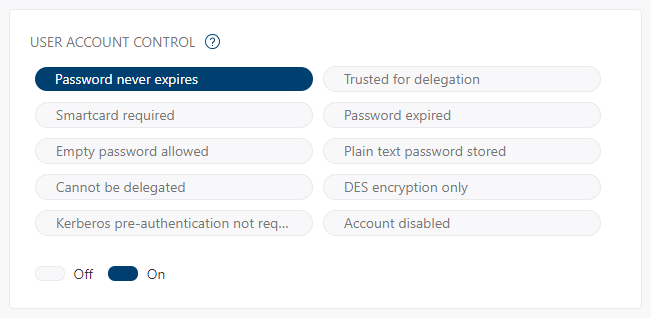

# Tutorial: Investigate an entity

[!INCLUDE [automatic-redirect](../includes/automatic-redirect.md)]

In this tutorial you'll learn how to investigate entities connected to suspicious activities detected by Microsoft Defender for Identity. After viewing a security alert in the timeline, you'll learn how to drill down into the entity involved in the alert, and use the following parameters and details to learn more about what happened and what you need to do to mitigate risk.

> [!div class="checklist"]
>
> - Check the entity profile
> - Check entity tags
> - Check user account control flags
> - Cross-check with Windows Defender
> - Keep an eye on sensitive users and groupsgit st
> - Review potential lateral movement paths
> - Check honeytoken status

## Check the entity profile

The entity profile provides you with a comprehensive entity page, designed for full deep-dive investigation of users, computers, devices, and the resources they have access to along with their history. The profile page takes advantage of the new Defender for Identity logical activity translator that can look at a group of activities occurring (aggregated up to a minute) and group them into a single logical activity to give you a better understanding of the actual activities of your users.

To access an entity profile page, click on the name of the entity, such as a username, in the security alert timeline. You can also see a mini-version of the entity profile in the security alert page by hovering over the entity name.

The entity profile lets you view entity activities, view directory data, and view [lateral movement paths](/defender-for-identity/classic-use-case-lateral-movement-path) for the entity. For more information about entities, see [Understanding entity profiles](/defender-for-identity/classic-entity-profiles).

## Check entity tags

Defender for Identity pulls tags out of Active Directory to give you a single interface for monitoring your Active Directory users and entities.
These tags provide you with information about the entity from Active Directory, including:

- Partial: This user, computer or group was not synced from the domain, and was partially resolved via a global catalog. Some attributes are not available.
- Unresolved: This computer was not resolved to a valid entity in the active directory forest. No directory information is available.
- Deleted: The entity was deleted from Active Directory.
- Disabled: The entity is disabled in Active Directory.
- Locked: The entity entered a wrong password too many times and is locked.
- Expired: The entity is expired in Active Directory.
- New: The entity was created less than 30 days ago.

## Check user account control flags

The user account control flags are also imported from Active Directory. Defender for Identity entity directory data includes 10 flags that are effective for investigation:

- Password never expires
- Trusted for delegation
- Smartcard required
- Password expired
- Empty password allowed
- Plain text password stored
- Cannot be delegated
- DES encryption only
- Kerberos pre-authentication not required
- Account disabled

Defender for Identity lets you know if these flags are On or Off in Azure Active Directory. Colored icons and the corresponding toggle indicate the status of each flag. In the example below, only **Password never expires** is On in Active Directory.

 

## Cross-check with Windows Defender

To provide you with cross-product insights, your entity profile provides entities that have open alerts in Windows Defender with a badge. This badge lets you know how many open alerts the entity has in Windows Defender, and what their severity level is. Click on the badge to go directly to the alerts related to this entity in Windows Defender.

## Keep an eye on sensitive users and groups

Defender for Identity imports user and group information from Azure Active Directory, enabling you to identify which users are automatically considered sensitive because they are members of the following groups in Active Directory:

- Administrators
- Power Users
- Account Operators
- Server Operators
- Print Operators
- Backup Operators
- Replicators
- Remote Desktop Users
- Network Configuration Operators
- Incoming Forest Trust Builders
- Domain Admins
- Domain Controllers
- Group Policy Creator Owners
- read-only Domain Controllers
- Enterprise Read-only Domain Controllers
- Schema Admins
- Enterprise Admins

In addition, you can **manually tag** entities as sensitive within Defender for Identity. This is important because some Defender for Identity detections, such as sensitive group modification detection and lateral movement path, rely on an entity's sensitivity status. If you manually tag additional users or groups as sensitive, such as board members, company executives, and sales directors, Defender for Identity will consider them sensitive. For more information, see [Working with sensitive accounts](/defender-for-identity/classic-manage-sensitive-honeytoken-accounts).

## Review lateral movement paths

Defender for Identity can help you prevent attacks that use lateral movement paths. Lateral movement is when an attacker proactively uses non-sensitive accounts to gain access to sensitive accounts.

If a lateral movement path exists for an entity, in the entity profile page, you will be able to click the **Lateral movement paths** tab. The diagram that is displayed provides you with a map of the possible paths to your sensitive user.

For more information, see [Investigating lateral movement paths with Defender for Identity](/defender-for-identity/classic-use-case-lateral-movement-path).

## Check honeytoken status

Before you move on with your investigation, it's important to know if the entity is a honeytoken. You can tag accounts and entities as honeytokens in Defender for Identity. When you open the entity profile or mini-profile of an account or entity you tagged as a honeytoken, you will see the honeytoken badge. When investigating, the honeytoken badge alerts you that the activity under review was performed by an account that you tagged as a honeytoken.

## See also

- [Working with security alerts](/defender-for-identity/manage-security-alerts)
- [Check out the Defender for Identity forum!](<https://aka.ms/MDIcommunity>)

## Learn more

- Try our interactive guide: [Investigate and respond to attacks with Microsoft Defender for Identity](https://mslearn.cloudguides.com/guides/Investigate%20and%20respond%20to%20attacks%20with%20Microsoft%20Defender%20for%20Identity)
