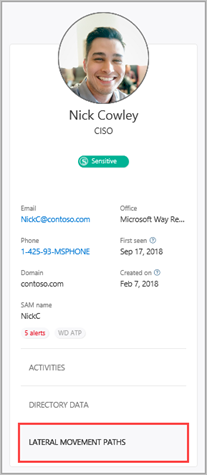
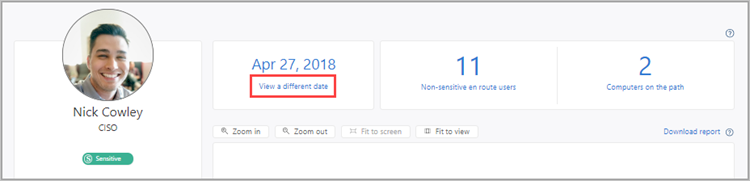
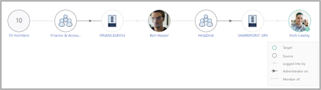

---

title: Investigating lateral movement paths with Microsoft Defender for Identity
description: This article describes how to detect and investigate potential lateral movement path attacks with Microsoft Defender for Identity.
ms.date: 01/30/2023
ms.topic: tutorial
ROBOTS: NOINDEX
---

# Tutorial: Use Lateral Movement Paths (LMPs)

> [!NOTE]
> The experience described in this page can be accessed at <https://security.microsoft.com> as part of Microsoft 365 Defender. 

Lateral movement attacks are typically accomplished using a number of different techniques. Some of the most popular methods used by attackers are [credential theft](suspicious-activity-guide.md#) and [Pass the Ticket](/defender-for-identity/alerts-overview) attacks. In both methods, non-sensitive accounts are used by attackers for lateral moves by exploiting non-sensitive machines that share stored log-in credentials in accounts, groups and machines with sensitive accounts.

In this tutorial, you'll learn how to use Microsoft Defender for Identity LMPs to [investigate](#investigate) potential lateral movement paths, and along with Defender for Identity security alerts, gain a better understanding of what happened in your network and how. In addition, you'll learn how to use the [LMP to sensitive account report](#discover-your-at-risk-sensitive-accounts) to discover all of the sensitive accounts with potential lateral movement paths discovered in your network by time period.

> [!div class="checklist"]
>
> - Investigate LMPs
> - Discover your sensitive accounts at risk
> - Access the **Lateral movement paths to sensitive accounts** report

## Investigate

There are multiple ways to use and investigate LMPs. In the Microsoft 365 Defender portal, search by entity and then explore by path or activity.

1. From the portal, search for a user or computer. Notice if a lateral movement badge was added to an entity profile. Badges will only display when an entity is discovered in a potential LMP within the last 48 hours.

     or .

1. In the user profile page that opens, click the **Lateral movement paths** tab.

    

1. The graph that is displayed provides a map of the possible paths to the sensitive user during the 48 hour time period. If no activity was detected in the last two days, the graph will not appear. Use the **View a different date** option to display the graph for previous lateral movement path detections for the entity.

    

1. Review the graph to see what you can learn about exposure of your sensitive user's credentials. For example, in the path, follow the **Logged into by** gray arrows to see where Nick logged in with their privileged credentials. In this case, Nick's sensitive credentials were saved on the SHAREPOINT-SRV computer. Now, notice which other users logged into which computers that created the most exposure and vulnerability. You can see this by looking at the **Administrator on** black arrows to see who has admin privileges on the resource. In this example, everyone in the group HelpDesk has the ability to access user credentials from that resource.

    

## Discover your at-risk sensitive accounts

To discover all the sensitive accounts in your network that are exposed because of their connection to non-sensitive accounts, groups and machines in lateral movement paths, follow these steps.

1. In the Defender for Identity portal menu, click the reports icon .

1. Under **Lateral movements paths to sensitive accounts**, if there are no potential lateral movement paths found, the report is grayed out. If there are potential lateral movement paths, the report automatically pre-selects the first date when there is relevant data. The lateral movement path report provides data for up to 60 days.

    

1. Click **Download**.

1. An Excel file is created that provides you with details about your potential lateral movement paths and sensitive account exposure for the dates selected. The **Summary** tab provides graphs that detail the number of sensitive accounts, computers, and averages for at-risk access. The **Details** tab provides a list of the sensitive accounts that you should investigate further.

## Schedule report

The Lateral movement to sensitive account report can also be scheduled using the set scheduled reports feature.

Note that the actual LMPs detailed in the downloadable report may no longer be available because they were detected in the past and may have been changed, modified or fixed since they were detected.

To review historical LMPs, select different available dates in the calendar selection when creating a report.

## Next steps

In this tutorial, you've learned how to use LMPs to investigate suspicious activities. To learn more about entities involved in LMPs, continue to the investigate entities tutorial.

> [!div class="nextstepaction"]
> [Investigate entities](/defender-for-identity/classic-investigate-entity)

## See Also

- [Understanding Defender for Identity Lateral Movement Paths](use-case-lateral-movement-path.md)
- [Configure Defender for Identity to make remote calls to SAM](install-step8-samr.md)
- [Working with security alerts](/defender-for-identity/manage-security-alerts)
- [Check out the Defender for Identity forum!](<https://aka.ms/MDIcommunity>)

## Learn more

- Try our interactive guide: [Investigate and respond to attacks with Microsoft Defender for Identity](https://mslearn.cloudguides.com/guides/Investigate%20and%20respond%20to%20attacks%20with%20Microsoft%20Defender%20for%20Identity)
