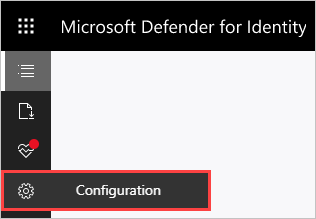
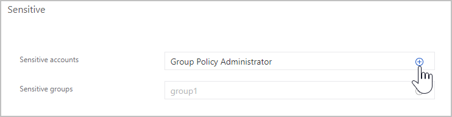

# Classic portal: Manage sensitive or honeytoken accounts

[!INCLUDE [automatic-redirect](../includes/automatic-redirect.md)]

This article explains how to apply entity tags to sensitive accounts. This is important because some Defender for Identity detections, such as sensitive group modification detection and lateral movement path rely on an entity's sensitivity status.

Defender for Identity also enables the configuration of honeytoken accounts, which are used as traps for malicious actors - any authentication associated with these honeytoken accounts (normally dormant), triggers an alert.

## Sensitive entities

The following list of groups are considered **Sensitive** by Defender for Identity. Any entity that is a member of one of these Active Directory groups (including nested groups and their members) is automatically considered sensitive:

- Administrators
- Power Users
- Account Operators
- Server Operators
- Print Operators
- Backup Operators
- Replicators
- Network Configuration Operators
- Incoming Forest Trust Builders
- Domain Admins
- Domain Controllers
- Group Policy Creator Owners
- Read-only Domain Controllers
- Enterprise Read-only Domain Controllers
- Schema Admins
- Enterprise Admins
- Microsoft Exchange Servers

  > [!NOTE]
  > Until September, 2018, Remote Desktop Users were also automatically considered sensitive by Defender for Identity. Remote Desktop entities or groups added after this date are no longer automatically marked as sensitive while Remote Desktop entities or groups added before this date may remain marked as Sensitive. This Sensitive setting can now be changed manually.

In addition to these groups, Defender for Identity identifies the following high value asset servers and automatically tags them as **Sensitive**:

- Certificate Authority Server
- DHCP Server
- DNS Server
- Microsoft Exchange Server

## Manually tagging entities

You can also manually tag entities as sensitive or honeytoken accounts. If you manually tag additional users or groups, such as board members, company executives, and sales directors, Defender for Identity will consider them sensitive.

### To manually tag entities

To tag entities, do the following:

1. In the Defender for Identity portal, select **Configuration**.

    

1. Under **Detection**, select **Entity tags**.

    

1. For each account that you want to configure, do the following:
    1. Under **Honeytoken accounts** or **Sensitive**, enter the account name.
    1. Click the plus icon **(+)**.

    > [!TIP]
    > The sensitive or honeytoken account field is searchable and will autofill with entities in your network.

    

1. Click **Save**.

## See also

- [Working with suspicious activities](/defender-for-identity/manage-security-alerts)
- [Check out the Defender for Identity forum!](<https://aka.ms/MDIcommunity>)
