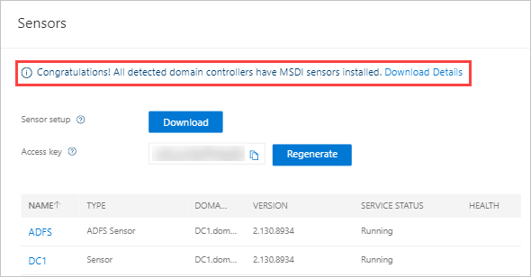
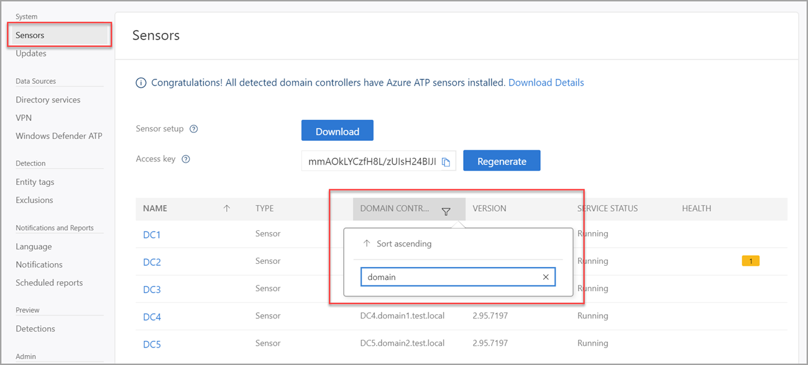

# Classic portal: Monitoring your domain controller coverage

[!INCLUDE [automatic-redirect](../includes/automatic-redirect.md)]

As soon as the first Microsoft Defender for Identity sensor is installed and configured on any domain controller in your network, Defender for Identity begins monitoring your environment for domain controllers.

Once a Defender for Identity sensor is installed and configured on a domain controller in your network, the sensor communicates with the Defender for Identity service on a constant basis sending sensor status, health and version information, and collected Active Directory events and changes.

## Domain controller status

Defender for Identity continuously monitors your environment for unmonitored domain controllers introduced into your environment, and reports on them to assist you in managing full coverage of your environment.

1. To check the status of your detected monitored and unmonitored domain controllers and their status, go to the **Configuration** area of the Defender for Identity portal and, under the **System** section, select **Sensors**.

    

1. Your currently monitored and unmonitored domain controllers are displayed at the top of the screen. To download the monitoring status details of your domain controllers, select **Download Details**.

The domain controller coverage Excel download provides the following information for all detected domain controllers in your organization:

|Title|Description|
|----|----|
|Hostname|Computer name|
|Domain name|Domain name|
|Monitored|Defender for Identity monitoring status|
|Sensor type|Defender for Identity sensor or Defender for Identity standalone sensor|
|Organizational unit|Location inside of Active Directory |
|Operating system version| Version of operating system detected|
|IP address|Detected IP address|

## Search domain controllers

Managing your fleet of sensors and domain controllers can be challenging. To make it easier to find and identify, domain controllers can be searched using the search feature in Defender for Identity Sensors list.

1. To search your domain controllers, go to the **Configuration** area of the Defender for Identity portal and, under the **System** section, select **Sensors**.
1. Select the filter option on the **domain controller** column in the domain controller table list.
1. Enter the name you wish to search. Wildcards are not currently supported in the search field.

    

> [!NOTE]
> Defender for Identity portal configuration pages can be modified by Defender for Identity admins only.

## See Also

- [Defender for Identity Architecture](architecture.md)
- [Configuring Defender for Identity sensors](/defender-for-identity/configure-sensor-settings)
- [Multi-forest support](multi-forest.md)
- [Check out the Defender for Identity forum!](<https://aka.ms/MDIcommunity>)
