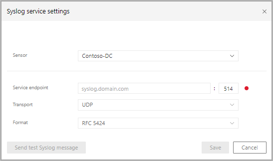

# Classic portal: Integrate with Syslog

[!INCLUDE [automatic-redirect](../includes/automatic-redirect.md)]

Microsoft Defender for Identity can notify you when it detects suspicious activities by sending security and health alerts to your Syslog server through a nominated sensor.

> [!NOTE]
> To learn how to integrate Defender for Identity with Microsoft Sentinel, see [Microsoft 365 Defender integration with Microsoft Sentinel](/azure/sentinel/microsoft-365-defender-sentinel-integration).

Once you enable Syslog notifications, you can set the following:

|Field|Description|
|---------|---------------|
|sensor|Select a designated sensor to be responsible for aggregating all the Syslog events and forwarding them to your SIEM server.|
|Service endpoint|IP address or DNS name of the Syslog server and optionally change the port number (default 514).  You can configure only one Syslog endpoint.|
|Transport|Can be UDP, TCP, or TLS (Secured Syslog)|
|Format|This is the format that Defender for Identity uses to send events to the SIEM server - either RFC 5424 or RFC 3164.|

1. Before configuring Syslog notifications, work with your SIEM admin to find out the following information:

    - FQDN or IP address of the SIEM server
    - Port on which the SIEM server is listening
    - What transport to use: UDP, TCP, or TLS (Secured Syslog)
    - Format in which to send the data RFC 3164 or 5424

1. Open the Defender for Identity portal.
1. Click **Settings**.
1. From the **Notifications and Reports** submenu, select **Notifications**.
1. From the **Syslog Service** option, click **Configure**.
1. Select the **Sensor**.
1. Enter the **Service endpoint** URL.
1. Select the **Transport** protocol (TCP or UDP).
1. Select the format (RFC 3164 or RFC 5424).
1. Select **Send test Syslog message** and then verify the message is received in your Syslog infrastructure solution.
1. Click **Save**.

To review or modify your Syslog settings.

1. Click **Notifications**, and then, under **Syslog notifications** click **Configure** and enter the following information:

    

1. You can select which events to send to your Syslog server. Under **Syslog notifications**, specify which notifications should be sent to your Syslog server - new security alerts, updated security alerts, and new health issues.

> [!NOTE]
>
> - If you plan to create automation or scripts for Defender for Identity SIEM logs, we recommend using the **externalId** field to identify the alert type instead of using the alert name for this purpose. Alert names may occasionally be modified, while the **externalId** of each alert is permanent. For more information, see [Defender for Identity SIEM log reference](cef-format-sa.md).
>
> - When working with Syslog in TLS mode, make sure to install the required certificates on the designated sensor.

## See Also

- [Working with sensitive accounts](/defender-for-identity/entity-tags)
- [Check out the Defender for Identity forum!](<https://aka.ms/MDIcommunity>)
