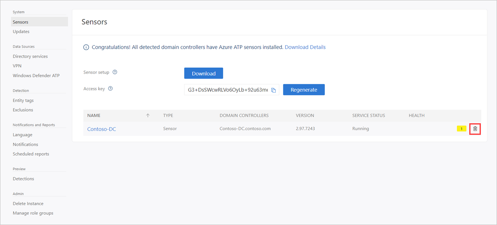

# Classic portal: Uninstall the Microsoft Defender for Identity sensor

[!INCLUDE [automatic-redirect](../includes/automatic-redirect.md)]

This article describes how to uninstall the Microsoft Defender for Identity sensor from domain controllers for the following scenarios:

1. Uninstall a sensor from a domain controller
1. Remove an orphaned sensor
1. Remove a duplicate sensor

## Uninstall a sensor from a domain controller

The following steps describe how to uninstall a sensor from a domain controller.

1. Sign in to the domain controller with local administrator privileges.
1. From the Windows **Start** menu, select **Settings** > **Control Panel** > **Add/ Remove Programs**.
1. Select the sensor installation, select **Uninstall**, and follow the instructions to remove the sensor.

> [!IMPORTANT]
> We recommend removing the sensor from the domain controller before demoting the domain controller.

## Remove an orphaned sensor

This scenario can occur when a domain controller was deleted without first uninstalling the sensor, and the sensor still appears in the Defender for Identity portal.

1. In the Defender for Identity portal, go to **Configuration** and under the **System** section, select **Sensors**.
1. Locate the orphaned sensor and, at the end of the row, select **Delete** (trash can icon).

    

## Remove a duplicate sensor

This scenario may occur after an in-place sensor upgrade, and the sensor appears twice in the Defender for Identity portal.

1. In the Defender for Identity portal, go to **Configuration** and under the **System** section, select **Sensors**.
1. Locate the orphaned sensor and, at the end of the row, select **Delete** (trash can icon).

## See Also

- [Uninstall the Defender for Identity sensor silently](/defender-for-identity/install-sensor#uninstall-the-defender-for-identity-sensor-silently)
