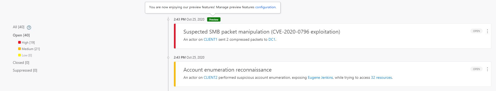
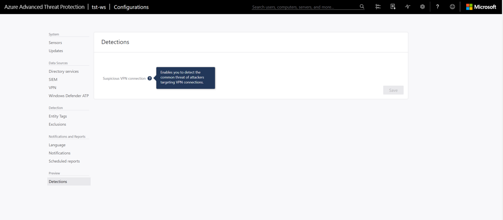

# Classic portal: Working with Security Alerts

> [!NOTE]
> The experience described in this page can also be accessed at <https://security.microsoft.com> as part of Microsoft 365 Defender. The supporting documents for the new experience can be found [here](/microsoft-365/security/defender-identity/manage-security-alerts). For more information about Microsoft Defender for Identity and when other features will be available in Microsoft 365 Defender, see [Microsoft Defender for Identity in Microsoft 365 Defender](defender-for-identity-in-microsoft-365-defender.md).

This article explains the basics of how to work with [!INCLUDE [Product long](includes/product-long.md)] security alerts.

## Review security alerts on the attack timeline

After logging in to the [!INCLUDE [Product short](includes/product-short.md)] portal, you're automatically taken to the open **Security Alerts Timeline**. Security alerts are listed in chronological order, with the newest alert on the top of the timeline.

Each security alert has the following information:

- Entities involved, including users, computers, servers, domain controllers, and resources.

- Times and time frame of the suspicious activities that initiated the security alert.
- Severity of the alert: High, Medium, or Low.
- Status: Open, closed, or suppressed.
- Ability to:
  - Share the security alert with other people in your organization via email.
  - Download the security alert in Excel format.

> [!NOTE]
>
> - When you hover your mouse over a user or computer, a mini entity profile is displayed. The mini-profile provides additional information about the entity and includes the number of security alerts that the entity is linked to.
> - Clicking on an entity, takes you to the entity profile of the user or computer.

] security alerts timeline image](media/sa-timeline.png)

## Security alert categories

[!INCLUDE [Product short](includes/product-short.md)] security alerts are divided into the following categories or phases, like the phases seen in a typical cyber-attack kill chain.

- [Reconnaissance alerts](reconnaissance-alerts.md)
- [Compromised credential alerts](compromised-credentials-alerts.md)
- [Lateral movement alerts](lateral-movement-alerts.md)
- [Domain dominance alerts](domain-dominance-alerts.md)
- [Exfiltration alerts](exfiltration-alerts.md)

## Preview detections

The [!INCLUDE [Product short](includes/product-short.md)] research team constantly works on implementing new detections for newly discovered attacks. Because [!INCLUDE [Product short](includes/product-short.md)] is a cloud service, new detections are released quickly to enable [!INCLUDE [Product short](includes/product-short.md)] customers to benefit from new detections as soon as possible.

These detections are tagged with a preview badge, to help you identify the new detections and know that they are new to the product. If you turn off preview detections, they will not be displayed in the [!INCLUDE [Product short](includes/product-short.md)] console - not in the timeline or in entity profiles - and new alerts won't be opened.

By default, preview detections are enabled in [!INCLUDE [Product short](includes/product-short.md)].

To disable preview detections:

1. In the [!INCLUDE [Product short](includes/product-short.md)] console, select **Configuration**.
1. In the left menu, under **Preview**, click **Detections**.
1. Use the slider to turn the preview detections on and off.

## Filter security alerts list

To filter the security alert list:

1. In the **Filter by** pane on the left side of the screen, select one of the following options: **All**, **Open**, **Closed**, or **Suppressed**.

1. To further filter the list, select **High**, **Medium**, or **Low**.

**Suspicious activity severity**

- **Low**

    Indicates activities that can lead to attacks designed for malicious users or software to gain access to organizational data.

- **Medium**

    Indicates activities that can put specific identities at risk for more severe attacks that could result in identity theft or privileged escalation

- **High**

    Indicates activities that can lead to identity theft, privilege escalation, or other high-impact attacks

## Managing security alerts

You can change the status of a security alert by clicking the current status of the security alert and selecting one of the following **Open**, **Suppressed**, **Closed**, or **Deleted**.
To do this, click the three dots at the top right corner of a specific alert to reveal the list of available actions.

] Actions for security alerts](media/sa-actions.png)

**Security alert status**

- **Open**: All new security alerts appear in this list.

- **Close**: Is used to track security alerts that you identified, researched, and fixed for mitigated.

- **Suppress**: Suppressing an alert means you want to ignore it for now, and only be alerted again if there's a new instance. This means that if there's a similar alert [!INCLUDE [Product short](includes/product-short.md)] doesn't reopen it. But if the alert stops for seven days, and is then seen again, a new alert is opened.

- **Delete**: If you Delete an alert, it is deleted from the system, from the database and you will NOT be able to restore it. After you click delete, you'll be able to delete all security alerts of the same type.

- **Exclude**: The ability to exclude an entity from raising more of a certain type of alerts. For example, you can set [!INCLUDE [Product short](includes/product-short.md)] to exclude a specific entity (user or computer) from alerting again for a certain type of activity, such as a specific admin who runs remote code or a security scanner that does DNS reconnaissance. In addition to being able to add exclusions directly on the security alert as it is detected in the time line, you can also go to the Configuration page to **Exclusions**, and for each security alert you can manually add and remove excluded entities or subnets (for example for Pass-the-Ticket).

> [!NOTE]
> The configuration pages can only be modified by [!INCLUDE [Product short](includes/product-short.md)] admins.

## See Also

- [Working with the [!INCLUDE [Product short](includes/product-short.md)] portal](workspace-portal.md)
- [Check out the [!INCLUDE [Product short](includes/product-short.md)] forum!](<https://aka.ms/MDIcommunity>)

## Learn more

- Try our interactive guide: [Detect suspicious activities and potential attacks with Microsoft Defender for Identity](https://mslearn.cloudguides.com/guides/Detect%20suspicious%20activities%20and%20potential%20attacks%20with%20Microsoft%20Defender%20for%20Identity)
