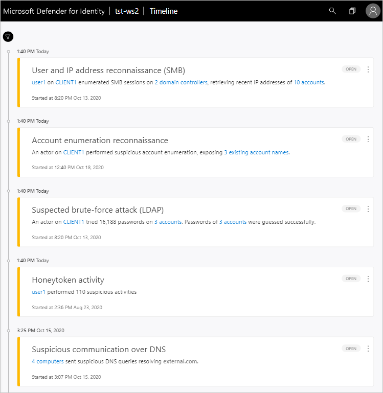
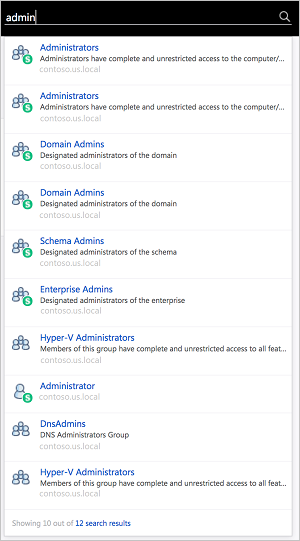
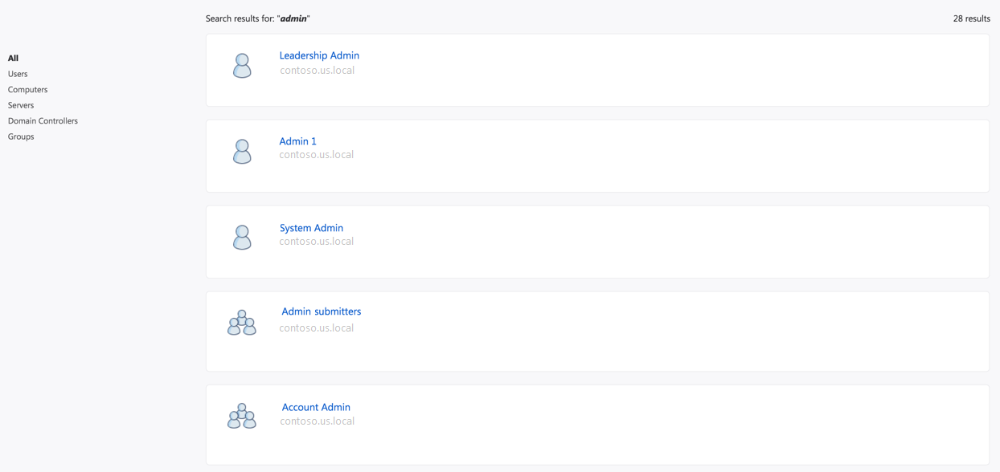
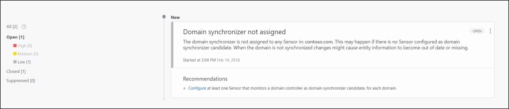
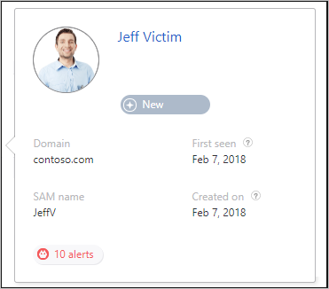

# Classic portal: Working with the Microsoft Defender for Identity portal

[!INCLUDE [automatic-redirect](../includes/automatic-redirect.md)]
 
Use the Microsoft Defender for Identity portal to monitor and respond to suspicious activity detected by Defender for Identity.

Typing the `?` key provides keyboard shortcuts for Defender for Identity portal accessibility.

The Defender for Identity portal provides a quick view of all suspicious activities in chronological order. It enables you to drill into details of any activity and perform actions based on those activities. The Defender for Identity portal also displays alerts and notifications to highlight problems seen by Defender for Identity or new activities that are deemed suspicious.

This article describes how to work with the key elements of the Defender for Identity portal.

## Enabling access to the Defender for Identity portal

To successfully log in to the Defender for Identity portal, you have to log in with a user assigned to an Azure Active Directory security group with access to the Defender for Identity portal.
For more information about role-based access control (RBAC) in Defender for Identity, see [Working with Defender for Identity role groups](role-groups.md).

## Logging into the Defender for Identity portal

1. You can enter the Defender for Identity portal either by logging in to the portal [https://portal.atp.azure.com](https://portal.atp.azure.com) and selecting your instance, or browsing to the instance URL: `https://*instancename*.atp.azure.com`.

1. Defender for Identity supports single sign-on integrated with Windows authentication - if you've already logged on to your computer, Defender for Identity uses that token to log you into the Defender for Identity portal. You can also log in using a smartcard. Your permissions in Defender for Identity correspond with your [administrator role](role-groups.md).

   > [!NOTE]
   > Make sure to log on to the computer from which you want to access the Defender for Identity portal using your Defender for Identity admin username and password. Alternatively, run your browser as a different user or log out of Windows and log on with your Defender for Identity admin user. Unlike the Defender for Identity portal, the new [Defender for Cloud Apps portal](https://portal.cloudappsecurity.com) offers multi-user login and requires no additional license to use with Defender for Identity.

### Attack time line

The Attack time line is the default landing page you are taken to when you log in to the Defender for Identity portal. By default, all open suspicious activities are shown on the attack time line. You can filter the attack time line to show All, Open, Dismissed or Suppressed suspicious activities. You can also see the severity assigned to each activity.

For more information, see [Working with security alerts](/defender-for-identity/classic-working-with-suspicious-activities).

### What's new

After a new version of Defender for Identity is released, the **What's new** window appears in the top right to let you know what was added in the latest version. It also provides you with a link to the version download.

### Filtering panel

You can filter which suspicious activities are displayed in the attack time line or displayed in the entity profile suspicious activities tab based on Status and Severity.

### Search bar

In the top menu, you can find a search bar. You can search for a specific user, computer, or groups in Defender for Identity. To give it a try, just start typing. At the bottom of the search bar, the number of search results found is indicated.

If you click the number, you can access the search results page in which you can filter results by entity type for further investigation.

### Health center

The Health center provides you with alerts when something isn't working properly in your Defender for Identity instance.

Any time your system encounters a problem, such as a connectivity error or a disconnected Defender for Identity standalone sensor, the Health Center icon lets you know by displaying a red dot.

### Sensitive groups

For information on sensitive groups in Defender for Identity, see [Working with sensitive groups](/defender-for-identity/classic-manage-sensitive-honeytoken-accounts).

### Mini profile

If you hover your mouse over an entity, anywhere in the Defender for Identity portal where there is a single entity presented, such as a user, or a computer, a mini profile automatically opens displaying the following information, if available and relevant:

- Name
- Title
- Department
- AD tags
- Email
- Office
- Phone number
- Domain
- SAM name
- Created on – When the entity was created in the Active Directory. If was created before Defender for Identity started monitoring, it will not be displayed.
- First seen – The first time Defender for Identity observed an activity from this entity.
- Last seen - The last time Defender for Identity observed an activity from this entity.
- SA badge - Is displayed if there are suspicious activities associated with this entity.
- WD ATP badge- Will be displayed if there are suspicious activities in Microsoft Defender for Endpoint associated with this entity.
- Lateral movement paths badge - Will be displayed if there have been lateral movement paths detected for this entity within the last two days.

## See Also

- [Creating Defender for Identity instances](/defender-for-identity/classic-install-step1)
- [Check out the Defender for Identity forum!](<https://aka.ms/MDIcommunity>)
