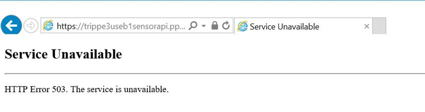
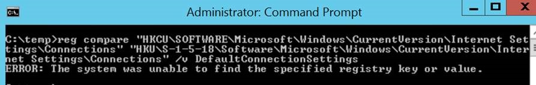
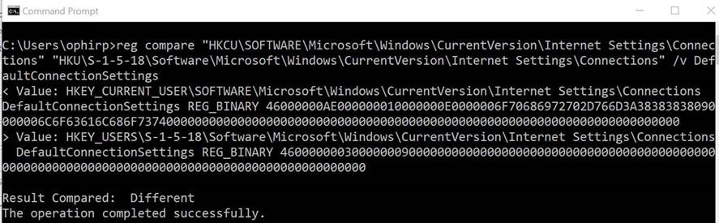

---
# required metadata

title: Configure your proxy or firewall to enable Azure ATP communication with the sensor | Microsoft Docs
description: Describes how to set up your firewall or proxy to allow communication between the Azure ATP cloud service and Azure ATP sensors
keywords:
author: rkarlin
ms.author: rkarlin
manager: mbaldwin
ms.date: 3/3/2018
ms.topic: get-started-article
ms.prod:
ms.service: azure-advanced-threat-protection
ms.technology:
ms.assetid: 9c173d28-a944-491a-92c1-9690eb06b151

# optional metadata

#ROBOTS:
#audience:
#ms.devlang:
ms.reviewer: itargoet
ms.suite: ems
#ms.tgt_pltfrm:
#ms.custom:

---

*Applies to: Azure Advanced Threat Protection*

# Configure your proxy to allow communication between Azure ATP sensors and the Azure ATP cloud service

For your Domain Controllers to communicate with the cloud service, you must open: *.atp.azure.com port 443 in your firewall or proxy. The configuration needs to be at the machine level (=machine account) and not at the user account level. You can test your configuration using the following steps:
 
1.	Confirm that the **current user** has access to the processor endpoint using IE, by browsing to the following URL from the DC: 
https://triprd1wcuse1sensorapi.eastus.cloudapp.azure.com (for US), you should get error 503:

 
 
2.	If you do not get an error 503, review the proxy configuration and try again.

3.	If the proxy configuration works for the **CURRENT_USER** (that is, you see the 503 error) then, check if the WinInet proxy settings are enabled for the **LOCAL_SYSTEM** account (used by the sensor updater service) by running the following command in elevated command prompt:
 
    reg compare "HKCU\SOFTWARE\Microsoft\Windows\CurrentVersion\Internet Settings\Connections" "HKU\S-1-5-18\Software\Microsoft\Windows\CurrentVersion\Internet Settings\Connections" /v DefaultConnectionSettings

If you get the error “ERROR: The system was unable to find the specified registry key or value.” this means that no proxy has been set on the **LOCAL_SYSTEM** level
 
 

If the result is “Result Compared: Different” this means that proxy is set for the **LOCAL_SYSTEM** but it is not the same as the **CURRENT_USER**:
 
  

5.	If the **LOCAL_SYSTEM** does not have the correct proxy settings (either not configured or different from the **CURRENT_USER**), then you may need to copy the proxy setting from the **CURRENT_USER** to the **LOCAL_SYSTEM**. Make sure to back up this registry key before you modify it:

 Current user key:
    HKCU\SOFTWARE\Microsoft\Windows\CurrentVersion\Internet Settings\Connections\DefaultConnectionSettings”
 Local system key:
    HKU\S-1-5-18\Software\Microsoft\Windows\CurrentVersion\Internet Settings\Connections\DefaultConnectionSettings”

 
6.	Complete steps 4 & 5 for the**Local_Service** account (it is the same as **Local_System** but should be S-1-5-19 instead of S-1-5-18.

## See Also
- [Configure event forwarding](configure-event-forwarding.md)
- [Check out the ATP forum!](https://aka.ms/azureatpcommunity)