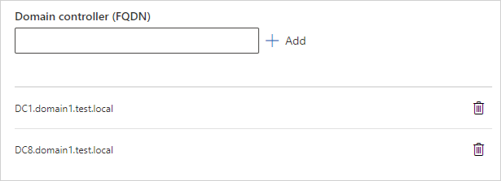

# Configure Microsoft Defender for Identity sensor settings

In this article, you'll learn how to correctly configure [!INCLUDE [Product long](includes/product-long.md)] sensor settings to start seeing data. You'll need to do additional configuration and integration to take advantage of [!INCLUDE [Product short](includes/product-short.md)]'s full capabilities.

## View and configure sensor settings

After the [!INCLUDE [Product short](includes/product-short.md)] sensor is installed, do the following to view and configure [!INCLUDE [Product short](includes/product-short.md)] sensor settings.

1. In [Microsoft 365 Defender](https://security.microsoft.com), go to **Settings** and then **Identities**.

   :::image type="content" source="media/settings-identities.png" alt-text="The option of Identities on the Settings page" lightbox="media/settings-identities.png":::

1. Select the **Sensors** page, which displays all of your Defender for Identity sensors. For each sensor, you'll see its name, its domain membership, the version number, if updates should be delayed, the service status, sensor status, health status, the number of health issues, and when the sensor was created.

    

1. If you select **Filters**, you can choose which filters will be available. Then with each filter, you can choose which sensors to display.

    

    :::image type="content" source="media/filtered-sensor.png" alt-text="The Filtered sensor" lightbox="media/filtered-sensor.png":::

1. If you select one of the sensors, a pane will display with information about the sensor and its health status.

    

1. If you select **Manage sensor**, a pane will open where you can configure the sensor details.

   :::image type="content" source="media/manage-sensor.png" alt-text="The Manage sensor option" lightbox="media/manage-sensor.png":::

   :::image type="content" source="media/configure-sensor-details.png" alt-text="The page on which you configure settings for the sensor" lightbox="media/configure-sensor-details.png":::

    You can configure the following sensor details:

    - **Description**: Enter a description for the [!INCLUDE [Product short](includes/product-short.md)] sensor (optional).
    - **Domain Controllers (FQDN)**: This is required for the [!INCLUDE [Product short](includes/product-short.md)] standalone and AD FS sensors. (It can't be changed for the [!INCLUDE [Product short](includes/product-short.md)] sensor.) Enter the complete FQDN of your domain controller and select the plus sign to add it to the list. For example,  **DC1.domain1.test.local**.

      

    The following information applies to the servers you enter in the **Domain Controllers** list:
    - All domain controllers whose traffic is being monitored via port mirroring by the [!INCLUDE [Product short](includes/product-short.md)] standalone sensor must be listed in the **Domain Controllers** list. If a domain controller isn't listed in the **Domain Controllers** list, detection of suspicious activities might not function as expected.
    - At least one domain controller in the list should be a global catalog. This enables [!INCLUDE [Product short](includes/product-short.md)] to resolve computer and user objects in other domains in the forest.

    - **Capture Network adapters** (required):

    - For [!INCLUDE [Product short](includes/product-short.md)] sensors, all network adapters that are used for communication with other computers in your organization.
    - For [!INCLUDE [Product short](includes/product-short.md)] standalone sensor on a dedicated server, select the network adapters that are configured as the destination mirror port. These network adapters receive the mirrored domain controller traffic.

1. In the **Sensors** page, you can export your list of sensors to a .csv file by selecting **Export**.

   :::image type="content" source="media/export-sensors.png" alt-text="The Export list of sensors" lightbox="media/export-sensors.png":::

## Validate installations

To validate that the [!INCLUDE [Product short](includes/product-short.md)] sensor has been successfully deployed, check the following:

1. Check that the service named **Azure Advanced Threat Protection sensor** is running. After you save the [!INCLUDE [Product short](includes/product-short.md)] sensor settings, it might take a few seconds for the service to start.

1. If the service doesn't start, review the "Microsoft.Tri.sensor-Errors.log" file located in the following default folder, "%programfiles%\Azure Advanced Threat Protection sensor\Version X\Logs".

    >[!NOTE]
    > The version of [!INCLUDE [Product short](includes/product-short.md)] updates frequently, to check the latest version, in the [!INCLUDE [Product short](includes/product-short.md)] portal, go to **Configuration** and then **About**.

1. Go to your [!INCLUDE [Product short](includes/product-short.md)] instance URL. In the [!INCLUDE [Product short](includes/product-short.md)] portal, search for something in the search bar, such as a user or group on your domain.

1. Verify [!INCLUDE [Product short](includes/product-short.md)] connectivity on any domain device using the following steps:
    1. Open a command prompt
    1. Type `nslookup`
    1. Type **server** and the FQDN or IP address of the domain controller where the [!INCLUDE [Product short](includes/product-short.md)] sensor is installed. For example,
    `server contosodc.contoso.azure`
    1. Type `ls -d contoso.azure`
        - Make sure to replace contosodc.contoso.azure and contoso.azure with the FQDN of your [!INCLUDE [Product short](includes/product-short.md)] sensor and domain name respectively.
    1. Repeat steps 3 and 4 for each sensor you wish to test.
    1. From the [!INCLUDE [Product short](includes/product-short.md)] console, open the entity profile for the computer you ran the connectivity test from.
    1. Check the related logical activity and confirm connectivity.

    > [!NOTE]
    >If the domain controller you wish to test is your first deployed sensor, wait at least 15 minutes to allow the database backend to finish initial deployment of the necessary microservices before you attempt to verify the related logical activity for that domain controller.

## Related videos

- [Microsoft Defender for Identity settings](https://www.microsoft.com/videoplayer/embed/RWFVEX)

## Next steps

Now that you've configured the initial configuration steps, you can configure more settings. Go to any of the pages below for more information:

- [Updating your sensors](sensor-settings.md#updating-your-sensors)
- [Set entity tags: sensitive, honeytoken, and Exchange server](entity-tags.md)
- [Configure detection exclusions](exclusions.md)
- [Configure notifications: health issues, alerts, and Syslog](notifications.md)
