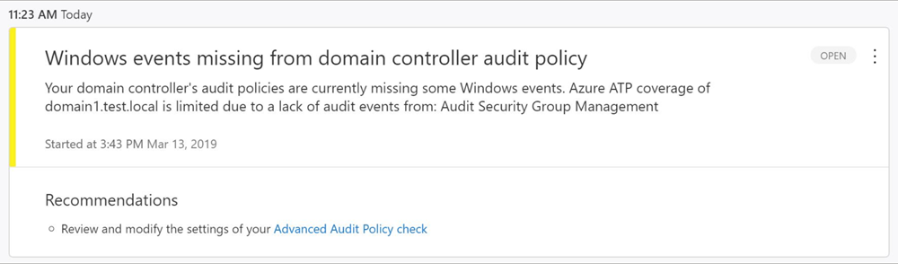
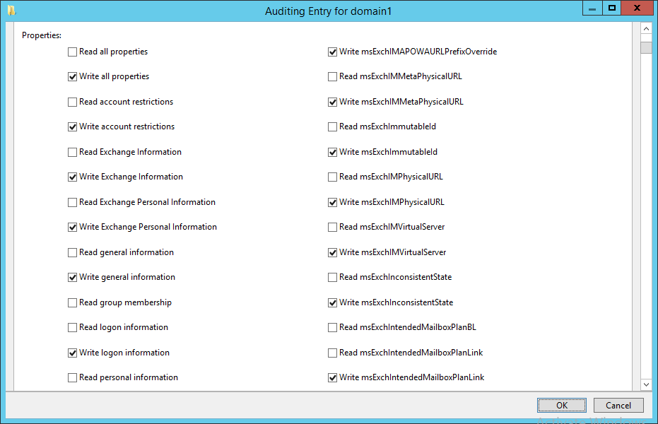

# Configure Windows Event collection

[!INCLUDE [Product long](includes/product-long.md)] detection relies on specific Windows Event log entries to enhance some detections and provide additional information on who performed specific actions such as NTLM logons, security group modifications, and similar events. For the correct events to be audited and included in the Windows Event Log, your domain controllers require accurate Advanced Audit Policy settings. Incorrect Advanced Audit Policy settings can lead to the required events not being recorded in the Event Log and result in incomplete [!INCLUDE [Product short](includes/product-short.md)] coverage.

To enhance threat detection capabilities, [!INCLUDE [Product short](includes/product-short.md)] needs the following Windows Events to be [configured](#configure-audit-policies) and [collected](#configure-event-collection) by [!INCLUDE [Product short](includes/product-short.md)]:

## Relevant Windows Events

### For Active Directory Federation Services (AD FS) events

- 1202 - The Federation Service validated a new credential
- 1203 - The Federation Service failed to validate a new credential
- 4624 - An account was successfully logged on
- 4625 - An account failed to log on

### For other events

- 4662 - An operation was performed on an object
- 4726 - User Account Deleted
- 4728 - Member Added to Global Security Group
- 4729 - Member Removed from Global Security Group
- 4730 - Global Security Group Deleted
- 4732 - Member Added to Local Security Group
- 4733 - Member Removed from Local Security Group
- 4741 - Computer Account Added
- 4743 - Computer Account Deleted
- 4753 - Global Distribution Group Deleted
- 4756 - Member Added to Universal Security Group
- 4757 - Member Removed from Universal Security Group
- 4758 - Universal Security Group Deleted
- 4763 - Universal Distribution Group Deleted
- 4776 - Domain Controller Attempted to Validate Credentials for an Account (NTLM)
- 7045 - New Service Installed
- 8004 - NTLM Authentication

## Configure audit policies

Modify the Advanced Audit Policies of your domain controller using the following instructions:

1. Log in to the server as **Domain Administrator**.
1. Open the Group Policy Management Editor from **Server Manager** > **Tools** > **Group Policy Management**.
1. Expand the **Domain Controllers Organizational Units**, right-click  **Default Domain Controllers Policy**, and then select **Edit**.

    > [!NOTE]
    > You can use the Default Domain Controllers Policy or a dedicated GPO to set these policies.

    

1. From the window that opens, go to **Computer Configuration** > **Policies** > **Windows Settings** > **Security Settings** and depending on the policy you want to enable, do the following:

    **For Advanced Audit Policy Configuration**

    1. Go to **Advanced Audit Policy Configuration** > **Audit Policies**.
        
    1. Under **Audit Policies**, edit each of the following policies and select **Configure the following audit events** for both **Success** and **Failure** events.

        | Audit policy | Subcategory | Triggers event IDs |
        | --- |---|---|
        | Account Logon | Audit Credential Validation | 4776 |
        | Account Management | Audit Computer Account Management | 4741, 4743 |
        | Account Management | Audit Distribution Group Management | 4753, 4763 |
        | Account Management | Audit Security Group Management | 4728, 4729, 4730, 4732, 4733, 4756, 4757, 4758 |
        | Account Management | Audit User Account Management | 4726 |
        | DS Access | Audit Directory Service Access | 4662 - For this event, it's also necessary to [Configure object auditing](#configure-object-auditing).  |
        | System | Audit Security System Extension | 7045 |

        For example, to configure **Audit Security Group Management**, under **Account Management**, double-click **Audit Security Group Management**, and then select **Configure the following audit events** for both **Success** and **Failure** events.

        

1. From an elevated command prompt type `gpupdate /force`.

1. After applying via GPO, the new events are visible under your **Windows Event logs**.

> [!NOTE]
> If you choose to use a local security policy instead of using a group policy, make sure to add the **Account Logon**, **Account Management**, and **Security Options** audit logs in your local policy. If you are configuring the advanced audit policy, make sure to force the [audit policy subcategory](/windows/security/threat-protection/security-policy-settings/audit-force-audit-policy-subcategory-settings-to-override).

### Event ID 8004

To audit Event ID 8004, additional configuration steps are required.

> [!NOTE]
>
> - Domain group policies to collect Windows Event 8004 should **only** be applied to domain controllers.
> - When Windows Event 8004 is parsed by [!INCLUDE [Product short](includes/product-short.md)] Sensor, [!INCLUDE [Product short](includes/product-short.md)] NTLM authentications activities are enriched with the server accessed data.

1. Following the steps above, open **Group Policy Management** and navigate to the **Default Domain Controllers Policy**.
1. Go to **Local Policies** > **Security Options**.
1. Under **Security Options**, configure the specified security policies, as follows

    | Security policy setting | Value |
    |---|---|
    | Network security: Restrict NTLM: Outgoing NTLM traffic to remote servers | Audit all |
    | Network security: Restrict NTLM: Audit NTLM authentication in this domain | Enable all |
    | Network security: Restrict NTLM: Audit Incoming NTLM Traffic | Enable auditing for all accounts |

    For example, to configure **Outgoing NTLM traffic to remote servers**, under **Security Options**, double-click **Network security: Restrict NTLM: Outgoing NTLM traffic to remote servers**, and then select **Audit all**.

    

<!--
## Defender for Identity Advanced Audit Policy check

To make it easier to verify the current status of each of your domain controller's Advanced Audit Policies, [!INCLUDE [Product short](includes/product-short.md)] automatically checks your existing Advanced Audit Policies and issues health alerts for policy settings that require modification. Each health alert provides specific details of the domain controller, the problematic policy as well as remediation suggestions.

Advanced Security Audit Policy is enabled via **Default Domain Controllers Policy** GPO. These audit events are recorded on the domain controller's Windows Events.
-->

## Configure object auditing

To collect 4662 events, it's also necessary to configure object auditing on the user objects. Here's an example for how to enable auditing on all users, groups, and computers in the Active Directory domain, but it can be also scoped by OU (organizational unit):

> [!NOTE]
> It is important to [review and verify your audit policies](#configure-audit-policies) before enabling event collection to ensure that the domain controllers are properly configured to record the necessary events.

1. Go to the **Active Directory Users and Computers** console.
1. Select the domain or OU that contains the users, groups, or computers you want to audit.
1. Right-click the container (the domain or OU) and select **Properties**.

    

1. Go to the **Security** tab, and select **Advanced**.

    

1. In **Advanced Security Settings**, choose the **Auditing** tab. Select **Add**.

    

1. Click **Select a principal**.

    

1. Under **Enter the object name to select**, type **Everyone**. Then select **Check Names**, and select **OK**.

    

1. You'll then return to **Auditing Entry**. Make the following selections:

    - For **Type** select **Success**.
    - For **Applies to** select **Descendant User objects.**
    - Under **Permissions**, scroll down and select **Clear all.** Scroll up and select **Full Control**. All the permissions will be selected. Then uncheck the **List contents**, **Read permissions**, and **Read all properties** permissions. Then select **OK**. This will set all the **Properties** settings to **Write**. Now when triggered, all relevant changes to directory services will appear as 4662 events.

        

        

1. Then repeat the steps above, but for **Applies to**, select **Descendant Group Objects**, and then again for **Descendant Computer Objects**.

### Auditing for specific detections

Some detections require auditing specific Active Directory objects. To do so, follow the steps above, but note the changes below regarding which objects to audit and which permissions to include.

#### Enable auditing on an ADFS object

1. Go to the **Active Directory Users and Computers** console, and choose the domain you want to enable the logs on.
1. Navigate to **Program Data** > **Microsoft** > **ADFS**.

    

1. Right-click **ADFS** and select **Properties**.
1. Go to the **Security** tab, and select **Advanced**.
1. In **Advanced Security Settings**, choose the **Auditing** tab. Select **Add**.
1. Click **Select a principal**.
1. Under **Enter the object name to select**, type **Everyone**. Then select **Check Names**, and select **OK**.
1. You'll then return to **Auditing Entry**. Make the following selections:

    - For **Type** select **All**.
    - For **Applies to** select **This object and all descendant objects**.
    - Under **Permissions**, select **Read all properties** and **Write all properties**.

    

1. Select **OK**.

#### Enable auditing on an Exchange object

1. Open ADSI Edit. To do this, select **Start**, select **Run**, type *ADSIEdit.msc*, and then select **OK**.
1. On the **Action** menu, select **Connect to**.
1. In the **Connection Settings** dialog box under **Select a well known Naming Context**, select **Configuration**, and then select **OK**.
1. Expand the **Configuration** container. Under the **Configuration** container, you'll see the **Configuration** node. It will begin with *“CN=Configuration,DC=..."*
1. Right-click the **Configuration** node and select **Properties**.

    

1. Go to the **Security** tab, and select **Advanced**.
1. In **Advanced Security Settings**, choose the **Auditing** tab. Select **Add**.
1. Click **Select a principal**.
1. Under **Enter the object name to select**, type **Everyone**. Then select **Check Names**, and select **OK**.
1. You'll then return to **Auditing Entry**. Make the following selections:

    - For **Type** select **All**.
    - For **Applies to** select **This object and all descendant objects**.
    - Under **Permissions**, select **Write all properties**.

    

1. Select **OK**.

## Configure event collection

These events can be collected automatically by the [!INCLUDE [Product short](includes/product-short.md)] sensor or, if the [!INCLUDE [Product short](includes/product-short.md)] sensor isn't deployed, they can be forwarded to the [!INCLUDE [Product short](includes/product-short.md)] standalone sensor in one of the following ways:

- [Configure the [!INCLUDE [Product short](includes/product-short.md)] standalone sensor](configure-event-forwarding.md) to listen for SIEM events
- [Configure Windows Event Forwarding](configure-event-forwarding.md)

> [!NOTE]
>
> - [!INCLUDE [Product short](includes/product-short.md)] standalone sensors do not support the collection of Event Tracing for Windows (ETW) log entries that provide the data for multiple detections. For full coverage of your environment, we recommend deploying the [!INCLUDE [Product short](includes/product-short.md)] sensor.

## Next steps

> [!div class="step-by-step"]
> [« Plan capacity for Microsoft Defender for Identity](capacity-planning.md)
> [Directory Service accounts »](directory-service-accounts.md)

