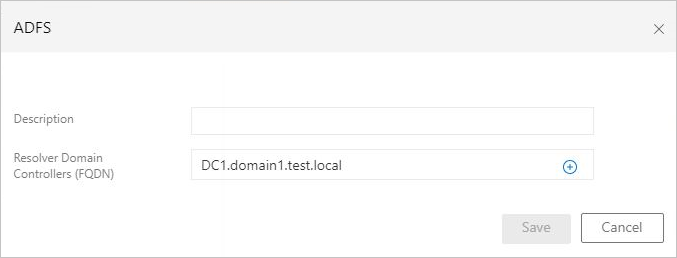

# Deploying Microsoft Defender for Identity on AD FS and AD CS servers

<!--do we need NNR/SAM-R ports open for AD CS sensors?-->
Defender for Identity protects the Active Directory Federation Services (AD FS) in your environment by detecting on-premises attacks against AD FS servers, and protects the Active Directory Certificate Services (AD CS) by detecting on-premises attacks against AD CS servers.

This article describes the additional prerequisites and post-installation steps required when installing Defender for Identity sensors on AD FS or AD CS servers.

For more information, see:

- [Microsoft Defender for Identity prerequisites](prerequisites.md)
- [Install the Microsoft Defender for Identity sensor](install-sensor.md)


> [!NOTE]
> If you use both Defender for Identity and Defender for Endpoint, you must install both sensors on domain controllers or AD FS /AD CS servers to protect both the server and Active Directory.

## Prerequisites

Before you start, make sure to have the following prerequisites, as listed in this section:

- Server specifications
- Network requirements

### Server specifications

The Defender for Identity sensor supports the following AD FS / AD CS servers:

| Operating system | Server with desktop experience | Server core | Nano server |
| ------------------------ | ------------------------------- | ------------ | ------------ |
| Windows Server 2016      | ✔                               | ✔           | ❌           |
| Windows Server 2019      | ✔                               | ✔           | ❌           |
| Windows Server 2022      | ✔                               | ✔           | ❌           |

> [!NOTE]
> The Defender for Identity sensor is supported only on the federation servers. It is not required on the Web Application Proxy (WAP) servers.

For more information, see [Sensor requirements](prerequisites.md#sensor-requirements).

### Network requirements

For sensors running on AD FS / AD CS servers to be able to communicate with the Defender for Identity cloud service, you must open port 443 on your firewalls and proxies to the following endpoint: `<your-workspace-name>sensorapi.atp.azure.com`

For example: *contoso-corpsensorapi.atp.azure.com*

For more information see [Configure endpoint proxy and Internet connectivity settings for your Microsoft Defender for Identity sensor](configure-proxy.md).

## Verbose logging for AD FS / AD CS Windows event logs

Sensors running on AD FS / AD CS servers must have the auditing level set to **Verbose**, tracking the following events: <!--what about ad cs?-->

- 1202 - The Federation Service validated a new credential
- 1203 - The Federation Service failed to validate a new credential
- 4624 - An account was successfully logged on
- 4625 - An account failed to log on

Configure the auditing level to **Verbose**. For example, for AD FS servers, use the following command:

```powershell
Set-AdfsProperties -AuditLevel Verbose
```
For more information, see [Event auditing information for AD FS](/windows-server/identity/ad-fs/troubleshooting/ad-fs-tshoot-logging#event-auditing-information-for-ad-fs-on-windows-server-2016). 

## Read permissions for the AD FS / AD CS database

For sensors running on AD FS / AD CS servers to have access to the AD FS / AD CS database, you need to grant read (*db_datareader*) permissions for the relevant [Directory Services Account](directory-service-accounts.md) configured.

If you have more than one AD FS / AD CS server, make sure to grant this permission across all of them since database permissions are not replicated across servers.

> [!NOTE]
> If the AD FS / AD CS database runs on a dedicated SQL server instead of the local AD FS / AD CSserver, and you're using a group-managed service account (gMSA) as the [Directory Services Account (DSA)](directory-service-accounts.md), make sure that you grant the SQL server the [required permissions](directory-service-accounts.md#grant-permissions-to-retrieve-the-gmsa-accounts-password) to retrieve the gMSA's password. 

### Grant access to the AD FS / AD CS database 
<!--what about ad cs?-->
Grant access to the database using SQL Server Management Studio, TSQL, or PowerShell.

For example, the commands listed below might be helpful if you're using the Windows Internal Database (WID) or an external SQL server.

In these sample codes:

- **[DOMAIN1\triservice]** is the directory services user of the workspace
- **AdfsConfigurationV4** is an example of an AD FS database name, and may vary
- **server=\.\pipe\MICROSOFT##WID\tsql\query** - is the connection string to the database if you are using WID

> [!TIP]
> If you don't know your connection string, follow the steps in the [Windows server documentation](/windows-server/identity/ad-fs/troubleshooting/ad-fs-tshoot-sql#to-acquire-the-sql-connection-string).
>

**To grant the sensor access to the AD FS database using TSQL**:

```tsql
USE [master]
CREATE LOGIN [DOMAIN1\triservice] FROM WINDOWS WITH DEFAULT_DATABASE=[master]
USE [AdfsConfigurationV4]
CREATE USER [DOMAIN1\triservice] FOR LOGIN [DOMAIN1\triservice]
ALTER ROLE [db_datareader] ADD MEMBER [DOMAIN1\triservice]
GRANT CONNECT TO [DOMAIN1\triservice]
GRANT SELECT TO [DOMAIN1\triservice]
GO
```

**To grant the sensor access to the AD FS database using PowerShell**:

```powershell
$ConnectionString = 'server=\\.\pipe\MICROSOFT##WID\tsql\querydatabase=AdfsConfigurationV4;trusted_connection=true;'
$SQLConnection= New-Object System.Data.SQLClient.SQLConnection($ConnectionString)
$SQLConnection.Open()
$SQLCommand = $SQLConnection.CreateCommand()
$SQLCommand.CommandText = @"
USE [master]; 
CREATE LOGIN [DOMAIN1\triservice] FROM WINDOWS WITH DEFAULT_DATABASE=[master];
USE [AdfsConfigurationV4]; 
CREATE USER [DOMAIN1\triservice] FOR LOGIN [DOMAIN1\triservice]; 
ALTER ROLE [db_datareader] ADD MEMBER [DOMAIN1\triservice]; 
GRANT CONNECT TO [DOMAIN1\triservice]; 
GRANT SELECT TO [DOMAIN1\triservice];
"@
$SqlDataReader = $SQLCommand.ExecuteReader()
$SQLConnection.Close()
```

## SQL server permissions

For sensor installations on AD FS servers, configure the SQL server to allow *Directory service* account with the following permissions to the **AdfsConfiguration** database:

- *connect*
- *log in*
- *read*
- *select*

<!--what about ad cs?-->


## Validate successful deployment on an AD FS / AD CS server

To validate that the Defender for Identity sensor has been successfully deployed on an AD FS / AD CS server:

1. Check that the **Azure Advanced Threat Protection sensor** service is running. After you save the Defender for Identity sensor settings, it might take a few seconds for the service to start.

1. If the service doesn't start, review the `Microsoft.Tri.sensor-Errors.log` file, located by default at: `%programfiles%\Azure Advanced Threat Protection sensor\Version X\Logs`

1. Use AD FS / AD CS to authenticate a user to any application, and then verify that the AD FS authentication was observed by Defender for Identity:

   From Microsoft 365 Defender, select **Hunting** > **Advanced Hunting**. For example, in the **Query** pane, enter and run the following query:

   ```query
   IdentityLogonEvents | where Protocol contains 'Adfs'
   ```

   The results pane should include a list of events with a **LogonType** of **Logon with ADFS authentication**. Select a specific row to see additional details in the **Inspect Record** left pane. For example:

   :::image type="content" source="../media/adfs-logon-advanced-hunting.png" alt-text="Screenshot of the results of an AD FS logon advanced hunting query." lightbox="../media/adfs-logon-advanced-hunting.png":::

## Post-installation steps for AD FS / AD CS servers

Installing the sensor on an AD FS / AD CS server automatically selects the closest domain controller. Use the following steps to check or modify the selected domain controller.

1. In [Microsoft 365 Defender](https://security.microsoft.com), go to **Settings**  > **Identities** > **Sensors** to view all of your Defender for Identity sensors.

1. Locate and select the sensor you installed on an AD FS / AD CS server.

1. In the pane that opens, in the **Domain Controller (FQDN)** field, enter the FQDN of the resolver domain controllers. Select **+ Add** to add the FQDN, and then select **Save**.   For example:

    

Initializing the sensor may take a couple of minutes, at which time the AD FS / AD CS sensor service status should change from **stopped** to **running**.


## Related content

For more information, see:

- [Microsoft Defender for Identity prerequisites](prerequisites.md)
- [Install the Microsoft Defender for Identity sensor](install-sensor.md)
- [Configure a Directory Service account for Microsoft Defender for Identity](directory-service-accounts.md)
