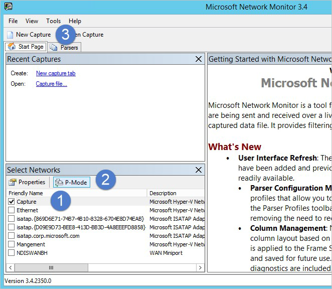

# Configure port mirroring

This article describes port mirroring options for Microsoft Defender for Identity, and is relevant only for standalone sensors. Defender for Identity mainly uses deep packet inspection over network traffic to and from your domain controllers. For Defender for Identity standalone sensors to see network traffic, you must either configure port mirroring, or use a Network TAP. Port mirroring copies the traffic from one port (the source port) to another port (the destination port).

When using port mirroring, configure port mirroring for each domain controller that you're monitoring as the source of your network traffic. We recommend working with your networking or virtualization team to configure port mirroring.

> [!IMPORTANT]
> Defender for Identity standalone sensors do not support the collection of Event Tracing for Windows (ETW) log entries that provide the data for multiple detections. For full coverage of your environment, we recommend deploying the Defender for Identity sensor.
>

## Choose a port mirroring method

Your domain controllers and Defender for Identity standalone sensor can be either physical or virtual. The following are common methods for port mirroring and some considerations. For more information, see your switch or virtualization server product documentation. Your switch manufacturer might use different terminology.

- **Switched Port Analyzer (SPAN)** – Copies network traffic from one or more switch ports to another switch port on the same switch. Both the Defender for Identity standalone sensor and domain controllers must be connected to the same physical switch.

- **Remote Switch Port Analyzer (RSPAN)**  – Allows you to monitor network traffic from source ports distributed over multiple physical switches. RSPAN copies the source traffic into a special RSPAN configured VLAN. This VLAN needs to be trunked to the other switches involved. RSPAN works at Layer 2.

- **Encapsulated Remote Switch Port Analyzer (ERSPAN)** – A Cisco proprietary technology working at Layer 3. ERSPAN allows you to monitor traffic across switches without the need for VLAN trunks and uses generic routing encapsulation (GRE) to copy monitored network traffic.

    Defender for Identity currently cannot directly receive ERSPAN traffic. Instead:

    1. Configure the ERSPAN destination where the traffic is decapsulated as a switch or router that can decapsulate the traffic. 
    1. Configure the switch or router to forward the decapsulated traffic to the Defender for Identity standalone sensor using either SPAN or RSPAN.

> [!NOTE]
> - If the domain controller being port mirrored is connected over a WAN link, make sure the WAN link can handle the additional load of the ERSPAN traffic.
>
> - Defender for Identity only supports traffic monitoring when the traffic reaches the NIC and the domain controller in the same manner. Defender for Identity does not support traffic monitoring when the traffic is broken out to different ports.

## Supported port mirroring options

The following table describes Defender for Identity's support for port mirroring configurations:

|Defender for Identity standalone sensor|Domain controller|Considerations|
|---------------|---------------------|------------------|
|Virtual|Virtual on same host|The virtual switch needs to support port mirroring.  Moving one of the virtual machines to another host by itself may break the port mirroring.|
|Virtual|Virtual on different hosts|Make sure your virtual switch supports this scenario.|
|Virtual|Physical|Requires a dedicated network adapter otherwise Defender for Identity sees all of the traffic coming in and out of the host, even the traffic it sends to the Defender for Identity cloud service.|
|Physical|Virtual|Make sure your virtual switch supports this scenario - and port mirroring configuration on your physical switches based on the scenario:  If the virtual host is on the same physical switch, you need to configure a switch level span.  If the virtual host is on a different switch, you need to configure RSPAN or ERSPAN&#42;.|
|Physical|Physical on the same switch|Physical switch must support SPAN/Port Mirroring.|
|Physical|Physical on a different switch|Requires physical switches to support RSPAN or ERSPAN   ERSPAN is only supported when decapsulation is performed before the traffic is analyzed by Defender for Identity.|

> [!NOTE]
> The time on your domain controllers and the connected Defender for Identity sensor must be synchronized to within 5 minutes of eachother.
>

## Validate port mirroring

After configuring port mirroring, validate that port mirroring is working before installing the Defender for Identity standalone sensor. The Defender for Identity standalone sensor must be able to see the traffic to and from the domain controller.

> [!IMPORTANT]
> This procedure uses Microsoft Network Monitor to validate port mirroring.  If you choose to validate with Wireshark, restart the Defender for Identity standalone sensor service after you finish validating.
>

**To validate port mirroring**:

1. Install [Microsoft Network Monitor 3.4](https://www.microsoft.com/download/details.aspx?id=4865) on the Defender for Identity standalone sensor that you want to validate. <!--is there a newer option? Network Monitor 3.4 is the archive versioned tool for network traffic capture and protocol analysis.i can't even install it anymore to validate this procedure.-->

1. Open Network Monitor and create a new capture tab.

    1. Select only the **Capture** network adapter or the network adapter that is connected to the switch port that is configured as the port mirroring destination.

    1. Ensure that P-Mode is enabled.

    1. Select **New Capture**. For example:

        

1. In your new tab's **Display Filter** area, enter the following filter: **KerberosV5 OR LDAP** and then select **Apply**.

1. Select **Start** to start the capture session. If you do not see traffic to and from the domain controller listed in the **Frame summary** area, review your port mirroring configuration.

    Make sure you see traffic to and from the domain controllers.

1. If you only see traffic in one direction, work with your networking or virtualization teams to help troubleshoot your port mirroring configuration.

## Working with virtualization clusters

If you are working with virtualization clusters:

- **Configure affinity between the domain controller and the Defender for Identity standalone sensor**. This step is irrelevant if your environment supports Virtual to Virtual on different hosts (RSPAN).

    Configure affinity for each domain controller running on the virtualization cluster in a virtual machine with the Defender for Identity standalone sensor. When the domain controller moves to another host in the cluster, the Defender for Identity standalone sensor follows it. This works well when there are a few domain controllers.

- **Ensure proper sensor sizing**. Make sure that the Defender for Identity standalone sensor is properly sized to handle monitoring all of the DCs by themselves:

    1. Install a virtual machine on each virtualization host.
    1. Install a Defender for Identity standalone sensor on each host.
    1. Configure each Defender for Identity standalone sensor to monitor all of the domain controllers that run on the cluster.

    Any host the domain controllers run on is monitored.

## Next step

[Listen for SIEM events on your Defender for Identity standalone sensor](configure-event-collection.md)
