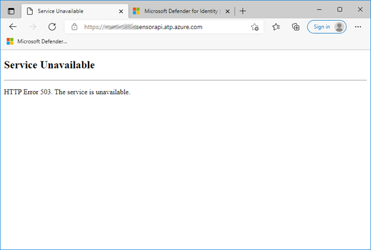
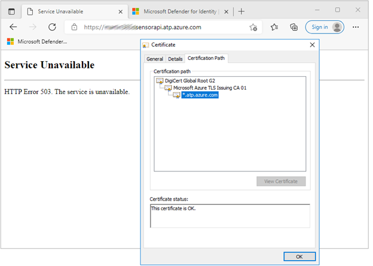

# Configure endpoint proxy and Internet connectivity settings for your Microsoft Defender for Identity sensor

Each Microsoft Defender for Identity sensor requires internet connectivity to the Defender for Identity cloud service to report sensor data and operate successfully. 

In some organizations, the domain controllers aren't directly connected to the internet, but are connected through a web proxy connection, and SSL inspection and intercepting proxies are not supported for security reasons. 

In such cases, your proxy server must allow the data to directly pass from the Defender for Identity sensors to the relevant URLs without interception.

Use the command line, Microsoft Windows Internet (WinINet), or the registry to configure your proxy server. 

We recommend using the command line to ensure that only the Defender for Identity sensor services communicate through the proxy. When you use WinINet or the registry to configure your proxy, other services running in the context as Local System or Local Service will also direct traffic through the proxy.

> [!NOTE]
> Microsoft does not provide a proxy server. This article describes how to ensure that the required URLs are accessible via a proxy server that you configure.

## Configure a proxy server using the command line

Configure your proxy server during sensor installation using the following command-line switches.

### Syntax

`"Azure ATP sensor Setup.exe" [/quiet] [/Help] [ProxyUrl="http://proxy.internal.com"] [ProxyUserName="domain\proxyuser"] [ProxyUserPassword="ProxyPassword"]`

### Switch descriptions

|Name|Syntax|Mandatory for silent installation?|Description|
|-------------|----------|---------|---------|
|**ProxyUrl**|`ProxyUrl="http\://proxy.contoso.com:8080"`|No|Specifies the proxy URL and port number for the Defender for Identity sensor.|
|**ProxyUserName**|`ProxyUserName="Contoso\ProxyUser"`|No|If your proxy service requires authentication, define a user name in the `DOMAIN\user` format.|
|**ProxyUserPassword**|`ProxyUserPassword="P@ssw0rd"`|No|Specifies the password for your  proxy user name.   Credentials are encrypted and stored locally by the Defender for Identity sensor.|

> [!TIP]
> If you've configured a proxy during installation, changing the proxy configuration requires you to remove and install the sensor. Therefore, we recommend creating and using a custom DNS A record for the proxy server, which you can use to change the proxy server's address when needed. 
>
> We also recommend using the *hosts* file for testing.

## Configure a proxy server using WinINet

When configuring the proxy using WinINet, keep in mind that the embedded Defender for Identity sensor service runs in system context using the **LocalService** account, and that the Defender for Identity Sensor updater service runs in the system context using **LocalSystem** account.

- If you use WinHTTP for proxy configuration, you still need to configure Windows Internet (WinINet) browser proxy settings for communication between the sensor and the Defender for Identity cloud service.

- If you're using Transparent proxy or WPAD in your network topology, you don't need to configure WinINet for your proxy.

## Configure a proxy server using the registry

This section describes how to configure a static proxy server manually using a registry-based static proxy. 

> [!IMPORTANT]
> Configuring a proxy via the registry affects all applications that use WinINet with the **LocalService** and **LocalSystem** accounts, including Windows services.
>
>Apply registry changes only to the **LocalService** and **LocalSystem** accounts.
>

To configure your proxy, copy your proxy configuration in user context to the **LocalSystem** and **LocalService** accounts as follows:

1. Back up your registry keys.

1. In the registry, search for the `DefaultConnectionSettings` value as REG_BINARY, under the `HKCU\Software\Microsoft\Windows\CurrentVersion\Internet Settings\Connections\DefaultConnectionSettings` registry key, and copy it.

1. If the LocalSystem doesn't have the correct proxy settings (either they aren't configured or they're different from the Current_User), then copy the proxy setting from the Current_User to the LocalSystem. Under the registry key `HKU\S-1-5-18\Software\Microsoft\Windows\CurrentVersion\Internet Settings\Connections\DefaultConnectionSettings`.

1. Paste the value from the Current_user `DefaultConnectionSettings` as REG_BINARY.

1. If the LocalService doesn't have the correct proxy settings, then copy the proxy setting from the Current_User to the LocalService. Under the registry key `HKU\S-1-5-19\Software\Microsoft\Windows\CurrentVersion\Internet Settings\Connections\DefaultConnectionSettings`.

1. Paste the value from the Current_User `DefaultConnectionSettings` as REG_BINARY.

 

> [!NOTE]

## Enable access to Defender for Identity service URLs in the proxy server

To enable access to Defender for Identity, we require allowing traffic to the following URLs. The URLs automatically map to the correct service location for your Defender for Identity instance.

- `<your-instance-name>sensorapi.atp.azure.com` - for example, `contoso-corpsensorapi.atp.azure.com`

You can also use the IP address ranges in our Azure service tag (**AzureAdvancedThreatProtection**) to enable access to Defender for Identity. For more information about service tags, see [Virtual network service tags](/azure/virtual-network/service-tags-overview).

If you would like to download the "Azure IP Ranges and Service Tags - Public Cloud" file, you can do so [here](https://www.microsoft.com/download/details.aspx?id=56519). For US Government offerings, see [Get started with US Government offerings](../us-govt-gcc-high.md).

> [!NOTE]
>
> - To ensure maximal security and data privacy, Defender for Identity uses certificate based mutual authentication between each Defender for Identity sensor and the Defender for Identity cloud backend. SSL inspection and interception are not supported, as they interfere in the authentication process.
> - Occasionally, the Defender for Identity service IP addresses may change. Therefore, if you manually configure IP addresses or if your proxy automatically resolves DNS names to their IP address and uses them, you should periodically check that the configured IP addresses are still up-to-date.

## Test proxy connectivity

The Defender for Identity sensor requires network connectivity to the Defender for Identity service running in Azure. Most organizations control access to the internet via firewall or proxies.  When using a proxy, you can allow access port 443 via a single URL. For more information about the ports that the Defender for Identity requires, see [Required ports](prerequisites.md#required-ports)

After the proxy has been configured to allow the sensor access to the Defender for Identity service, follow the steps below to confirm that everything is working as expected. This can be done:

- before you deploy the sensor
- if the sensor experiences connectivity issues after being installed

1. Open a browser using the same proxy settings being used by the sensor.

    >[!NOTE]
    >If the proxy settings are defined for **Local System**, you'll need to use PSExec to open a session as **Local System** and open the browser from that session.

1. Browse to the following URL: `https://<your_workspace_name>sensorapi.atp.azure.com.` Replace `<your_workspace_name>` with the name of your Defender for Identity workspace.

    >[!IMPORTANT]
    >You must specify HTTPS, not HTTP, to properly test connectivity.

1. **Result**: You should get an *Error 503 The service is unavailable*, which indicates you were successfully able to route to the Defender for Identity HTTPS endpoint.  This is the desired result.

    

1. If you don't get *Error 503 The service is unavailable*, then you may have a problem with your proxy configuration. Check your network and proxy settings.

1. If you get a certificate error, ensure that you have the required trusted root certificates installed before continuing. For more information, see [Proxy authentication problem presents as a connection error](../troubleshooting-known-issues.md#proxy-authentication-problem-presents-as-a-connection-error). The certificate details should look like this:

    

## Next steps

> [!div class="step-by-step"]
> [« Download the Defender for Identity sensor](download-sensor.md)
> [Install the Defender for Identity sensor »](install-sensor.md)
