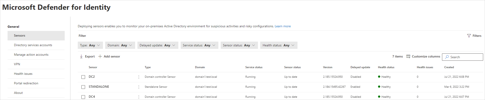

# Configure Microsoft Defender for Identity sensor settings

In this article, you'll learn how to correctly configure Microsoft Defender for Identity sensor settings to start seeing data. You'll need to do additional configuration and integration to take advantage of Defender for Identity's full capabilities.

The following video shows a review of the Defender for Identity sensor settings: 

 

> [!VIDEO (https://www.microsoft.com/en-us/videoplayer/embed/RWFVEX)]

## View and configure sensor settings

After the Defender for Identity sensor is installed, do the following to view and configure Defender for Identity sensor settings:

1. In [Microsoft 365 Defender](https://security.microsoft.com), go to **Settings** > **Identities** **Sensors**. For example:

   

   The **Sensors** page displays all of your Defender for Identity sensors, listing the following details per sensor:

   :::row:::
       :::column:::
          - Sensor name
          - Sensor domain membership
          - Sensor version number
          - Whether updates should be [delayed](../sensor-settings.md#delayed-sensor-update).        
       :::column-end:::
       :::column:::
          - Sensor service status
          - Sensor status
          - Sensor health status
          - The number of health issues
          - When the sensor was created. 
       :::column-end:::
   :::row-end:::

   For more information, see [Sensor details](../sensor-settings.md#sensor-details).

1. Select **Filters** to select the filters you want visible. For example:

   

1. Use the displayed filters to determine which sensors to display. For example:

   :::image type="content" source="../media/filtered-sensor.png" alt-text="Screenshot of a filtered list of sensors." lightbox="../media/filtered-sensor.png":::

1. Select a sensor to show a details pane with more information about the sensor and its health status. For example:

   

1. Select **Manage sensor** to show a pane where you can configure sensor details. For example:

   :::image type="content" source="../media/manage-sensor.png" alt-text="Screenshot of the Manage sensor option." lightbox="../media/manage-sensor.png":::

1. Configure the following sensor details:

   - **Description** (optional): Enter a description for the Defender for Identity sensor.

   - **Domain Controllers (FQDN)**: This is required for the Defender for Identity standalone and AD FS sensors, and cannot be modified for the Defender for Identity sensor.
   
      Enter the complete FQDN of your domain controller and select the plus sign to add it to the list. For example,  **DC1.domain1.test.local**.

      For any servers you define in the **Domain Controllers** list:

      - All domain controllers whose traffic is being monitored via port mirroring by the Defender for Identity standalone sensor must be listed in the **Domain Controllers** list. If a domain controller isn't listed in the **Domain Controllers** list, detection of suspicious activities might not function as expected.

      - At least one domain controller in the list should be a global catalog. This enables Defender for Identity to resolve computer and user objects in other domains in the forest.

   - **Capture Network adapters** (required):

      - For Defender for Identity sensors, all network adapters that are used for communication with other computers in your organization.
      - For Defender for Identity standalone sensor on a dedicated server, select the network adapters that are configured as the destination mirror port. These network adapters receive the mirrored domain controller traffic.

1. On the **Sensors** page, select **Export** to export a list of your sensors to a **.csv** file. For example:

   :::image type="content" source="../media/export-sensors.png" alt-text="Screenshot of exporting a list of sensors." lightbox="../media/export-sensors.png":::

## Validate installations

Use the following procedures to validate your Defender for Identity sensor installation. 

> [!NOTE]
> If you're installing on an AD FS server, you'll use a different set of validations. For more information, see [Microsoft Defender for Identity on Active Directory Federation Services (AD FS)](active-directory-federation-services.md).
>

### Verify latest available sensor version

The Defender for Identity version is updated frequently. Check for the latest version in the Microsoft 365 Defender **Settings** > **Identities** > **About** page.

### Validate successful deployment

To validate that the Defender for Identity sensor has been successfully deployed:

1. Check that the **Azure Advanced Threat Protection sensor** service is running on your sensor machine. After you save the Defender for Identity sensor settings, it might take a few seconds for the service to start.

1. If the service doesn't start, review the **Microsoft.Tri.sensor-Errors.log** file, located by default at `%programfiles%\Azure Advanced Threat Protection sensor\<sensor version>\Logs`, where `<sensor version>` is the version you deployed.

### Validate connectivity

Verify Defender for Identity connectivity on any domain device using the following steps.

When using the examples in the following steps, make sure to replace `contosodc.contoso.azure` and `contoso.azure` with the FQDN of your Defender for Identity sensor and domain name respectively.

1. Open a command prompt and enter `nslookup`

1. Enter `server` and the FQDN or IP address of the domain controller where the Defender for Identity sensor is installed. For example:  `server contosodc.contoso.azure`

1. Enter `ls -d contoso.azure`
   
1. Repeat the previous two steps for each sensor you want to test.

1. From the Defender for Identity console, open the entity profile for the computer you ran the connectivity test from.

1. In Microsoft 365 Defender, search for the name of the user you used to run the commands in the previous steps. Select the name in the results, and view the user details page and all related activities and alerts.

If the domain controller that you're testing is the first sensor you've deployed, wait at least 15 minutes before verifying any logical activity for that domain controller, allowing the database backend to complete the initial microservice deployments.

## Next step

Now that you've configured the initial configuration steps, you can configure more settings. Go to any of the pages below for more information:

- [Updating your sensors](../sensor-settings.md#updating-your-sensors)
- [Set entity tags: sensitive, honeytoken, and Exchange server](../entity-tags.md)
- [Configure detection exclusions](../exclusions.md)
- [Configure notifications: health issues, alerts, and Syslog](../notifications.md)
