# Configure audit policies for Windows event logs

Microsoft Defender for Identity detection relies on specific Windows Event log entries to enhance detections and provide extra information on the users who performed specific actions, such as NTLM logons and security group modifications.

For the correct events to be audited and included in the Windows Event Log, your domain controllers require specific Advanced Audit Policy settings. Misconfigured Advanced Audit Policy settings can cause gaps in the Event Log and incomplete Defender for Identity coverage.

This article describes how to configure your Advanced Audit Policy settings as needed for a standalone Defender for Identity sensor, and other configurations for specific event types.

> [!IMPORTANT]
> Defender for Identity standalone sensors do not support the collection of Event Tracing for Windows (ETW) log entries that provide the data for multiple detections. For full coverage of your environment, we recommend deploying the Defender for Identity sensor.

For more information, see [What is Windows event collection for Defender for Identity](event-collection-overview.md).

## Configure Advanced Audit Policy settings

This procedure describes how to modify your domain controller's Advanced Audit Policies as needed for Defender for Identity.

1. Log in to the server as **Domain Administrator**.
1. Open the Group Policy Management Editor from **Server Manager** > **Tools** > **Group Policy Management**.
1. Expand the **Domain Controllers Organizational Units**, right-click  **Default Domain Controllers Policy**, and then select **Edit**. For example:

    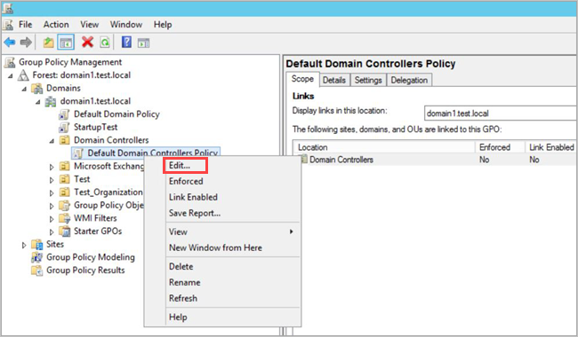

    > [!NOTE]
    > Use the Default Domain Controllers Policy or a dedicated GPO to set these policies.

1. From the window that opens, go to **Computer Configuration** > **Policies** > **Windows Settings** > **Security Settings** and depending on the policy you want to enable, do the following:

    1. Go to **Advanced Audit Policy Configuration** > **Audit Policies**. For example:

        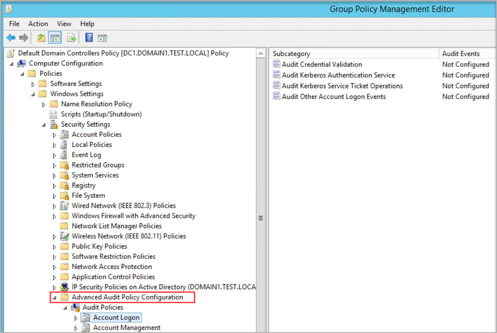

    1. Under **Audit Policies**, edit each of the following policies and select **Configure the following audit events** for both **Success** and **Failure** events.

        | Audit policy | Subcategory | Triggers event IDs |
        | --- |---|---|
        | **Account Logon** | Audit Credential Validation | 4776 |
        | **Account Management** | Audit Computer Account Management | 4741, 4743 |
        | **Account Management** | Audit Distribution Group Management | 4753, 4763 |
        | **Account Management** | Audit Security Group Management | 4728, 4729, 4730, 4732, 4733, 4756, 4757, 4758 |
        | **Account Management** | Audit User Account Management | 4726 |
        | **DS Access** | Audit Directory Service Changes | 5136  |
        | **System** | Audit Security System Extension | 7045 |

        <!--
        | **DS Access** | Audit Directory Service Access | 4662 - For this event, it's also necessary to [configure object auditing](#configure-object-auditing-for-event-id-4662).  | -->

        For example, to configure **Audit Security Group Management**, under **Account Management**, double-click **Audit Security Group Management**, and then select **Configure the following audit events** for both **Success** and **Failure** events:

        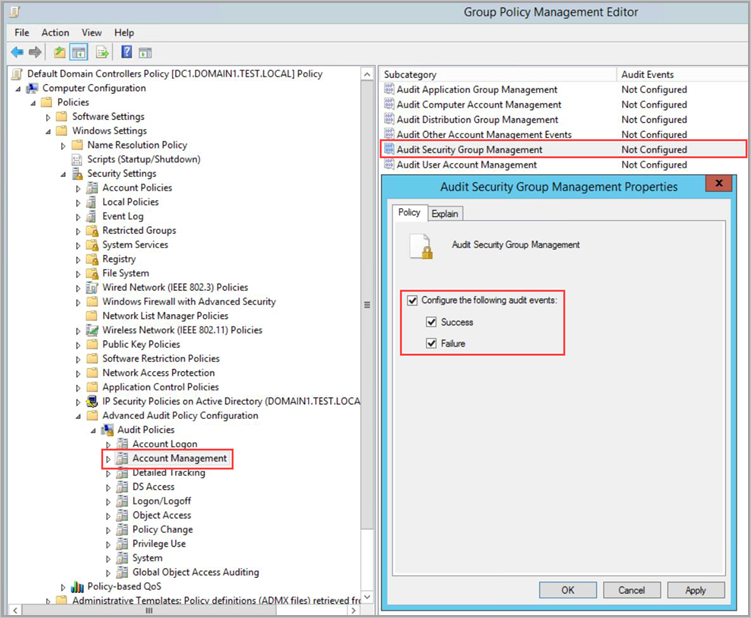

1. From an elevated command prompt type `gpupdate`.

1. After applying via GPO, the new events are visible in the Event Viewer, under **Windows Logs** -> **Security**.

## Configure auditing for Event ID 8004

This section describes the extra configuration steps needed to audit Event ID 8004.

> [!NOTE]
>
> - Domain group policies to collect Windows Event 8004 should **only** be applied to domain controllers.
> - When Windows Event 8004 is parsed by Defender for Identity Sensor, Defender for Identity NTLM authentications activities are enriched with the server accessed data.

1. Following the [initial steps](#configure-advanced-audit-policy-settings), open **Group Policy Management** and go to the **Default Domain Controllers Policy** > **Local Policies** > **Security Options**.

1. Under **Security Options**, configure the specified security policies as follows:

    | Security policy setting | Value |
    |---|---|
    | **Network security: Restrict NTLM: Outgoing NTLM traffic to remote servers** | Audit all |
    | **Network security: Restrict NTLM: Audit NTLM authentication in this domain** | Enable all |
    | **Network security: Restrict NTLM: Audit Incoming NTLM Traffic** | Enable auditing for all accounts |

For example, to configure **Outgoing NTLM traffic to remote servers**, under **Security Options**, double-click **Network security: Restrict NTLM: Outgoing NTLM traffic to remote servers**, and then select **Audit all**:

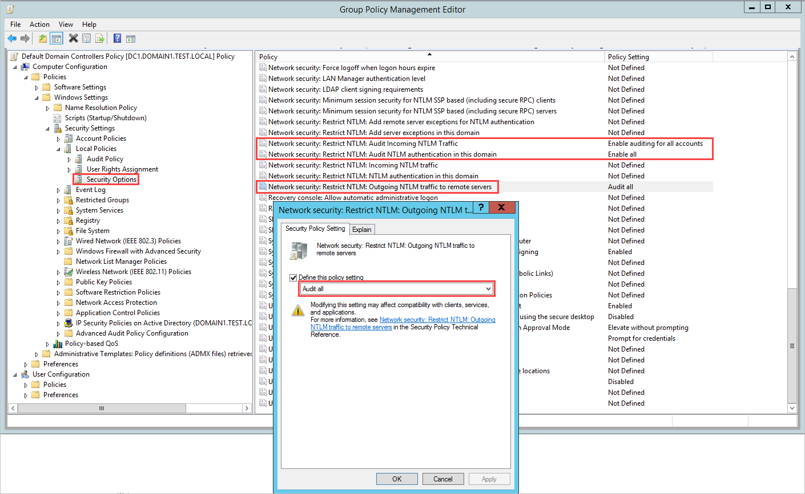

<!--
## Configure auditing for extra LDAP queries

Microsoft Defender for Identity can monitor extra LDAP queries in your network, which are sent over the Active Directory Web Service protocol and act like normal LDAP queries. To have visibility into these activities, you need to enable **event 1644** on your domain controllers. 

Event 1644 covers LDAP activities in your domain and is primarily used to identify expensive, inefficient, or slow Lightweight Directory Access Protocol (LDAP) searches that are serviced by Active Directory domain controllers.

> [!IMPORTANT]
> Logging the 1644 events may impact server performance. While the resource limitation feature can stop the Defender for Identity service if the server is running out of resources, it does not stop the event auditing at the operating system level. Therefore, to avoid performance issues, make sure your servers have sufficient memory, CPU, and disk resources.

Windows event 1644 isn't collected by default on domain controllers and needs to be manually activated to support this feature. Create registry keys with the following values:

```reg
Windows Registry Editor Version 5.00 
[HKEY_LOCAL_MACHINE\SYSTEM\CurrentControlSet\Services\NTDS\Diagnostics] 
"15 Field Engineering"=dword:00000005 
[HKEY_LOCAL_MACHINE\SYSTEM\CurrentControlSet\Services\NTDS\Parameters] 
"Expensive Search Results Threshold"=dword:00000001 
"Inefficient Search Results Threshold"=dword:00000001 "Search Time Threshold (msecs)"=dword:00000001 
```


## Configure object auditing for Event ID 4662

To collect 4662 events, you must also configure object auditing on the user, group and computer objects. This procedure describes how to enable auditing on all users, groups, and computers in the Active Directory domain.

> [!IMPORTANT]
> Make sure to [review and verify your audit policies](#configure-advanced-audit-policy-settings) before enabling event collection to ensure that the domain controllers are properly configured to record the necessary events. If configured properly, this auditing should have minimal effect on server performance.

1. Go to the **Active Directory Users and Computers** console.
1. Select the domain you want to audit.
1. Select the **View** menu and select **Advanced Features**.
1. Right-click the domain and select **Properties**. For example:

    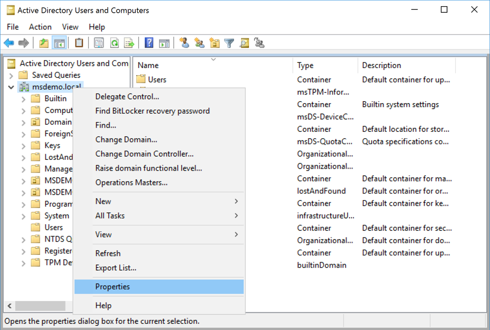

1. Go to the **Security** tab, and select **Advanced**. For example:

    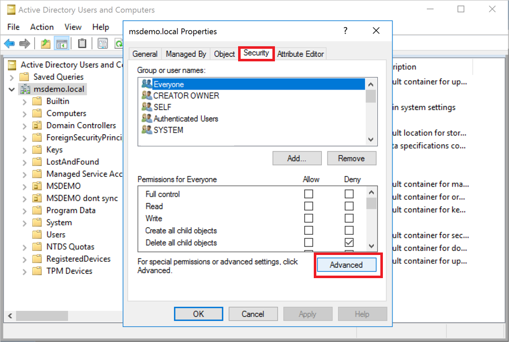

1. In **Advanced Security Settings**, select the **Auditing** tab and then select **Add**. For example:

    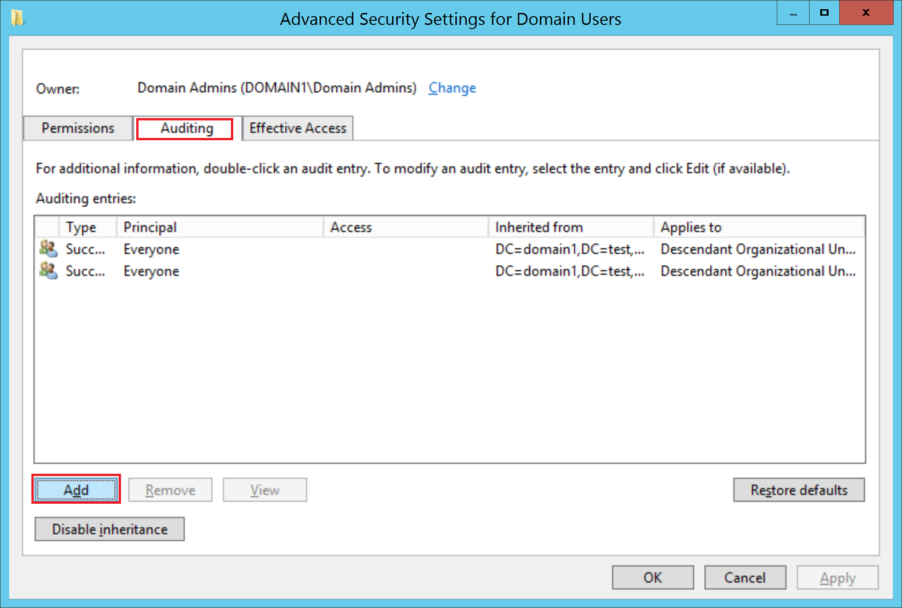

1. Select **Select a principal**. For example:

    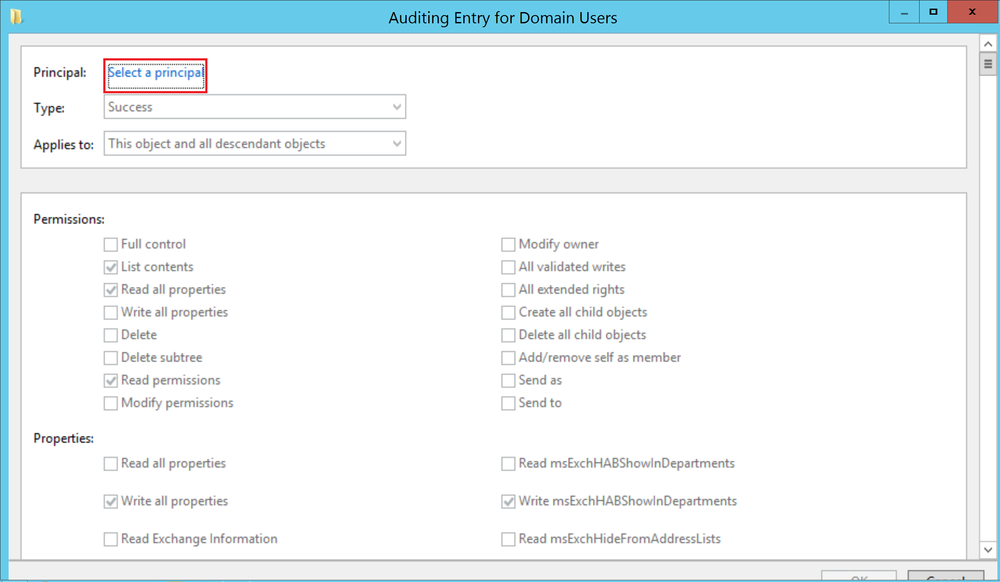

1. Under **Enter the object name to select**, enter **Everyone** and select **Check Names** > **OK**. For example:

    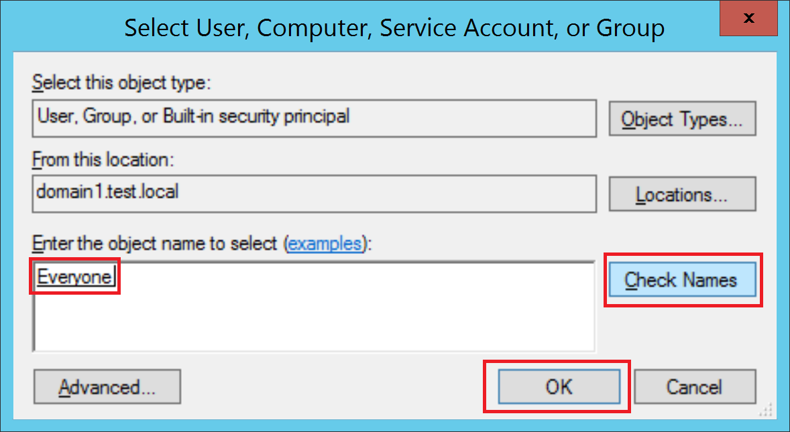

1. You'll then return to **Auditing Entry**. Make the following selections:

    1. For **Type** select **Success**.
    1. For **Applies to** select **Descendant User objects.**
    1. Under **Permissions**, scroll down and select the **Clear all** button. For example:

        :::image type="content" source="../media/clear-all.png" alt-text="Screenshot of selecting Clear all.":::

    1. Scroll back up and select **Full Control**. All the permissions are selected. 
    
    1. Clear the selection for the **List contents**, **Read all properties**, and **Read permissions** permissions, and select **OK**. This sets all the **Properties** settings to **Write**. For example:

        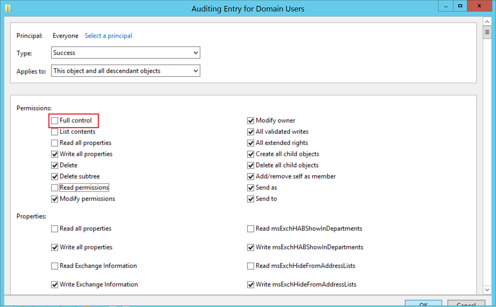

        Now, when triggered, all relevant changes to directory services will appear as 4662 events.

1. Repeat the steps in this procedure, but for **Applies to**, select the following object types:
   - **Descendant Group Objects**
   - **Descendant Computer Objects**
   - **Descendant msDS-GroupManagedServiceAccount Objects**
   - **Descendant msDS-ManagedServiceAccount Objects**

> [!NOTE]
> Assigning the auditing permissions on the **All descendant objects** would work as well, but we only require the object types as detailed above.
>

Some detections require auditing specific Active Directory objects. To do so, follow the steps in this procedure, with the changes noted as follows regarding the objects to audit and permissions to include.
-->

### Enable auditing on an ADFS object

1. Go to the **Active Directory Users and Computers** console, and select the domain you want to enable the logs on.
1. Go to to **Program Data** > **Microsoft** > **ADFS**. For example:

    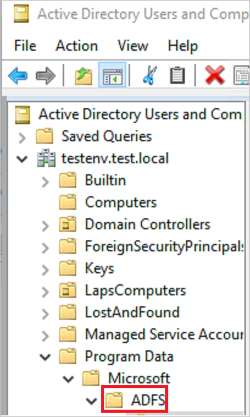

1. Right-click **ADFS** and select **Properties**.
1. Go to the **Security** tab and select **Advanced** > **Advanced Security Settings** > **Auditing** tab > **Add** > **Select a principal**.
1. Under **Enter the object name to select**, enter **Everyone**. 
1. Select **Check Names** > **OK**.
1. You'll then return to **Auditing Entry**. Make the following selections:

    - For **Type** select **All**.
    - For **Applies to** select **This object and all descendant objects**.
    - Under **Permissions**, scroll down and select **Clear all**. Scroll up and select **Read all properties** and **Write all properties**.

    For example:

    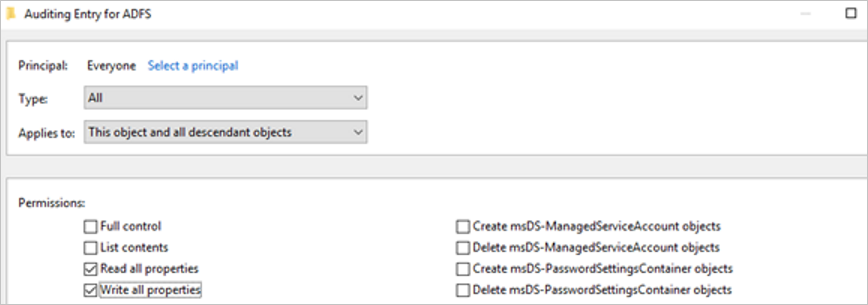

1. Select **OK**.

### Enable auditing on an Exchange object
<a name="enable-auditing-on-an-exchange-object"></a>

1. Open ADSI Edit by selecting **Start** > **Run**. Enter *ADSIEdit.msc* and select **OK**.

1. On the **Action** menu, select **Connect to**.

1. In the **Connection Settings** dialog boxm under **Select a well known Naming Context**, select **Configuration** > **OK**.

1. Expand the **Configuration** container to show the **Configuration** node, beginning with *“CN=Configuration,DC=..."*

1. Right-click the **Configuration** node and select **Properties**. For example:

    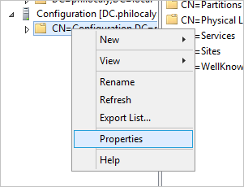

1. Select the **Security** tab > **Advanced**.

1. In the **Advanced Security Settings**, select the **Auditing** tab > **Add**.

1. Select **Select a principal**.

1. Under **Enter the object name to select**, enter **Everyone** and select **Check Names** > **OK**.

1. You'll then return to **Auditing Entry**. Make the following selections:

    - For **Type** select **All**.
    - For **Applies to** select **This object and all descendant objects**.
    - Under **Permissions**, scroll down and select **Clear all**. Scroll up and select **Write all properties**.

    For example:

    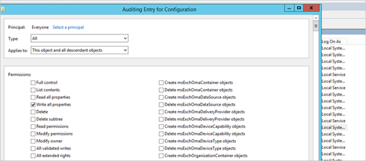

1. Select **OK**.

## Configure auditing for AD CS

If you're working with a dedicated server with Active Directory Certificate Services (AD CS) configured, make sure to configure auditing as follows to view dedicated alerts and Secure Score reports:

1. Create a group policy to apply to your AD CS server. Edit it and configure the following auditing settings:

    1. Go to and double click **Computer Configuration\Policies\Windows Settings\Security Settings\Advanced Audit Policy Configuration\Audit Policies\Object Access\Audit Certification Services**, and then configure audit events for **Success and Failure**. For example:

    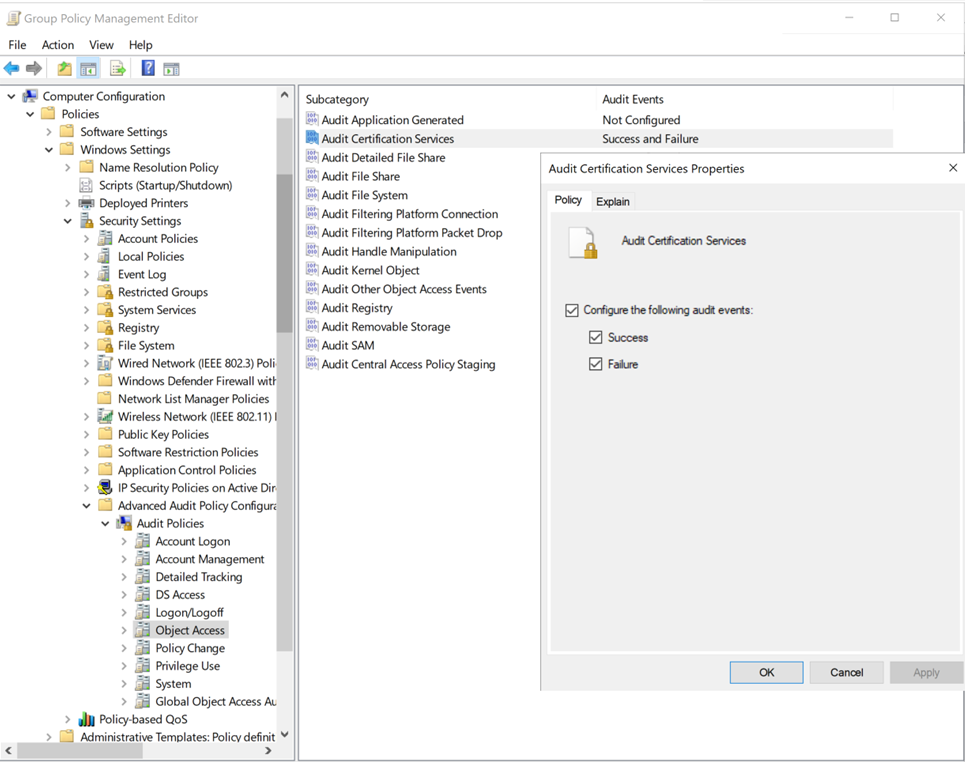

1. Configure auditing on the certificate authority (CA) using one of the following methods:

    - **To configure CA auditing using the command line**, run:

        ```cmd
        certutil –setreg CA\AuditFilter 127 

        net stop certsvc && net start certsvc
        ````

    - **To Configure CA auditing using the GUI**:

        1. Select **Start -> Certification Authority (MMC Desktop application)**. Right-click your CA's name and select **Properties**. For example: 

            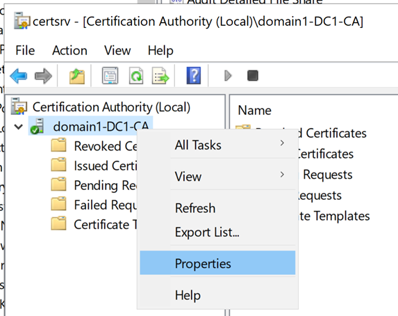

        1. Select the **Auditing** tab, select all the events you want to audit, and then select **Apply**. For example:


            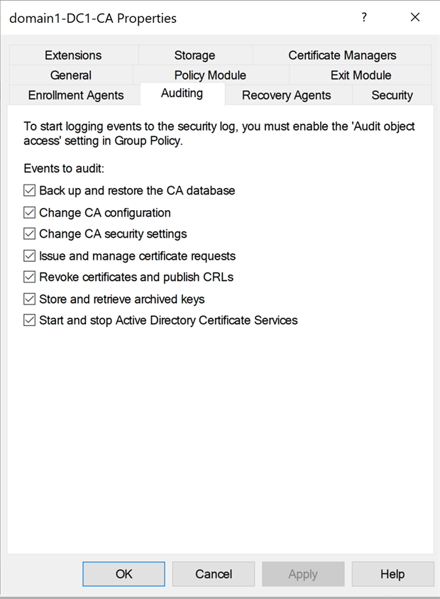

        For more information, see [Supported Windows events](event-collection-overview.md#supported-windows-events).


## Next step

> [!div class="step-by-step"]
> [Listen for SIEM events on your Defender for Identity standalone sensor »](configure-event-collection.md)