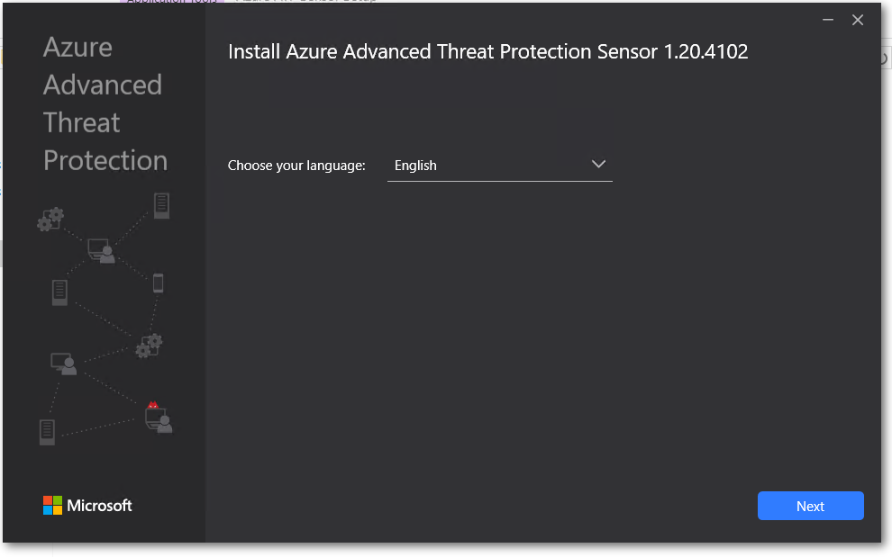
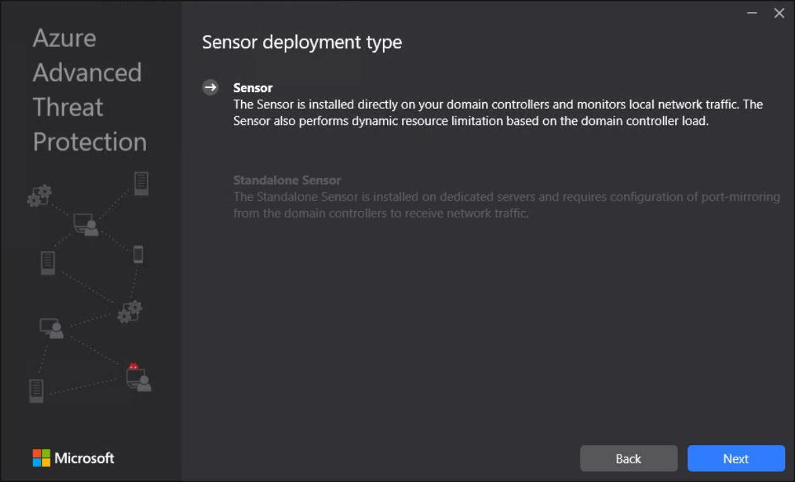
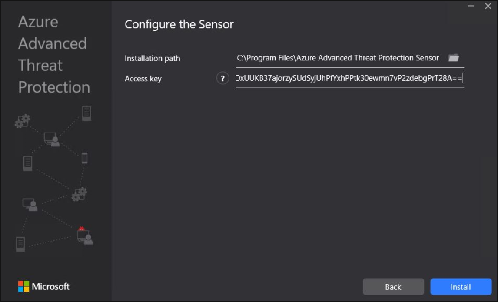

# Install the Microsoft Defender for Identity sensor

This article describes how to install the Microsoft Defender for Identity sensor, including a standalone sensor, using the installation wizard.

- If you're using a proxy, we recommend that you install the sensor and configure your proxy together from the command line. For more information, see [Configure endpoint proxy and internet connectivity settings](configure-proxy.md).

- When installing the sensor on Windows Server Core, or to deploy the sensor via a software deployment system, follow the steps for [silent installation](#defender-for-identity-sensor-silent-installation) instead.

## Prerequisites

Before you start, make sure that you have:

- A downloaded copy of your [Defender for Identity sensor setup package](download-sensor.md) and the access key.

- Microsoft .NET Framework 4.7 or later is installed on the machine. If Microsoft .NET Framework 4.7 or later isn't installed, the Defender for Identity sensor setup package installs it, which may require a reboot of the server.

- Relevant server specifications and network requirements. For more information, see:

    - [Microsoft Defender for Identity prerequisites](prerequisites.md)
    - [Microsoft Defender for Identity standalone sensor prerequisites](prerequisites-standalone.md)
    - [Deploying Microsoft Defender for Identity on AD FS and AD CS servers](active-directory-federation-services.md)

## Install the sensor using the UI

Perform the following steps on the domain controller or AD FS /AD CS server.

1. Verify the machine has connectivity to the relevant [Defender for Identity cloud service endpoint(s)](configure-proxy.md#enable-access-to-defender-for-identity-service-urls-in-the-proxy-server).

1. Extract the installation files from the zip file. Installing directly from the zip file will fail.

1. Run **Azure ATP sensor setup.exe** with elevated privileges (**Run as administrator**) and follow the setup wizard.

1. On the **Welcome** page, select your language and select **Next**. For example:

    

    The installation wizard automatically checks if the server is a domain controller, AD FS server, AC CS server, or a dedicated server.

    - If it's a domain controller / AD FS server / AD CS server, the Defender for Identity sensor is installed.
    - If it's a dedicated server, the Defender for Identity standalone sensor is installed.

    For example, for a Defender for Identity sensor, the following screen is displayed to let you know that a Defender for Identity sensor is installed on your dedicated server:

    

1. Select **Next**.

    A warning is issued if the domain controller / AD FS server / AD CS or dedicated server does not meet the minimum hardware requirements for the installation. The warning doesn't prevent you from selecting **Next** and proceeding with the installation, which might still be the right option. For example, you'll need less room for data storage when installing a small lab test environment.

    For production environments, we highly recommend working with Defender for Identity's [capacity planning](capacity-planning.md) guide to make sure your domain controllers or dedicated servers meet the necessary requirements.

1. Under **Configure the sensor**, enter the installation path and the setup package access key. For example:

    

    Enter the following details:

    - **Installation path**: The location where the Defender for Identity sensor is installed. By default the path is  `%programfiles%\Azure Advanced Threat Protection sensor`. Leave the default value.
    - **Access key**: Retrieved from the Microsoft 365 Defender portal in a [previous step](download-sensor.md).


1. Select **Install**. The following components are installed and configured during the installation of the Defender for Identity sensor:

    - **Defender for Identity sensor service** and **Defender for Identity sensor updater service**

    - **Microsoft Visual C++ 2013 Redistributable**

    - **KB 3047154** (for Windows Server 2012 R2 only)

        > [!IMPORTANT]
        >
        > - Don't install KB 3047154 on a virtualization host, which is the host that is running the virtualization. This may cause port mirroring to stop working properly. It's fine to run KB 3047154 on a virtual machine.
        >
        > - If Wireshark is installed on the Defender for Identity sensor machine, you'll need to restart the Defender for Identity sensor after running Wireshark because they use the same drivers.

### Viewing sensor versions

Beginning with version 2.176, when installing the sensor from a new package, the sensor's version under **Add/Remove Programs** appears with the full version number, such as **2.176.x.y**, instead of the static **2.0.0.0** that was previously shown.

The installed version continues to show even after automatic updates are run from the Defender for Identity cloud services.

View the sensor's real version in the Microsoft 365 Defender [sensor settings page](https://security.microsoft.com/settings/identities?tabid=sensor), in the executable path or in the file version.

## Defender for Identity sensor silent installation

The Defender for Identity silent installation is configured to automatically restart the server at the end of the installation if necessary. 

Make sure to schedule a silent installation only during a maintenance window. Because of a Windows Installer bug, the *norestart* flag cannot be reliably used to make sure the server does not restart.

To track your deployment progress, monitor the Defender for Identity installer logs, which are located in `%AppData%\Local\Temp`.

### Silent installation via a deployment system

When silently deploying the Defender for Identity sensor via System Center Configuration Manager or other software deployment system, we recommend creating two deployment packages:

- Net Framework 4.7 or later, which may include rebooting the domain controller
- The Defender for Identity sensor

Make the Defender for Identity sensor package dependent on the deployment of the .Net Framework package deployment. If needed, get the [.Net Framework 4.7 offline deployment package](https://support.microsoft.com/topic/the-net-framework-4-7-offline-installer-for-windows-f32bcb33-5f94-57ce-6120-62c9526a91f2).

### Run a silent installation

Use the following commands to perform a fully silent install of the Defender for Identity sensor, using the access key copied in a [previous step](download-sensor.md). 

**cmd.exe syntax**:

```cmd
"Azure ATP sensor Setup.exe" /quiet NetFrameworkCommandLineArguments="/q" AccessKey="<Access Key>"
```

**Powershell syntax**:

```powershell
.\"Azure ATP sensor Setup.exe" /quiet NetFrameworkCommandLineArguments="/q" AccessKey="<Access Key>"
```

> [!NOTE]
> When using the Powershell syntax, omitting the `.\` preface results in an error that prevents silent installation.

**Installation options**:

|Name|Syntax|Mandatory for silent installation?|Description|
|-------------|----------|---------|---------|
|`Quiet`|`/quiet`|Yes|Runs the installer displaying no UI and no prompts.|
|`Help`|`/help`|No|Provides help and quick reference. Displays the correct use of the setup command including a list of all options and behaviors.|
|`NetFrameworkCommandLineArguments="/q"`|`NetFrameworkCommandLineArguments="/q"`|Yes|Specifies the parameters for the .Net Framework installation. Must be set to enforce the silent installation of .Net Framework.|

**Installation parameters**:

|Name|Syntax|Mandatory for silent installation?|Description|
|-------------|----------|---------|---------|
|`InstallationPath`|`InstallationPath=""`|No|Sets the path for the installation of Defender for Identity Sensor binaries. Default path: `%programfiles%\Azure Advanced Threat Protection Sensor` |
|`AccessKey`|`AccessKey="\*\*"`|Yes|Sets the access key that is used to register the Defender for Identity sensor with the Defender for Identity workspace.|
|`AccessKeyFile`|`AccessKeyFile=""`|No|Sets the workspace Access Key from the provided text file path.|
|`DelayedUpdate`|`DelayedUpdate=true`|No|Sets the sensor's update mechanism to delay the update for 72 hours from the official release of each service update. For more information, see [Delayed sensor update](../sensor-settings.md#delayed-sensor-update).|
|`LogsPath`|`LogsPath=""`|No|Sets the path for the Defender for Identity Sensor logs. Default path: `%programfiles%\Azure Advanced Threat Protection Sensor`|

**Examples**:

Use the following commands to silently install the Defender for Identity sensor:

```cmd
"Azure ATP sensor Setup.exe" /quiet NetFrameworkCommandLineArguments="/q" AccessKey="<access key value>"
```

```cmd
"Azure ATP sensor Setup.exe" /quiet NetFrameworkCommandLineArguments="/q" AccessKeyFile="C:\Path\myAccessKeyFile.txt"
```

### Run a silent installation with a proxy configuration

Use the following command to configure your proxy together with a silent installation:

```cmd
"Azure ATP sensor Setup.exe" [/quiet] [/Help] [ProxyUrl="http://proxy.internal.com"] [ProxyUserName="domain\proxyuser"] [ProxyUserPassword="ProxyPassword"]`
```

> [!NOTE]
> If you've previously configured your proxy using legacy options, including WiniNet or a registry key update, you'll need to make any changes using the method you used originally. For more information, see [Configure proxy settings (legacy methods)](../sensor-settings.md#configure-proxy-settings-legacy-methods).

**Installation parameters**:

|Name|Syntax|Mandatory for silent installation?|Description|
|-------------|----------|---------|---------|
|**ProxyUrl**|`ProxyUrl="http\://proxy.contoso.com:8080"`|No|Specifies the proxy URL and port number for the Defender for Identity sensor.|
|**ProxyUserName**|`ProxyUserName="Contoso\ProxyUser"`|No|If your proxy service requires authentication, define a user name in the `DOMAIN\user` format.|
|**ProxyUserPassword**|`ProxyUserPassword="P@ssw0rd"`|No|Specifies the password for your  proxy user name. <br><br>Credentials are encrypted and stored locally by the Defender for Identity sensor.|

> [!TIP]
> If you've configured a proxy during installation, changing the proxy configuration requires you to remove and install the sensor. Therefore, we recommend creating and using a custom DNS A record for the proxy server, which you can use to change the proxy server's address when needed. <!--add powershell script in here when ready. also Can mention that to modify the Proxy URL - the cusotmer can modify the sensorconfiguratio.json file manually and stop and restart the sensor services? also should this note be here or on [Configure endpoint proxy and internet connectivity settings](configure-proxy.md)-->
>
> We also recommend using the *hosts* file for testing. <!--what does this mean?-->


## Related content

If you installed the sensor on an AD FS / AD CS server, or if you installed a standalone sensor, following the extra post-installation steps:

- [Post-installation steps for AD FS / AD CS servers](active-directory-federation-services.md#post-installation-steps-for-ad-fs--ad-cs-servers)

- **Standalone sensors**:

    - [Configure port mirroring](configure-port-mirroring.md)
    - [Configure Windows event collection](event-collection-overview.md)

## Next step

> [!div class="step-by-step"]
> [Configure the Defender for Identity sensor »](configure-sensor-settings.md)
