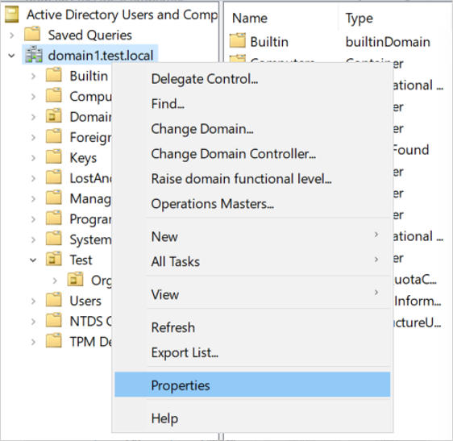
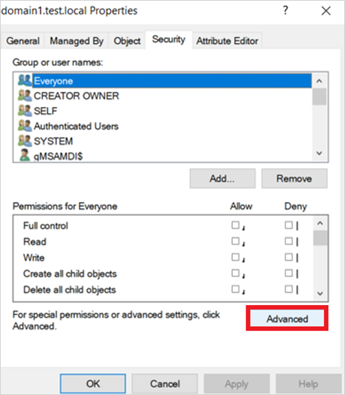
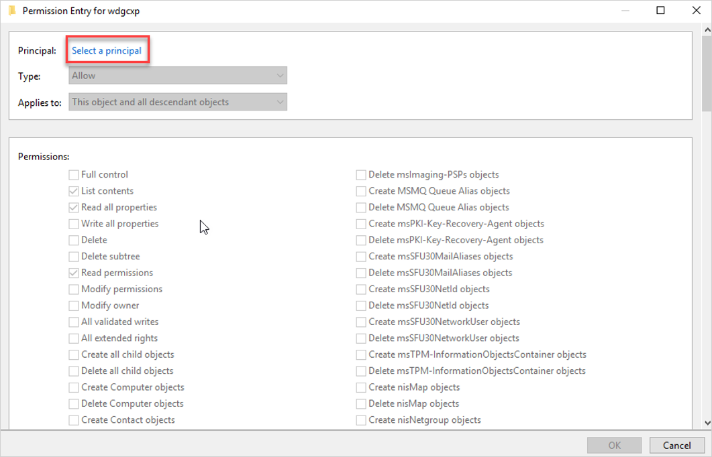
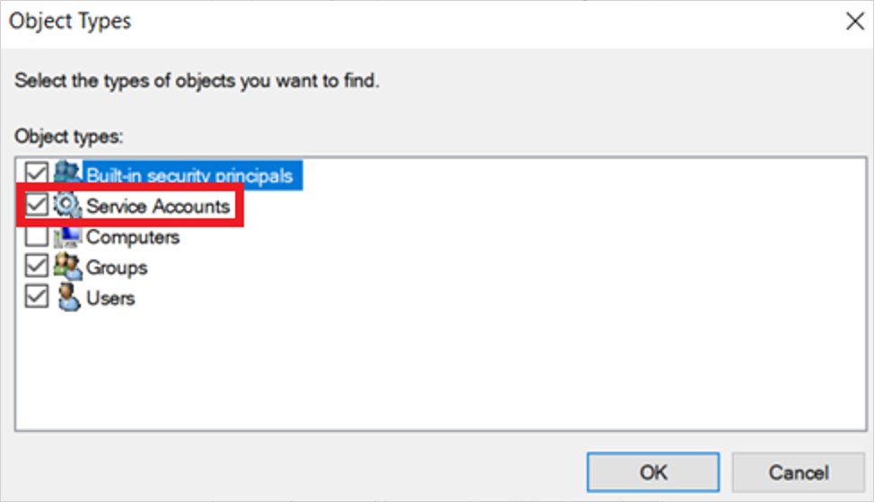
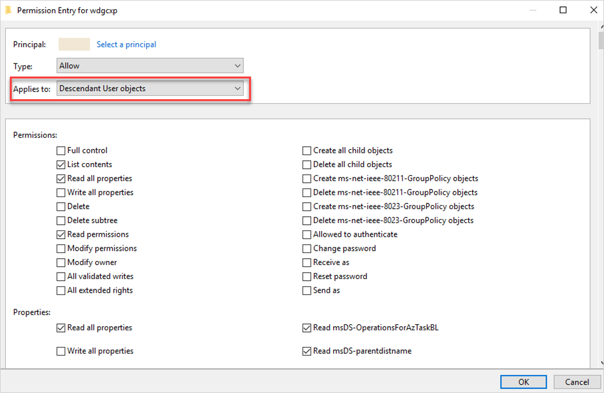
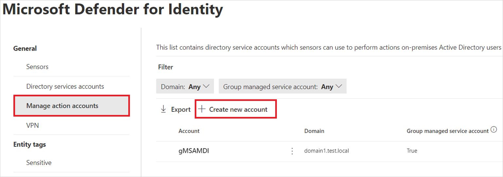

# Microsoft Defender for Identity action accounts

Defender for Identity allows you to take [remediation actions](../remediation-actions.md) targeting on-premises Active Directory accounts in the event that an identity is compromised. To take these actions, Microsoft Defender for Identity needs to have the required permissions to do so.

By default, the Microsoft Defender for Identity sensor installed on a domain controller will impersonate the `LocalSystem` account of the domain controller and perform the actions. However, you can change this default behavior by setting up a gMSA account and scope the permissions as you need. For example:

:::image type="content" source="../media/management-accounts.png" alt-text="Screenshot of the Manage action accounts tab." lightbox="../media/management-accounts.png":::

Watch the following video to learn more about remediation actions in Defender for Identity:

 

> [!VIDEO https://www.microsoft.com/en-us/videoplayer/embed/RE4U7Pe]

## Best practices for action accounts

We recommend that you avoid using the same gMSA account you configured for Defender for Identity managed actions on servers other than domain controllers. If you use the same account and the server is compromised, an attacker could retrieve the password for the account and gain the ability to change passwords and disable accounts.

We also recommend that you avoid using the same account as both the Directory Service account and the Manage Action account. This is because the Directory Service account requires only read-only permissions to Active Directory, and the Manage Action accounts needs write permissions on user accounts.

## Create and configure a specific action account

1. Create a new gMSA account. For more information, see [Getting started with Group Managed Service Accounts](/windows-server/security/group-managed-service-accounts/getting-started-with-group-managed-service-accounts).

1. Assign the **Log on as a service** right to the gMSA account on each domain controller running the Defender for Identity sensor.

1. Grant the required permissions to the gMSA account as follows:

    1. Open **Active Directory Users and Computers**.

    1. Right-click the relevant domain or OU and select **Properties**. For example:

        

    1. Go the **Security** tab and select **Advanced**. For example:

        

    1. Select **Add** > **Select a principal**. For example:

        

    1. Make sure **Service accounts** is marked in **Object types**. For example:

        

    1. In the **Enter the object name to select** box, enter the name of the gMSA account and select **OK**.

    1. In the **Applies to** field, select **Descendant User objects**, leave the existing settings, and add the permissions and properties shown in the following example:

        

        Required permissions include:

        |Action  |Permissions  |Properties  |
        |---------|---------|---------|
        |**Enable force password reset**     |  Reset password       |   - `Read pwdLastSet`  - `Write pwdLastSet`      |
        |**To disable user**     |    -     |                   - `Read userAccountControl`  - `Write userAccountControl`      |

    1. In the **Applies to** field, select **Descendant Group objects** and set the following properties:

        - `Read members`
        - `Write members`

    1. Select **OK**.

## Add the gMSA account in the Microsoft 365 Defender portal

1. Go to the [Microsoft 365 Defender portal](https://security.microsoft.com) and select **Settings** -> **Identities** > **Microsoft Defender for Identity** > **Manage action accounts** > **+Create new account**. For exmaple:

    

1. Enter the account name and domain and select **Save**.

Your action account is listed on the **Manage action accounts** page.

## Next step

> [!div class="step-by-step"]
> [Configure the Defender for Identity sensor »](configure-sensor-settings.md)
