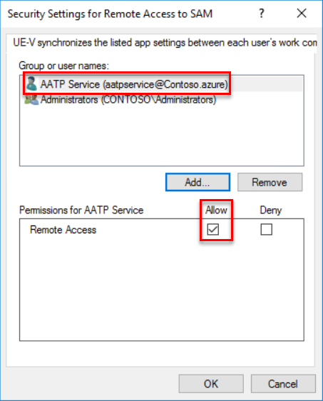
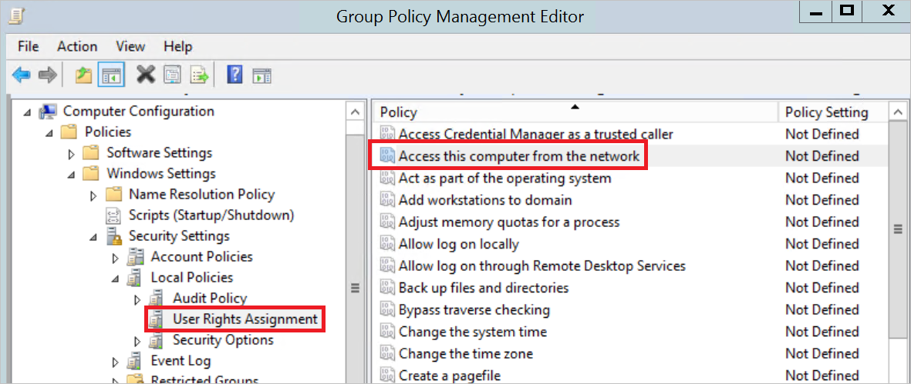
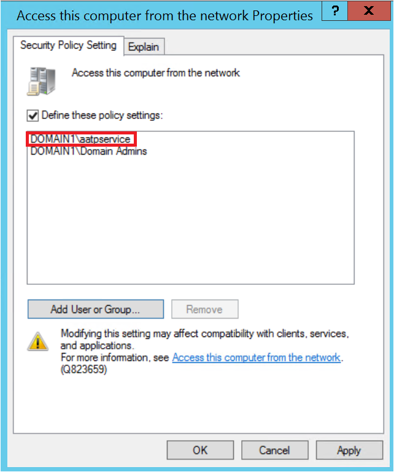

# Configure SAM-R to enable lateral movement path detection in Microsoft Defender for Identity

Microsoft Defender for Identity [lateral movement path](/defender-for-identity/understand-lateral-movement-paths) detection relies on queries that identify local admins on specific machines. These queries are performed with the SAM-R protocol, using the Defender for Identity [Directory Service account](directory-service-accounts.md) you configured.

This article describes how to configure required permissions for using the SAM-R protocol.

## Configure SAM-R required permissions

To ensure that Windows clients and servers allow your Defender for Identity Directory Service account to perform SAM-R, you must modify the **Group Policy** and add the Defender for Identity Directory Service account, in addition to the configured accounts listed in the **Network access** policy. Make sure to apply group policies to all computers **except domain controllers**.

> [!NOTE]
> Perform this procedure in *audit mode* first, verifying the compatibility of the proposed changes before making changes to your production environment.
>
> Testing in audit mode is critical in ensuring that your environment remains secure, and any changes will not impact your application compatibility. You may observe increased SAM-R traffic, generated by the Defender for Identity sensors.
>

**To configure required permissions**:

1. Locate the policy. In your **Computer configuration > Windows settings > Security settings > Local policies > Security options**, select the **Network access - Restrict clients allowed to make remote calls to SAM** policy. For example:

    

1. Add the Defender for Identity Directory Service account to the list of approved accounts able to perform this action on your modern Windows systems. For example:

    

The Defender for Identity Directory Service account now has the privileges needed to perform SAM-R in the environment.

For more information, see [Network access: Restrict clients allowed to make remote calls to SAM](/windows/security/threat-protection/security-policy-settings/network-access-restrict-clients-allowed-to-make-remote-sam-calls).

## Add the service account to the list of allowed accounts

After defining the *[Access this computer from the network](/windows/security/threat-protection/security-policy-settings/access-this-computer-from-the-network)* setting in any GPO that applies to computers in your domain, add the Defender for Identity Directory Service account to the list of allowed accounts for that setting.

This procedure is only required if you've previously enabled the [Access this computer from the network](/windows/security/threat-protection/security-policy-settings/access-this-computer-from-the-network) setting. The [Access this computer from the network](/windows/security/threat-protection/security-policy-settings/access-this-computer-from-the-network) setting isn't enabled by default.

>[!NOTE]
> The [Microsoft Security Compliance Toolkit](https://www.microsoft.com/download/details.aspx?id=55319) recommends replacing the default *Everyone* with *Authenticated Users* to prevent anonymous connections from performing network sign-ins. Review your local policy settings before managing the [Access this computer from the network](/windows/security/threat-protection/security-policy-settings/access-this-computer-from-the-network) setting from a GPO, and consider including *Authenticated Users* in the GPO if needed.

**To add the Defender for Identity service account to the list of allowed accounts**:

1. Go to the policy and navigate to **Computer Configuration** -> **Policies** -> **Windows Settings** -> **Local Policies** -> **User Right Assignment**, and select the **Access this computer from the network** setting. For example:

    

1. Add the Defender for Identity Directory Service account to the list of approved accounts. For example:

    

## Next steps

> [!div class="step-by-step"]
> [« Microsoft Defender for Identity roles and permissions](role-groups.md)
> [Download the Defender for Identity sensor »](download-sensor.md)
