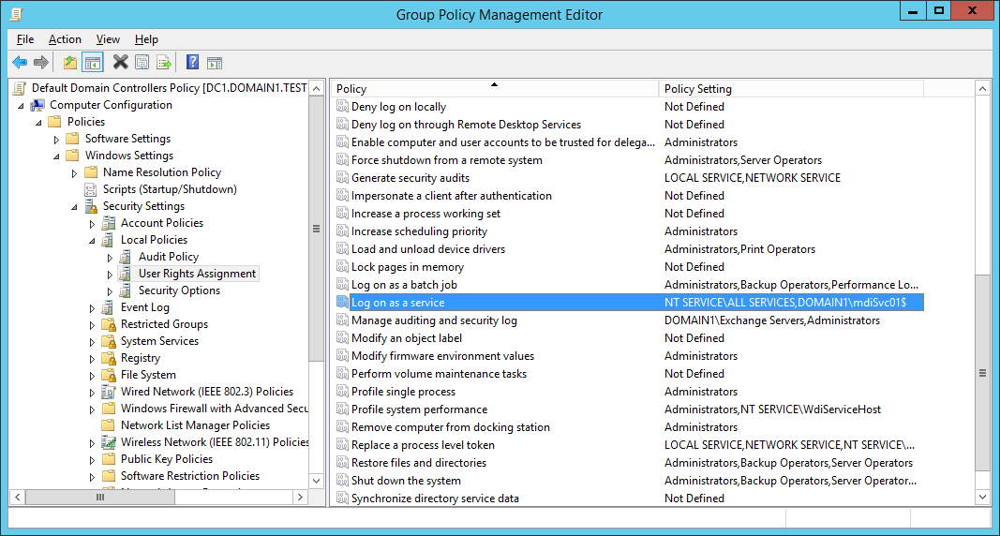
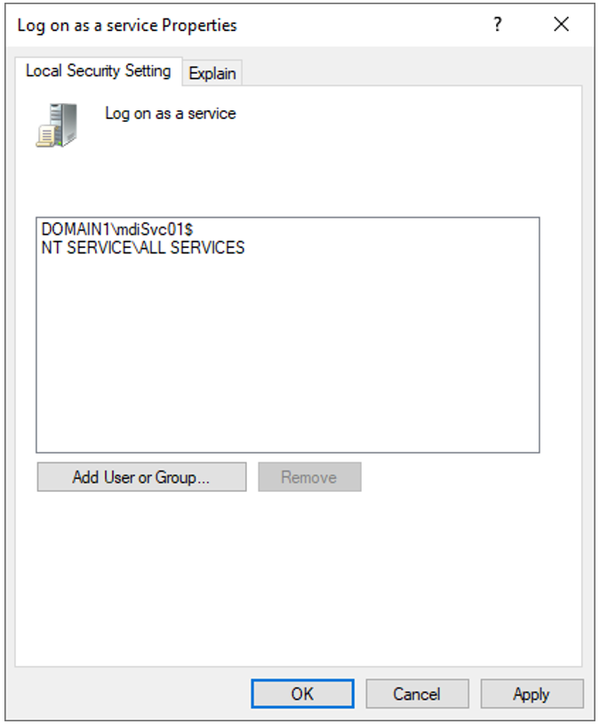
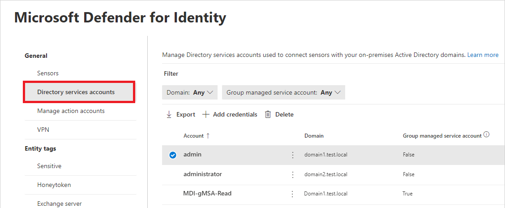
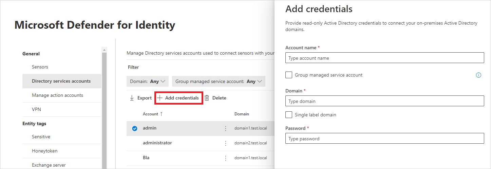
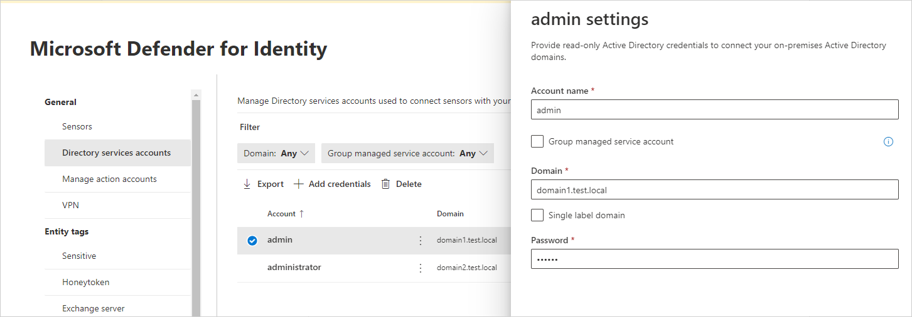

# Microsoft Defender for Identity Directory Service account recommendations

Learn how to create a Directory Service account (DSA), and configure it to work with Microsoft Defender for Identity.

## Introduction

The Directory Service account (DSA) in Defender for Identity is used by the sensor to perform the following functions:

- At startup, the sensor connects to the domain controller using the configured DSA option.

- The sensor queries the domain controller for information on entities seen in network traffic, monitored events, and monitored ETW activities.

- One sensor in each domain will be set as the "domain synchronizer" and is responsible for tracking changes to the entities in the domain, like objects created, entity attributes tracked by Defender for Identity, and so on.

- If the sensor sees activities from entities in other domains, it will query that domain via LDAP for information on the entity.

- Defender for Identity requests the list of members of the local administrator group from devices seen in network traffic, events, and ETW activities. This is done by making a [SAM-R](/defender-for-identity/remote-calls-sam) call to the device. This information is used to calculate potential lateral movement paths.

>[!NOTE]
>By default, Defender for Identity supports up to 30 credentials. If you want to add more credentials, contact Defender for Identity support.

## Types of DSA accounts

The following DSA options can be used:

- **Group Managed Service Account (gMSA) (recommended)** – This is the recommended DSA option due to its more secure deployment and management of passwords.
- **Regular user account in Active Directory** – This option is easy to get started with but requires additional management overhead of passwords.
- **Local service account** – This option is used out-of-the-box and deployed by default with the sensor, no additional configuration steps are required. This option has limitations such as no support for SAM-R queries and multi-forest scenarios.


| Type of DSA           | Pros                                                         | Cons                                                         |
| --------------------- | ------------------------------------------------------------ | ------------------------------------------------------------ |
| gMSA (Recommended) | <li>    More secure deployment since Active Directory manages the creation and rotation of the account's password like a computer account's password.  <li> You can control how often the account's password is changed. | <li> Requires additional setup  steps. |
| Regular user account | <li> Easy to create and start working with.  <li> Easy to configure read permissions between trusted forests. | <li> Less secure since it  requires the creation and management of passwords.   <li> Can lead to downtime if the password expires and password isn't updated (both at the user and DSA configuration). |
| Local service account | <li> Configured by default during install of sensors. Deploy sensors quickly and easily without the need to create and configure additional AD user accounts. | <li> SAM-R queries for potential lateral movement paths not supported. <li> LDAP queries only within the domain the sensor is installed. Queries to other domains in the same forest or cross forest will fail. |


  >[!NOTE]
  > The Defender for Identity sensor will not attempt to use a gMSA entry from a non-trusting domain, nor for a connection to a non-trusted target domain.

## Number of DSA entries

### How many DSA entries are required?

In a single domain environment, with sensors only on domain controllers, no DSA is required. However, if there is no DSA configured, Defender for Identity can't calculate risky lateral movement paths using [SAM-R queries](remote-calls-sam.md).

In a more complex environment, for example one with AD FS sensors, or a multi-domain/multi-forest environment, a minimum of one DSA entry is required for each forest.

### How does the sensor pick which DSA entity to use?

When the sensor starts, it will get a list of DSA entries configured in Defender for Identity.

#### One DSA entry is configured

The sensor will attempt to use the DSA entry configured during start-up, as a reaction to a new domain contacting the domain controller, each time a SAM-R query is made, or whenever such a connection needs to be recreated.

- **gMSA account**: – the sensor will attempt to retrieve the password for the gMSA account from Active Directory (AD). After retrieving the password, the sensor will attempt to sign in to the domain.
 
- **Regular account**: the sensor will attempt to sign in to the domain controller using the username and password configured.
  
#### Two or more DSA entries are configured

When there are two or more DSA entries, the following logic is applied:
  
- The sensor will look for an entry with an exact match of the domain name of the target domain.  If an exact match is found, the sensor will attempt to authenticate using the credentials in that entry.
- If there isn't an exact match of the domain name or the exact match entry failed to authenticate, the sensor will search the list for an entry for the parent domain (using DNS FQDN, not the forest root/child relationships) and will attempt to authenticate using the credentials in that entry.
- If there isn't an entry for the parent domain or the parent domain entry failed to authenticate, the sensor will search the list for an entry for a "sibling domain" (again, using the DNS FQDN, not the forest root/child relationships) and will attempt to authenticate using the credentials in that entry.
- If there isn't an entry for a sibling domain or the sibling domain entry failed to authenticate, the sensor will traverse the list via round robin and try to authenticate with each of the entries until it succeeds. DSA gMSA entries have higher priority than regular DSA entries.
  
For example, the sensor will try the DSA entries in the following order:

1. Match between the DNS domain name of the target domain (for example, emea.contoso.com) and the domain of DSA gMSA entry (for example, emea.contoso.com).
1. Match between the DNS domain name of the target domain (for example, emea.contoso.com) and the domain of DSA regular entry (for example, emea.contoso.com).
1. Match in the root DNS name of the target domain (for example, emea.contoso.com) and the domain name of DSA gMSA entry (for example, contoso.com)
1. Match in the root DNS name of the target domain (for example, emea.contoso.com) and the domain name of DSA regular entry (for example, contoso.com)
1. Look for a "sibling domain" - target domain name (for example, emea.contoso.com) and DSA gMSA entry domain name (for example, apac.contoso.com).
1. Look for a "sibling domain" - target domain name (for example, emea.contoso.com) and DSA regular entry domain name (for example, apac.contoso.com).
1. Round robin all other DSA gMSA entries
1. Round robin all other DSA regular entries
1. The local service account will be used if no DSA entry is successful and there was no specific DSA for the domain.

Another example, if these are the DSA entries configured:

- DSA1.northamerica.contoso.com
- DSA2.EMEA.contoso.com
- DSA3.fabrikam.com

Then these are the sensors, and which DSA entry will be used first:

| Domain controller FQDN | DSA entry that  will be used |
| --------------------------- | -------------------------------- |
| **DC01.contoso.com**        | Round robin                      |
| **DC02.fabrikam.com**       | DSA3.fabrikam.com                |
| **DC03.emea.contoso.com**   | DSA2.emea.contoso.com            |
| **DC04.contoso.com**        | Round robin                      |

>[!NOTE]
>
> - In a multi-domain forest, it's recommended that the DSA account be created in the domain with the largest number of domain controllers.
> - In multi-forest multi-domain environments, consider creating a DSA entry for each domain in the environment to avoid failed authentications from being recorded due to the round robin method.

>[!IMPORTANT]
>If a sensor isn't able to successfully authenticate via LDAP to the Active Directory domain at startup, the sensor won't enter a running state and a health alert will be created. For more information, see [Defender for Identity health issues](health-alerts.md).

## How to create a gMSA account for use with Defender for Identity

The following steps can be followed to create a gMSA account to be used as the DSA entry for Defender for Identity. This doesn't provide full guidance on gMSA accounts. For additional information, review [Getting started with Group Managed Service Accounts](/windows-server/security/group-managed-service-accounts/getting-started-with-group-managed-service-accounts).
  
>[!NOTE]
>
>- In multi-forest multi-domain environments, we recommend creating the gMSAs with a unique name for each forest or domain, and creating a universal group in each domain, containing all sensors' computer accounts to enable all sensors to retrieve the gMSAs' passwords and perform the cross-domain authentications.
  
## Granting the permissions to retrieve the gMSA account's password

Before you create the gMSA account, consider how to assign permissions to retrieve the account's password.

When using a gMSA entry, the sensor needs to retrieve the gMSA's password from Active Directory. This can be done either by assigning to each of the sensors or by using a group.

- In a single-forest, single-domain deployment, if you aren't planning to install the sensor on any AD FS servers, you can use the built-in **Domain Controllers** security group.

- In a forest with multiple domains, when using a single DSA account, it's recommended to create a universal group and add each of the domain controllers (and AD FS servers) to the universal group.

  >[!NOTE]
  >If you add a computer account to the universal group after the computer has received it’s Kerberos ticket, it will not be able to retrieve the gMSA’s password, until it requests a new Kerberos ticket. The Kerberos ticket has a list of groups that an entity is part a member of when the ticket is issued. In this case you can:
  >
  > - Wait for new Kerberos ticket to be issued. (Kerberos tickets are normally valid for 10 hours)
  > - Reboot the server, when the server is rebooted, a new Kerberos ticket will be requested with the new group membership.
  > - Purge the existing Kerberos tickets. This will force the domain controller to request a new Kerberos ticket. From an administrator command prompt on the domain controller, run the following command: `klist purge -li 0x3e7`

## Create a gMSA account

In the following steps you'll create a specific group that can retrieve the account's password, create a gMSA account, and then test that the account is ready to use.

Run the following PowerShell commands as an administrator:

```powershell
# Set the variables:
$gMSA_AccountName = 'mdiSvc01'
$gMSA_HostsGroupName = 'mdiSvc01Group'
$gMSA_HostNames = 'DC1', 'DC2', 'DC3', 'DC4', 'DC5', 'DC6', 'ADFS1', 'ADFS2'

# Import the required PowerShell module:
Import-Module ActiveDirectory

# Create the group and add the members
$gMSA_HostsGroup = New-ADGroup -Name $gMSA_HostsGroupName -GroupScope Global -PassThru
$gMSA_HostNames | ForEach-Object { Get-ADComputer -Identity $_ } |
    ForEach-Object { Add-ADGroupMember -Identity $gMSA_HostsGroupName -Members $_ }
# Or, use the built-in 'Domain Controllers' group if the environment is a single forest, and will contain only domain controller sensors
# $gMSA_HostsGroup = Get-ADGroup -Identity 'Domain Controllers'
  
# Create the gMSA:
New-ADServiceAccount -Name $gMSA_AccountName -DNSHostName "$gMSA_AccountName.$env:USERDNSDOMAIN" `
-PrincipalsAllowedToRetrieveManagedPassword $gMSA_HostsGroupName
```

## Permissions required for the DSA

The DSA requires read only permissions on **all** the objects in Active Directory, including the **Deleted Objects Container**.
The read-only permissions on the Deleted Objects container allows Defender for Identity to detect user deletions from your Active Directory.

  >[!NOTE]
  >If the DSA you want to grant the permissions to is a Group Managed Service Account (gMSA), you need first to create a security group, add the gMSA as a member and add the permissions to that group

Granting the required read permissions on the Deleted Objects Container can be accomplished using the following code example:

```powershell
# Declare the identity that you want to add read access to the deleted objects container:
$Identity = 'mdiSvc01'

# If the identity is a gMSA, first to create a group and add the gMSA to it:
$groupName = 'mdiUsr01Group'
$groupDescription = 'Members of this group are allowed to read the objects in the Deleted Objects container in AD'
if(Get-ADServiceAccount -Identity $Identity -ErrorAction SilentlyContinue) {
    $groupParams = @{
        Name           = $groupName
        SamAccountName = $groupName
        DisplayName    = $groupName
        GroupCategory  = 'Security'
        GroupScope     = 'Universal'
        Description    = $groupDescription
    }
    $group = New-ADGroup @groupParams -PassThru
    Add-ADGroupMember -Identity $group -Members ('{0}$' -f $Identity)
    $Identity = $group.Name
}

# Get the deleted objects container's distinguished name:
$distinguishedName = ([adsi]'').distinguishedName.Value
$deletedObjectsDN = 'CN=Deleted Objects,{0}' -f $distinguishedName

# Take ownership on the deleted objects container:
$params = @("$deletedObjectsDN", '/takeOwnership')
C:\Windows\System32\dsacls.exe $params

# Grant the 'List Contents' and 'Read Property' permissions to the user or group:
$params = @("$deletedObjectsDN", '/G', ('{0}\{1}:LCRP' -f ([adsi]'').name.Value, $Identity))
C:\Windows\System32\dsacls.exe $params
  
# To remove the permissions, uncomment the next 2 lines and run them instead of the two prior ones:
# $params = @("$deletedObjectsDN", '/R', ('{0}\{1}' -f ([adsi]'').name.Value, $Identity))
# C:\Windows\System32\dsacls.exe $params
```

For more information about configuring read-only permissions on the Deleted Objects container, see the **Changing permissions on a deleted object container** section of the [View or Set Permissions on a Directory Object](/previous-versions/windows/it-pro/windows-server-2008-R2-and-2008/cc816824(v=ws.10)) article.

## Install the gMSA account

To install the gMSA account, run locally (as an administrator) on each of the servers, the following command:

```powershell
# Import the required PowerShell module:
Import-Module ActiveDirectory

# Install the gMSA account
Install-ADServiceAccount -Identity 'mdiSvc01'
```

>[!NOTE]
>Trying to intall a gMSA from a root domain on a child domain will fail, as the Install-ADServiceAccount cmdlet can only look for the account on the local domain.
>There's no need to install the gMSA for Defender for Identity sensors to be able to use the gMSA. It is only required for the password rotation mechanism.

## How to validate that the domain controller can retrieve the gMSA's password

To validate that the server has the required permissions to retrieve the gMSA's password, run the following PowerShell command:

```powershell
Test-ADServiceAccount -Identity 'mdiSvc01'
```

If it has the permissions, the command will return a **True** message.

>[!NOTE]
>If you get an error message when running Test-ADServiceAccount, either restart the server or run `klist purge -li 0x3e7` and try again.

## Verify that the gMSA account has the required rights (if needed)

The sensor (Azure Advanced Threat Protection Sensor) service runs as **LocalService** and performs impersonation of the DSA account. The impersonation will fail if the **Log on as a service** policy is configured but the permission hasn't been granted to the gMSA account, and you'll receive a health alert: **Directory services user credentials are incorrect**.

If you receive the alert, you should check if the **Log on as a service** policy is configured.

The **Log on as a service** policy can be configured either in a Group Policy setting or in a Local Security Policy.

- To check the Local Policy, run **secpol.msc** and select **Local Policies**. Under **User Rights Assignment**, go to the **Log on as a service** policy setting. If the policy is enabled, add the gMSA account to the list of accounts that can log on as a service.

- To check if the setting is set in Group Policy, run **rsop.msc** and see if the setting **Computer Configuration**  -> **Windows Settings** -> **Security Settings** -> **Local Policies** -> **User Rights Assignment** -> **Log on as a service** is set. If the setting is configured, add the gMSA account to the list of accounts that can log on as a service in the Group Policy Management Editor.

[](media/log-on-as-a-service-gpmc.png#lightbox)

[](media/log-on-as-a-service.png#lightbox)

> [!NOTE]
> If you use Group Policy to configure the **Log on as a service** setting, make sure you add both **NT Service\All Services** and the gMSA account you created.

## Configure Directory Service account in Microsoft 365 Defender

To connect your sensors with your Active Directory domains, you'll need to configure Directory Service accounts in Microsoft 365 Defender.

1. In [Microsoft 365 Defender](https://security.microsoft.com/), go to **Settings** and then **Identities**.

    [](media/settings-identities.png#lightbox)

1. Select **Directory Service accounts**. You'll see which accounts are associated with which domains.

    [](media/directory-service-accounts.png#lightbox)

1. To add Directory Service account credentials, select **Add credentials** and fill in the **Account name**, **Domain**, and **Password** of the account you created earlier. You can also choose if it's a **Group managed service account** (gMSA), and if it belongs to a **Single label domain**.

    [](media/new-directory-service-account.png#lightbox)

    |Field|Comments|
    |---|---|
    |**Account name** (required)|Enter the read-only AD username. For example: **DefenderForIdentityUser**. You must use a **standard** AD user or gMSA account. **Don't** use the UPN format for your username. When using a gMSA, the user string should end with the '$' sign. For example: mdisvc$<br />**NOTE:** We recommend that you avoid using accounts assigned to specific users.|
    |**Password** (required for standard AD user accounts)|For AD user accounts only, generate a strong password for the read-only user. For example: *PePR!BZ&}Y54UpC3aB*.|
    |**Group managed service account** (required for gMSA accounts)|For gMSA accounts only, select **Group managed service account**.|
    |**Domain** (required)|Enter the domain for the read-only user. For example: **contoso.com**. It's important that you enter the complete FQDN of the domain where the user is located. For example, if the user's account is in domain corp.contoso.com, you need to enter `corp.contoso.com` not contoso.com. For information on **Single Label Domains**, see [Microsoft support for Single Label Domains](/troubleshoot/windows-server/networking/single-label-domains-support-policy).|

1. Select **Save**.
1. (Optional) If you select an account, a pane will open with the settings for that account.

    [](media/account-settings.png#lightbox)

> [!NOTE]
> You can use this same procedure to change the password for standard Active Directory user accounts. There is no password set for gMSA accounts.

## Troubleshooting

- [Sensor failed to retrieve the gMSA credentials](troubleshooting-known-issues.md#sensor-failed-to-retrieve-group-managed-service-account-gmsa-credentials)

## Next steps

> [!div class="step-by-step"]
> [« Configure Windows Event collection](configure-windows-event-collection.md)
> [Role groups »](role-groups.md)
