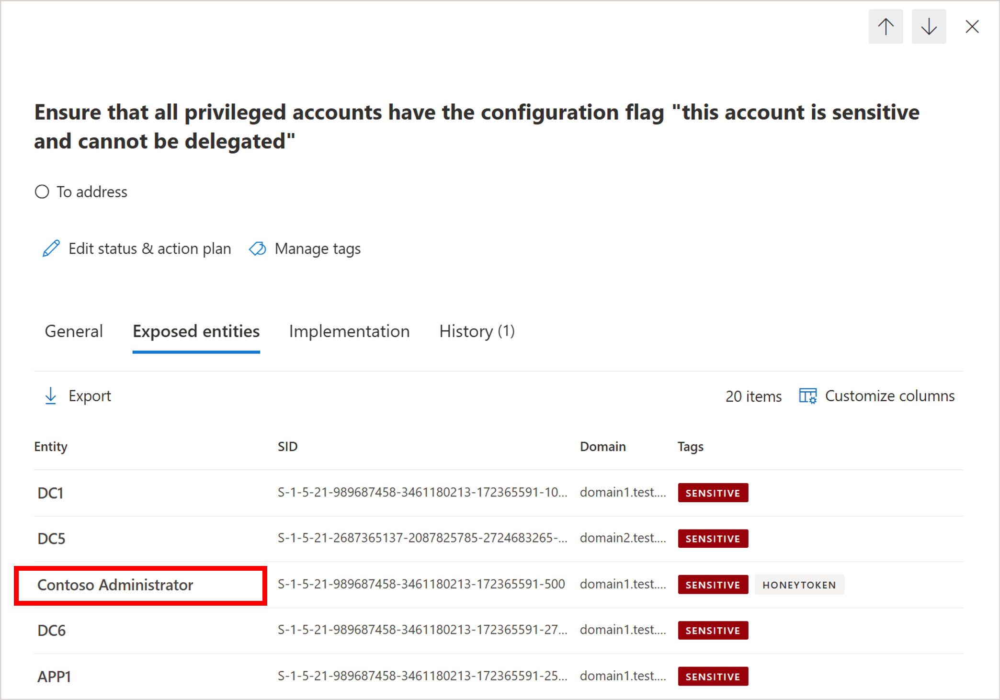

---
# Required metadata
# For more information, see https://review.learn.microsoft.com/en-us/help/platform/learn-editor-add-metadata?branch=main
# For valid values of ms.service, ms.prod, and ms.topic, see https://review.learn.microsoft.com/en-us/help/platform/metadata-taxonomies?branch=main

title: 'Security Arsement: Ensure that all privileged accounts have the configuration flag "this account is sensitive and cannot be delegated"'
description: This recommendation lists all privileged accounts that lack the "account is sensitive and cannot be delegated" flag.
author:      LiorShapiraa # GitHub alias
ms.author: liorshapira
ms.service: microsoft-defender-for-identity
ms.topic: article
ms.date:     10/05/2024
---

# Security Assessment: Ensure that all privileged accounts have the configuration flag "this account is sensitive and cannot be delegated"

This recommendation lists all privileged accounts that lack the "account is sensitive and cannot be delegated" flag. Privileged accounts are accounts that are being members of a privileged group such as Domain admins, Schema admins, Read only domain controllers and so on. 

### Organization risk

If the sensitive flag is disabled, attackers could exploit Kerberos delegation to misuse privileged account credentials, leading to unauthorized access, lateral movement, and potential network-wide security breaches.   Setting the sensitive flag on privileged accounts will prevent users from gaining access to the account and manipulating system settings. 

### Remediation steps

1. Review the list of exposed entities to discover which of your privileged accounts don’t have the configuration flag "this account is sensitive and cannot be delegated". 

1. Take appropriate action on those accounts by setting the account's control flags to "this account is sensitive and cannot be delegated". Under the Account tab, select use the check box to this flag in the Account Options section. This will prevent users from gaining access to the account and manipulating system settings.  

For example:

### 

Next steps

[Learn more about Microsoft Secure Score](/microsoft-365/security/defender/microsoft-secure-score)

