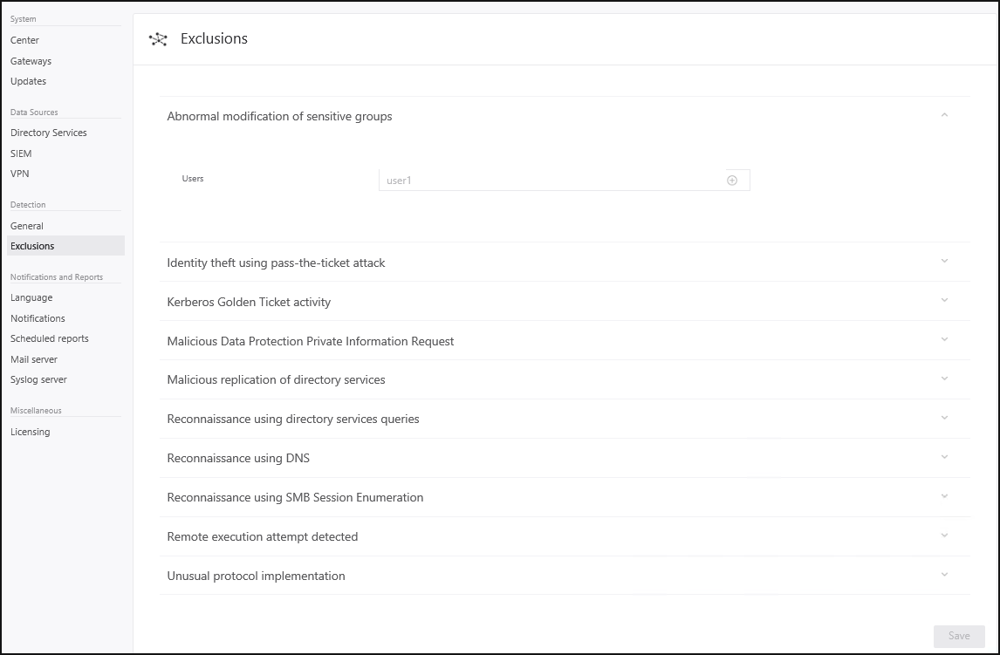
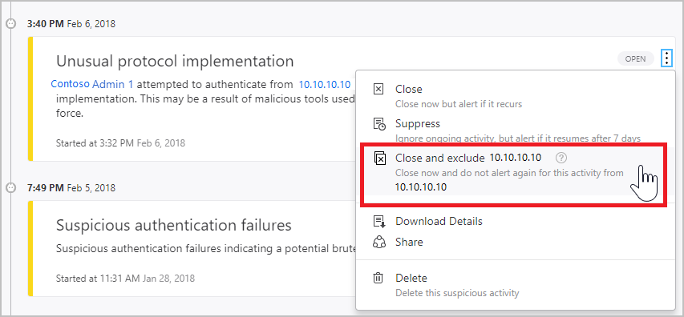

# Configure detection exclusions

> [!NOTE]
> The experience described in this page can also be accessed at <https://security.microsoft.com> as part of Microsoft 365 Defender. The supporting documents for the new experience can be found [here](/microsoft-365/security/defender-identity/exclusions). For more information about Microsoft Defender for Identity and when other features will be available in Microsoft 365 Defender, see [Microsoft Defender for Identity in Microsoft 365 Defender](defender-for-identity-in-microsoft-365-defender.md).

[!INCLUDE [Product long](includes/product-long.md)] enables the exclusion of specific IP addresses, computers, or users from a number of detections.

For example, a **DNS Reconnaissance exclusion** could be a security scanner that uses DNS as a scanning mechanism. The exclusion helps [!INCLUDE [Product short](includes/product-short.md)] ignore such scanners.

## How to add detection exclusions

There are two ways you can manually exclude users, computers, domains, or IP addresses for a detection. You can either do so on the **Configuration** page under **Exclusions**, or directly from the security alert.

### From the Configuration page

To configure exclusions from the configuration page, do the following:

1. In the [!INCLUDE [Product short](includes/product-short.md)] portal, select **Configuration**.

    ] configuration settings](media/config-menu.png)

1. Under **Detection**, select **Exclusions**.
1. For each detection that you want to configure, do the following:
    1. Enter an IP address, computer, domain, or user account to be excluded from the detection
    1. Select the plus icon **(+)**.

    > [!TIP]
    > The user or computer field is searchable and will autofill with entities in your network. For more information, see the [security alert guide](suspicious-activity-guide.md).

    

1. Select **Save**.

>[!NOTE]
>Of the most common domains with [Suspicious communication over DNS](exfiltration-alerts.md#suspicious-communication-over-dns-external-id-2031) alerts opened on them, we observed the domains that customers most excluded from the alert. These domains are added to the exclusions list by default, but you have the option to easily remove them.

### From a security alert

To configure exclusions from a security alert, do the following:

1. In the [!INCLUDE [Product short](includes/product-short.md)] portal, select **Timeline**.
1. Identify an alert on an activity for a user, computer, or IP address that **is** allowed to perform the particular activity.

1. To the right of the alert, select **More [...]** > **Close and exclude**. The action closes the alert and it's no longer listed in the **Open** events list in the **Alert timeline**. The action also adds the user, computer, or IP address to the exclusions list for that alert.

    

[!INCLUDE [Product short](includes/product-short.md)] scanning starts immediately. Some detections, such as [Suspicious additions to sensitive groups](domain-dominance-alerts.md#suspicious-additions-to-sensitive-groups-external-id-2024), require a learning period and aren't available immediately after [!INCLUDE [Product short](includes/product-short.md)] deployment. The learning period for each alert is listed in the detailed [security alert guide](suspicious-activity-guide.md).

## See Also

- [Configure event collection](configure-event-collection.md)
- [Check out the [!INCLUDE [Product short](includes/product-short.md)] forum!](<https://aka.ms/MDIcommunity>)
