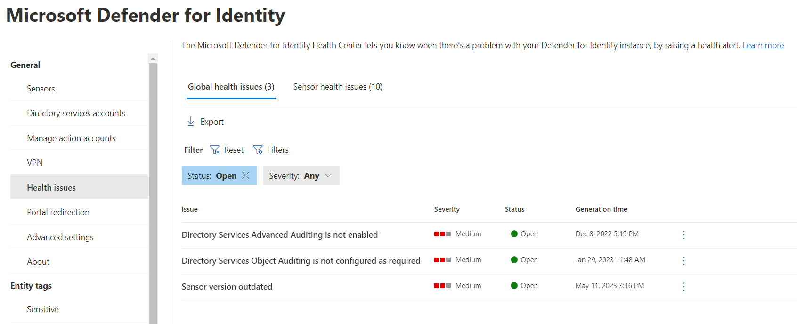

# Microsoft Defender for Identity sensor health issues

> [!NOTE]
> The experience described in this page can be accessed at <https://security.microsoft.com> as part of Microsoft 365 Defender.

## Health issues page

The Microsoft Defender for Identity **Health issues** page lets you know when there's a problem with your Defender for Identity instance, by raising a health alert. To access the page, follow these steps:

1. In [Microsoft 365 Defender](https://security.microsoft.com), go to **Settings** and then **Identities**.

    

1. Under **General**, select **Health issues**.

    

1. The **Health issues** page appears, where you can see **Open**, **Closed**, and **Suppressed** health issues.

1. Select any issue for more details, and the option to close or suppress the issue.

    :::image type="content" source="media/global-health-issues-details.png" alt-text="Health issues details":::

## Health issues

This section describes all the health issues for each component, listing the cause and the steps needed to resolve the problem.

Sensor-specific health issues are displayed in the **Sensor health issues** tab and domain related or aggregated health issues are displayed in the **Global health issues** tab as detailed in the following tables:

### A domain controller is unreachable by a sensor

|Alert|Description|Resolution|Severity|Displayed in|
|----|----|----|----|----|
|The Defender for Identity sensor has limited functionality due to connectivity issues to the configured domain controller.|This affects Defender for Identity's ability to detect suspicious activities related to domain controllers monitored by this Defender for Identity sensor.| Make sure the domain controllers are up and running and that this Defender for Identity sensor can open LDAP connections to them. In addition, in **Settings** make sure to configure a Directory Service account for every deployed forest.|Medium|Sensors health issues tab|

### All/Some of the capture network adapters on a sensor are not available

|Alert|Description|Resolution|Severity|Displayed in|
|----|----|----|----|----|
|All/Some of the selected capture network adapters on the Defender for Identity sensor are disabled or disconnected.|Network traffic for some/all of the domain controllers is no longer captured by the Defender for Identity sensor. This issue affects the ability to detect suspicious activities, related to those domain controllers.|Make sure these selected capture network adapters on the Defender for Identity sensor are enabled and connected.|Medium|Sensors health issues tab|

### Directory services user credentials are incorrect

|Alert|Description|Resolution|Severity|Displayed in|
|----|----|----|----|----|
|The credentials for the directory services user account are incorrect.|This issue affects sensors' ability to detect activities using LDAP queries against domain controllers.|- For a **standard** AD accounts: Verify that the username, password, and domain in the **Directory services** configuration page are correct. - For **group Managed Service Accounts:** Verify that the username and domain in the **Directory Services** configuration page are correct. Also check all the other **gMSA account** prerequisites described on the [Directory Service account recommendations](deploy/directory-service-accounts.md) page.|Medium|Global health issues tab|

### Low success rate of active name resolution

|Alert|Description|Resolution|Severity|Displayed in|
|----|----|----|----|----|
|The listed Defender for Identity sensors are failing to resolve IP addresses to device names more than 90% of the time using the following methods: - NTLM over RPC - NetBIOS - Reverse DNS|This affects Defender for Identity's detections capabilities and might increase the number of false positive alarms.|- For NTLM over RPC: Check that port 135 is open for inbound communication from Defender for Identity sensors on all computers in the environment. - For reverse DNS: Check that the sensors can reach the DNS server and that Reverse Lookup Zones are enabled. - For NetBIOS: Check that port 137 is open for inbound communication from Defender for Identity sensors on all computers in the environment. Additionally, make sure that the network configuration (such as firewalls) isn't preventing communication to the relevant ports.|Low|Sensors health issues tab and Global health issues tab|

### No traffic received from domain controller

|Alert|Description|Resolution|Severity|Displayed in|
|----|----|----|----|----|
|No traffic was received from the domain controller via this Defender for Identity sensor.|This issue might indicate that port mirroring from the domain controllers to the Defender for Identity sensor isn't configured yet or not working.|Verify that [port mirroring is configured properly on your network devices](deploy/configure-port-mirroring.md).  On the Defender for Identity sensor capture NIC, disable these features in Advanced Settings:  Receive Segment Coalescing (IPv4)  Receive Segment Coalescing (IPv6)|Medium|Sensors health issues tab and Global health issues tab|

### Read-only user password to expire shortly

|Alert|Description|Resolution|Severity|Displayed in|
|----|----|----|----|----|
|The read-only user password, used to perform resolution of entities against Active Directory, is about to expire in less than 30 days.|If the password for this user expires, all the Defender for Identity sensors stop running and no new data is collected.|Change the domain connectivity password and then [update the Directory Service account](deploy/directory-service-accounts.md#configure-a-directory-service-account-in-microsoft-365-defender) password.|Medium|Global health issues tab|

### Read-only user password expired

|Alert|Description|Resolution|Severity|Displayed in|
|----|----|----|----|----|
|The read-only user password, used to get directory data, expired.|All the Defender for Identity sensors stop running, or will stop running soon, and no new data is collected.|Change the domain connectivity password and then [update the Directory Service account](deploy/directory-service-accounts.md#configure-a-directory-service-account-in-microsoft-365-defender) password.|High|Global health issues tab|

### Sensor outdated

|Alert|Description|Resolution|Severity|Displayed in|
|----|----|----|----|----|
|A Defender for Identity sensor is outdated.|A Defender for Identity sensor is running a version that can't communicate with the Defender for Identity cloud infrastructure.|Manually update the sensor and check to see why the sensor isn't automatically updating. If this option doesn't work, download the latest sensor installation package and uninstall and reinstall the sensor. For more information, see [Download the Microsoft Defender for Identity sensor](deploy/download-sensor.md) and [Install the Microsoft Defender for Identity sensor](deploy/install-sensor.md).|Medium|Sensors health issues tab and Global health issues tab|

### Sensor reached a memory resource limit

|Alert|Description|Resolution|Severity|Displayed in|
|----|----|----|----|----|
|The Defender for Identity sensor stopped itself and restarts automatically to protect the domain controller from a low memory condition.|The Defender for Identity sensor enforces memory limitations upon itself to prevent the domain controller from experiencing resource limitations. This issue occurs when memory usage on the domain controller is high. Data from this domain controller is only partly monitored.|Increase the amount of memory (RAM) on the domain controller or add more domain controllers in this site to better distribute the load of this domain controller.|Medium|Sensors health issues tab|

### Sensor service failed to start

|Alert|Description|Resolution|Severity|Displayed in|
|----|----|----|----|----|
|The Defender for Identity sensor service failed to start for at least 30 minutes.|This issue can affect the ability to detect suspicious activities originating from domain controllers that are monitored by this Defender for Identity sensor.|Monitor Defender for Identity sensor logs to understand the root cause for Defender for Identity sensor service failure.|High|Sensors health issues tab|

### Sensor stopped communicating

|Alert|Description|Resolution|Severity|Displayed in|
|----|----|----|----|----|
|There has been no communication from the Defender for Identity sensor. The default time span for this alert is 5 minutes.|Network traffic is no longer captured by the network adapter on the Defender for Identity sensor. This affects Defender for Identity's ability to detect suspicious activities, since network traffic isn't able to reach the Defender for Identity cloud service.|Check that the port used for the communication between the Defender for Identity sensor and Defender for Identity cloud service isn't blocked by any routers or firewalls.|Medium|Sensors health issues tab|

### Some Windows events are not being analyzed

|Alert|Description|Resolution|Severity|Displayed in|
|----|----|----|----|----|
|The Defender for Identity sensor is receiving more events than it can process.|Some Windows events aren't being analyzed. This can affect the ability to detect suspicious activities originating from domain controllers being monitored by this Defender for Identity sensor.|Consider [adding more processors and memory](deploy/capacity-planning.md) as required. If you're using a standalone Defender for Identity sensor, verify that only the required events are forwarded to the sensor. Or, try forwarding some events to another Defender for Identity sensor.|Medium|Sensors health issues tab and Global health issues tab|

### Some network traffic could not be analyzed

|Alert|Description|Resolution|Severity|Displayed in|
|----|----|----|----|----|
|The Defender for Identity sensor is receiving more network traffic than it can process.|Some network traffic couldn't be analyzed. This issue can affect the ability to detect suspicious activities originating from domain controllers being monitored by this Defender for Identity sensor.|Consider [adding more processors and memory](deploy/capacity-planning.md) as required. If you're using a standalone Defender for Identity sensor, reduce the number of domain controllers being monitored.  This issue can also happen if you're using domain controllers on VMware virtual machines. To avoid these issues, you can check that the following settings are set to **0** or **Disabled** in the virtual machine (in the Windows OS, not in the VMware settings):  - **Large Send Offload V2 (IPv4)**  - **IPv4 TSO Offload**  The names may vary depending on your VMware version. For more information, see your VMware documentation.|Medium|Sensors health issues tab and Global health issues tab|

### Some ETW events are not being analyzed

|Alert|Description|Resolution|Severity|Displayed in|
|----|----|----|----|----|
|The Defender for Identity sensor is receiving more Event Tracing for Windows (ETW) events than it can process.|Some Event Tracing for Windows (ETW) events aren't being analyzed. This can affect the ability to detect suspicious activities originating from domain controllers being monitored by this Defender for Identity sensor.|Consider [adding more processors and memory](deploy/capacity-planning.md) as required.|Medium|Sensors health issues tab and Global health issues tab|

### Sensor with Windows Server 2008 R2: Will be unsupported soon

|Alert|Description|Resolution|Severity|Displayed in|
|----|----|----|----|----|
|The Defender for Identity sensor is running on Windows 2008 R2, which will be unsupported soon.|Starting June 15, 2022, Microsoft will no longer support the Defender for Identity sensor on devices running Windows Server 2008 R2. More details can be fount at: <https://aka.ms/mdi/2008r2> |Upgrade the Operating System on this Domain Controller to at least Windows Server 2012.|Medium (Starting June 1, 2022 the severity of this health alert will be High)|Sensors health issues tab|

### Sensor with Windows Server 2008 R2: Unsupported

|Alert|Description|Resolution|Severity|Displayed in|
|----|----|----|----|----|
|The Defender for Identity sensor is running on Windows 2008 R2, which is unsupported.|Starting June 15, 2022, Microsoft will no longer support the Defender for Identity sensor on devices running Windows Server 2008 R2. More details can be found at: <https://aka.ms/mdi/2008r2> |Upgrade the Operating System on this Domain Controller to at least Windows Server 2012.|High|Sensors health issues tab|

### Sensor has issues with packet capturing component

|Alert|Description|Resolution|Severity|Displayed in|
|----|----|----|----|----|
|The Defender for Identity sensor is using WinPcap drivers instead of Npcap drivers.|We recommend all customers use the Npcap driver instead of the WinPcap drivers. Starting with Defender for Identity version 2.184, the installation package installs Npcap 1.0 OEM instead of the WinPcap 4.1.3 drivers.|Install Npcap according to the guidance as described in: <https://aka.ms/mdi/npcap>|Low|Sensors health issues tab|
|The Defender for Identity sensor is running an Npcap version older than the minimum required version.|We recommend all customers use the Npcap driver instead of the WinPcap drivers. Starting with Defender for Identity version 2.184, the installation package installs Npcap 1.0 OEM instead of the WinPcap 4.1.3 drivers.|Upgrade Npcap according to the guidance as described in: <https://aka.ms/mdi/npcap>|Medium|Sensors health issues tab|
|The Defender for Identity sensor is running an Npcap component that isn't configured as required.|We recommend all customers use the Npcap driver instead of the WinPcap drivers. Starting with Defender for Identity version 2.184, the installation package installs Npcap 1.0 OEM instead of the WinPcap 4.1.3 drivers.|Install Npcap according to the guidance as described in: <https://aka.ms/mdi/npcap>|High|Sensors health issues tab|

### NTLM Auditing is not enabled

|Alert|Description|Resolution|Severity|Displayed in|
|----|----|----|----|----|
|NTLM Auditing isn't enabled.|NTLM Auditing (for event ID 8004) is not enabled on the server. (This configuration is validated once a week, per sensor).|Enable NTLM Auditing events according to the guidance as described at the [Event ID 8004](deploy/configure-windows-event-collection.md#event-id-8004) section, in the [Configure Windows Event collection](deploy/configure-windows-event-collection.md) page.|Medium|Sensors health issues tab|

### Directory Services Advanced Auditing is not enabled as required

|Alert|Description|Resolution|Severity|Displayed in|
|----|----|----|----|----|
|Directory Services Advanced Auditing is not enabled as required. (This configuration is validated once a day, per domain).|The Directory Services Advanced Auditing configuration doesn't include all the categories and subcategories as required.|Enable the Directory Services Advanced Auditing events. For more information, see [Configure audit policies for Windows event logs](deploy/configure-windows-event-collection.md).|Medium|Global health issues tab|

### Directory Services Object Auditing is not enabled as required

|Alert|Description|Resolution|Severity|Displayed in|
|----|----|----|----|----|
|Directory Services Object Auditing is not enabled as required. (This configuration is validated once a day, per domain).|The Directory Services Object Auditing configuration doesn't include all the object types and permissions as required.|Enable the Directory Services Object Auditing events according to the guidance as described in the [Configure Audit Policies](deploy/configure-windows-event-collection.md#configure-object-auditing) section, in the [Configure Windows Event collection](deploy/configure-windows-event-collection.md) page.|Medium|Global health issues tab|

### Auditing on the Configuration container is not enabled as required

|Alert|Description|Resolution|Severity|Displayed in|
|----|----|----|----|----|
|Auditing on the Configuration container isn't enabled as required. (This configuration is validated once a day, per domain).|The Directory Services Auditing on the Domain's Configuration container is not enabled as required.|Enable the Directory Services Auditing on the Domain's Configuration container according to the guidance as described in the [Configure Audit Policies](deploy/configure-windows-event-collection.md#enable-auditing-on-an-exchange-object) section, in the [Configure Windows Event collection](deploy/configure-windows-event-collection.md) page.|Medium|Global health issues tab|

### Auditing on the ADFS container is not enabled as required

|Alert|Description|Resolution|Severity|Displayed in|
|----|----|----|----|----|
|Auditing on the ADFS container is not enabled as required. (This configuration is validated once a day, per domain).|The Directory Services Auditing on the ADFS container isn't enabled as required.|Enable the Directory Services Auditing on the ADFS container according to the guidance as described in the [Enable auditing on an ADFS object](deploy/configure-windows-event-collection.md#enable-auditing-on-an-adfs-object) section, in the [Configure Windows Event collection](deploy/configure-windows-event-collection.md) page.|Medium|Global health issues tab|

### Power mode is not configured for optimal processor performance

|Alert|Description|Resolution|Severity|Displayed in|
|----|----|----|----|----|
|Power mode is not configured for optimal processor performance. (This configuration is validated once a day, per sensor).|The operating system's power mode isn't configured to the optimal processor performance settings. This issue can affect the server's performance and the sensors' ability to detect suspicious activities.|Do one of the following:   - Configure the power option of the machine running the Defender for Identity sensor to *High Performance* - Set both the minimum and maximum processor state to *100*  For more information, see the [Server specifications](deploy/prerequisites.md#sensor-requirements) section in the [Defender for Identity prerequisites](deploy/prerequisites.md) page.|Low|Sensors health issues tab|

### Sensor failed to write to the custom log path

|Alert|Description|Resolution|Severity|Displayed in|
|----|----|----|----|----|
|Sensor failed to write to the custom log path.|The custom log path provided in the sensor configuration can't be created.|1. Stop the `AATPSensorUpdater` and `AATPSensor` services.  2. Change the `SensorCustomLogLocation` in the sensor configuration file to a valid path or set it to null.  3. Start the `AATPSensorUpdater` and `AATPSensor` services again.|Low|Sensors health issues tab|

### Radius accounting (VPN integration) data ingestion failures

|Alert|Description|Resolution|Severity|Displayed in|
|----|----|----|----|----|
|Radius accounting (VPN integration) data ingestion failures.|The listed Defender for Identity sensors have radius accounting (VPN integration) data ingestion failures.|Validate that the shared secret in the Defender for Identity configuration settings matches your VPN server, according to the guidance described [Configure VPN in Defender for Identity](vpn-integration.md#configure-vpn-in-defender-for-identity) section, in the [Defender for Identity VPN integration](vpn-integration.md) page.|Low|Health issues page|

<!--
## Windows events missing from domain controller audit policy
|Alert|Description|Resolution|Severity|
|----|----|----|----|
| Windows events missing from domain controller audit policy|For the correct events to be audited and included in the Windows Event Log, your domain controllers require accurate Advanced Audit Policy settings. Incorrect Advanced Audit Policy settings leave critical events out of your logs, and result in incomplete Defender for Identity coverage.|Review your [Advanced Audit policy](configure-windows-event-collection.md) and modify as needed. | Medium|
-->

## Next steps

- [Defender for Identity prerequisites](deploy/prerequisites.md)
- [Defender for Identity capacity planning](deploy/capacity-planning.md)
- [Configure event collection](deploy/configure-event-collection.md)
- [Configuring Windows event forwarding](deploy/configure-event-forwarding.md)
- [Check out the Defender for Identity forum!](<https://aka.ms/MDIcommunity>)

