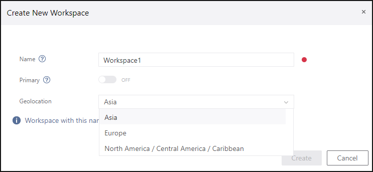
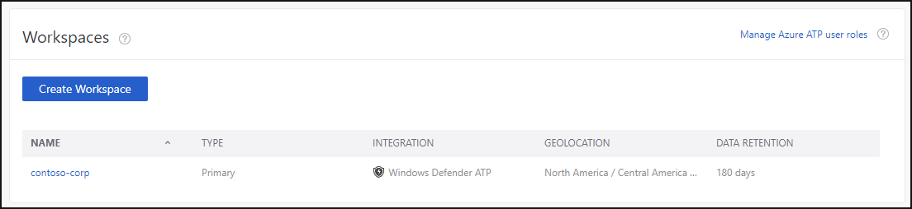

---
# required metadata

title: Install Azure Advanced Threat Protection - Step 1 | Microsoft Docs
description: First step to install Azure ATP involves creating a workspace for your Azure ATP deployment.
keywords:
author: rkarlin
ms.author: rkarlin
manager: mbaldwin
ms.date: 2/21/2018
ms.topic: get-started-article
ms.prod:
ms.service: azure-advanced-threat-protection
ms.technology:
ms.assetid: 15ee7d0b-9a0c-46b9-bc71-98d0b4619ed0

# optional metadata

#ROBOTS:
#audience:
#ms.devlang:
ms.reviewer: itargoet
ms.suite: ems
#ms.tgt_pltfrm:
#ms.custom:

---

*Applies to: Azure Advanced Threat Protection*

# Creating a workspace in the Azure ATP workspace management portal - Step 1

>[!div class="step-by-step"]
[Step 2 »](install-atp-step2.md)

This installation procedure provides instructions for creating and managing a workspace in the Azure ATP workspace management portal. For information on Azure ATP architecture, see [Azure ATP architecture](atp-architecture.md).

In Azure ATP, you have the ability to manage and monitor multiple workspaces. This is especially helpful if you want to create a demo workspace and a test workspace in which you can POC Azure ATP before rolling it out to your whole organization. This is also needed to support deployments with multiple forests. A single workspace can only monitor multiple domains from a single forest.

## Step 1. Enter the workspace management portal

After you verified that your network meets the requirements of the sensor, you can proceed with the creation of the Azure ATP workspace.

> [!NOTE]
>In order to access the workspace management portal, you need to be a global administrator or security administrator on that tenant.

1.  Enter [the Azure ATP workspace portal](https://portal.atp.azure.com).

2.  Log in with your on-premises Azure Active Directory user account that has at least read access to all objects in the monitored domains.

## Step 2. Create a workspace

1. Click **Create workspace**.

2. In the **Create new workspace** dialog, name your workspace, decide whether it's your primary workspace or not, and select a **Geolocation** for your data center. Only one workspace can be set as primary. Setting a workspace as primary affects integrations - you can only integrate Azure ATP with Windows Defender ATP for your primary workspace. You can change which workspace is Primary later, but in order to do so, you have to remove any integrations already set for the current primary workspace.
 > [!NOTE]
 > After you select a Geolocation, you cannot modify it.
    

3. You can click the **Manage Azure ATP user roles** link to directly access the [Azure Active Directory admin center](https://docs.microsoft.com/azure/active-directory/active-directory-assign-admin-roles-azure-portal) and manage your role groups.

 > [!NOTE]
 > To successfully log in to Azure ATP, you have to log in with a user who was assigned the proper Azure ATP role to access the Azure ATP workspace portal. For more information about role-based access control (RBAC) in Azure ATP, see [Working with Azure ATP role groups](atp-role-groups.md).

4. Click on the name of the new workspace access the Azure ATP workspace portal for that workspace.

    

- Only the Primary workspace can be edited. To make changes to other workspaces, you can delete them and add them again. If you want to delete the primary workspace, you must first turn off integrations and set the workspace to be not **Primary** before it is able to be deleted.
- To edit a Primary workspace, you must first turn off existing integrations in the workspace.

- Data retention – deleted workspaces do not appear in the UI, however their data is retained according to [Microsoft data retention policy](https://www.microsoft.com/trustcenter/privacy/you-own-your-data).

>[!div class="step-by-step"]
[« Pre-install](configure-port-mirroring.md)
[Step 2 »](install-atp-step2.md)

## See Also
- [Azure ATP sizing tool](http://aka.ms/aatpsizingtool)
- [Configure event collection](configure-event-collection.md)
- [Azure ATP prerequisites](atp-prerequisites.md)
- [Check out the ATP forum!](https://aka.ms/azureatpcommunity)
