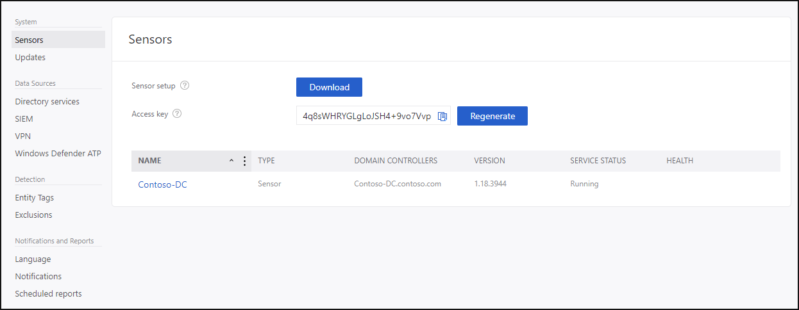

---
# required metadata

title: Download the Azure ATP sensor setup package quickstart | Microsoft Docs
description: Step three of installing Azure ATP helps you download the Azure ATP sensor setup package.
keywords:
author: shsagir
ms.author: shsagir
ms.date: 02/19/2020
ms.topic: conceptual
ms.collection: M365-security-compliance
ms.service: azure-advanced-threat-protection
ms.assetid: 95bb4ec1-841f-41b7-92fe-fbd144085724

# optional metadata

#ROBOTS:
#audience:
#ms.devlang:
# ms.reviewer: itargoet
# ms.suite: ems
#ms.tgt_pltfrm:
#ms.custom:

---
# Quickstart: Download the Azure ATP sensor setup package

In this quickstart, you'll download the Azure ATP sensor setup package from the portal.

## Prerequisites

- An [Azure ATP instance](install-atp-step1.md) that's [connected to Active Directory](install-atp-step2.md).

## Download the setup package

After configuring the domain connectivity settings, you can download the Azure ATP sensor setup package. For more information on the Azure ATP sensor, see [Azure ATP Architecture](atp-architecture.md).

Click **Download** in the list of steps at the top of the page to go to the **Sensor** page.

 To reach the sensor configuration screen later, click the **settings icon** (upper right corner), select **Configuration**, then, under **System**, click **sensor**.  

1. Click **sensor**.
2. Save the package locally.
3. Copy the **Access** **key**. The access key is required for the Azure ATP sensor to connect to your Azure ATP instance. The access key is a one-time-password for sensor deployment, after which all communication is performed using certificates for authentication and TLS encryption. Use the **Regenerate** button if you ever need to regenerate the new access key, you can, and it won't affect any previously deployed sensors, because it's only used for initial registration of the sensor.
4. Copy the package to the dedicated server or domain controller onto which you're installing the Azure ATP sensor. Alternatively, you can open the Azure ATP portal from the dedicated server or domain controller and skip this step.

The zip file includes the following files:

- Azure ATP sensor installer

- Configuration setting file with the required information to connect to the Azure ATP cloud service

## Next steps

> [!div class="step-by-step"]
> [« Step 2 - Connect to Active Directory](install-atp-step2.md)
> [Step 4 - Install the Azure ATP sensor »](install-atp-step4.md)

## Join the Community

Have more questions, or an interest in discussing Azure ATP and related security with others? Join the [Azure ATP Community](https://aka.ms/azureatpcommunity) today!
