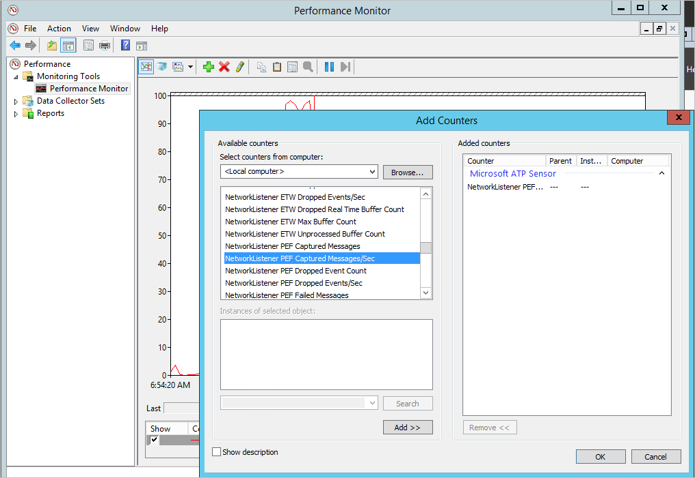

---
# required metadata

title: Install Azure Advanced Threat Protection - Step 5 | Microsoft Docs
description: Step five of installing Azure ATP helps you configure settings for your Azure ATP Standalone Sensor.
keywords:
author: rkarlin
ms.author: rkarlin
manager: mbaldwin
ms.date: 2/14/2017
ms.topic: get-started-article
ms.prod:
ms.service: azure-advanced-threat-protection
ms.technology:
ms.assetid: d7c95f8c-04f8-4946-9bae-c27ed362fcb0

# optional metadata

#ROBOTS:
#audience:
#ms.devlang:
ms.reviewer: bennyl
ms.suite: ems
#ms.tgt_pltfrm:
#ms.custom:

---

*Applies to: Azure Advanced Threat Protection*

# Install Azure ATP - Step 5

>[!div class="step-by-step"]
[« Step 4](install-atp-step4.md)
[Step 6 »](install-atp-step6.md)

## Step 5. Configure the Azure ATP Standalone Sensor settings
After the Azure ATP Standalone Sensor was installed, perform the following steps to configure the settings for the Azure ATP Standalone Sensor.

1.  In the Azure ATP workspace portal, go to **Configuration** and, under **System**, select **Sensors**.
   
     

2.  Click on the Sensor you want to configure and enter the following information:

    

  - **Description**: Enter a description for the Azure ATP Standalone Sensor (optional).
  - **Port Mirrored Domain Controllers (FQDN)** (required for the Azure ATP Standalone Sensor, this cannot be changed for the Azure ATP Sensor): Enter the complete FQDN of your domain controller and click the plus sign to add it to the list. For example,  **dc01.contoso.com**

      The following information applies to the servers you enter in the **Domain Controllers** list:
      - All domain controllers whose traffic is being monitored via port mirroring by the Azure ATP Standalone Sensor must be listed in the **Domain Controllers** list. If a domain controller is not listed in the **Domain Controllers** list, detection of suspicious activities might not function as expected.
      - At least one domain controller in the list should be a global catalog. This enables Azure ATP to resolve computer and user objects in other domains in the forest.

  - **Capture Network adapters** (required):
  - For an Azure ATP Standalone Sensor on a dedicated server, select the network adapters that are configured as the destination mirror port. These receive the mirrored domain controller traffic.
  - For an Azure ATP Sensor, this should be all the network adapters that are used for communication with other computers in your organization.

  - **Domain synchronizer candidate**: Any Azure ATP Standalone Sensor set to be a domain synchronizer candidate can be responsible for synchronization between Azure ATP and your Active Directory domain. Depending on the size of the domain, the initial synchronization might take some time and is resource-intensive. By default, only Azure ATP Standalone Sensors are set as Domain synchronizer candidates.
   It is recommended that you disable any remote site Azure ATP Sensors from being Domain synchronizer candidates.
   If your domain controller is read-only, do not set it as a Domain synchronizer candidate. For more information, see [Azure ATP architecture](atp-architecture.md#azure-atp-sensor-features).
  
3. Optionally, you can set the [Syslog listener](configure-event-collection.md). 
4. Click **Save**.

## Validate installations
To validate that the Azure ATP Standalone Sensor has been successfully deployed, check the following steps:

1.  Check that the service named **Azure Advanced Threat Protection Sensor** is running. After you save the Azure ATP Standalone Sensor settings, it might take a few seconds for the service to start.

2.  If the service does not start, review the “Microsoft.Tri.Sensor-Errors.log” file located in the following default folder, “%programfiles%\Azure Advanced Threat Protection\Sensor\Version X\Logs”.

3.  Go to your workspace URL. In the workspace portal, search for something in the search bar, such as a user or a group on your domain.

    

>[!div class="step-by-step"]
[« Step 4](install-atp-step4.md)
[Step 6 »](install-atp-step6.md)

## See Also

- [Azure ATP sizing tool](http://aka.ms/trisizingtool)
- [Configure event collection](configure-event-collection.md)
- [Azure ATP prerequisites](atp-prerequisites.md)

