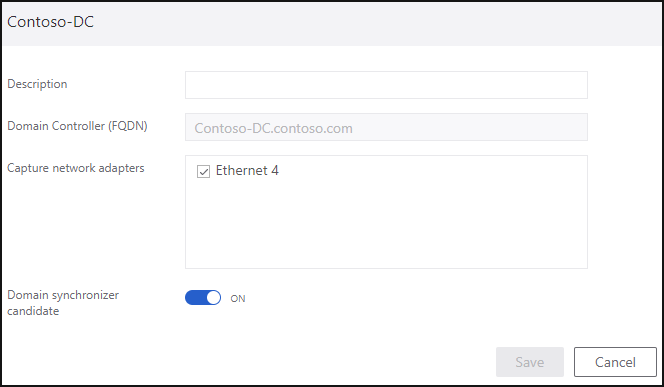

---
# required metadata

title: Configure Azure ATP sensor settings conceptual
description: Step five of installing Azure ATP helps you configure settings for your Azure ATP standalone sensor.
author: shsagir
ms.author: shsagir
ms.date: 09/15/2019
ms.topic: conceptual
ms.collection: M365-security-compliance
ms.service: azure-advanced-threat-protection


# optional metadata

#ROBOTS:
#audience:
#ms.devlang:
ms.reviewer: itargoet
ms.suite: ems
#ms.tgt_pltfrm:
#ms.custom:

---

# Configure Azure ATP sensor settings

In this article, you'll learn how to correctly configure Azure ATP sensor settings to start seeing data. You'll need to do additional configuration and integration to take advantage of Azure ATP's full capabilities.  

## Prerequisites

- An [Azure ATP instance](install-atp-step1.md) that's [connected to Active Directory](install-atp-step2.md).
- A downloaded copy of your [ATP sensor setup package](install-atp-step3.md) and the access key.

## Configure sensor settings

After the Azure ATP sensor is installed, do the following to configure Azure ATP sensor settings.

1. Click **Launch** to open your browser and sign in to the Azure ATP portal.

1.  In the Azure ATP portal, go to **Configuration** and, under the **System** section, select **Sensors**.
   
    


1. Click on the sensor you want to configure and enter the following information:

   

   - **Description**: Enter a description for the Azure ATP sensor (optional).
   - **Domain Controllers (FQDN)** (required for the Azure ATP standalone sensor, this can't be changed for the Azure ATP sensor): Enter the complete FQDN of your domain controller and click the plus sign to add it to the list. For example,  **dc01.contoso.com**

     The following information applies to the servers you enter in the **Domain Controllers** list:
     - All domain controllers whose traffic is being monitored via port mirroring by the Azure ATP standalone sensor must be listed in the **Domain Controllers** list. If a domain controller isn't listed in the **Domain Controllers** list, detection of suspicious activities might not function as expected.
     - At least one domain controller in the list should be a global catalog. This enables Azure ATP to resolve computer and user objects in other domains in the forest.

   - **Capture Network adapters** (required):
   
    - For Azure ATP sensors, all network adapters that are used for communication with other computers in your organization.
    - For Azure ATP standalone sensor on a dedicated server, select the network adapters that are configured as the destination mirror port. These network adapters receive the mirrored domain controller traffic.

 
1. Click **Save**.


## Validate installations
To validate that the Azure ATP sensor has been successfully deployed, check the following:

1. Check that the service named **Azure Advanced Threat Protection sensor** is running. After you save the Azure ATP sensor settings, it might take a few seconds for the service to start.

1. If the service doesn't start, review the “Microsoft.Tri.sensor-Errors.log” file located in the following default folder, “%programfiles%\Azure Advanced Threat Protection sensor\Version X\Logs”.
 
   >[!NOTE]
   > The version of Azure ATP updates frequently, to check the latest version, in the Azure ATP portal, go to **Configuration** and then **About**. 

1. Go to your Azure ATP instance URL. In the Azure ATP portal, search for something in the search bar, such as a user or group on your domain.

1. Verify ATP connectivity on any domain device using the following steps:
    1. Open a command prompt
    1. Type ```nslookup```
    1. Type **server** then the FQDN or IP address of the domain controller where the ATP sensor is installed. For example,
    ```server contosodc.contoso.azure```
        - Make sure to replace contosodc.contoso.azure and contoso.azure with the FQDN of your Azure ATP sensor and domain name respectively.
    1. Type ```ls -d contoso.azure```
    1. Repeat steps 3 and 4 for each sensor you wish to test.  
    1. From the Azure ATP console, open the entity profile for the computer you ran the connectivity test from. 
    1. Check the related logical activity and confirm connectivity. 

    > [!NOTE] 
    >If the domain controller you wish to test is your first deployed sensor, wait at least 15 minutes to allow the database backend to finish initial deployment of the necessary microservices before you attempt to verify the related logical activity for that domain controller.

## Next steps

- [Proxy configuration](configure-proxy.md)
- [Advanced Audit Policy](atp-advanced-audit-policy.md)
- [Configure Azure ATP to make remote calls to SAM](install-atp-step8-samr.md)


## Join the Community

Have more questions, or an interest in discussing Azure ATP and related security with others? Join the [Azure ATP Community](https://aka.ms/azureatpcommunity) today!
