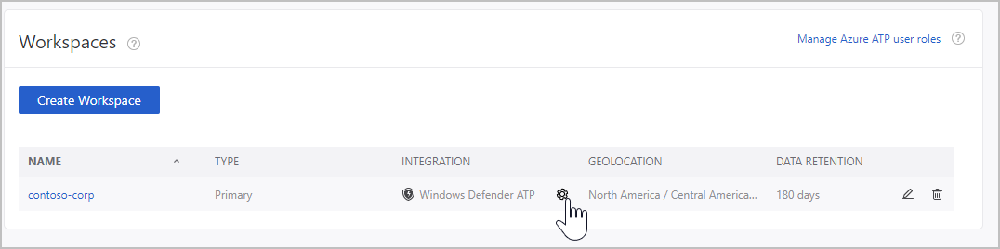
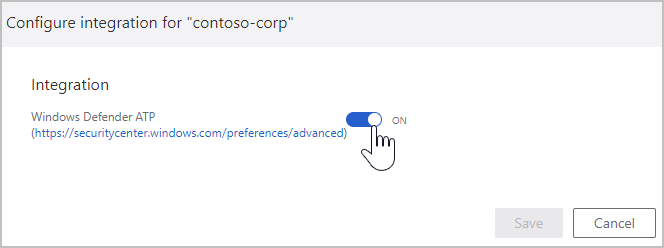
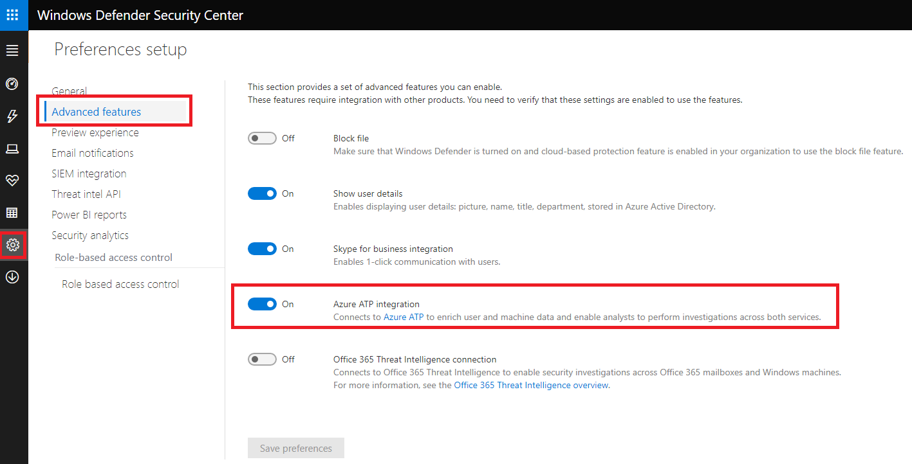
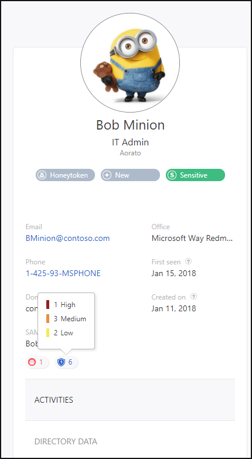
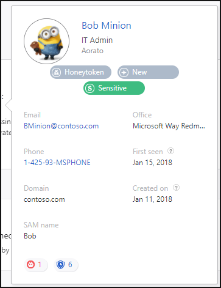
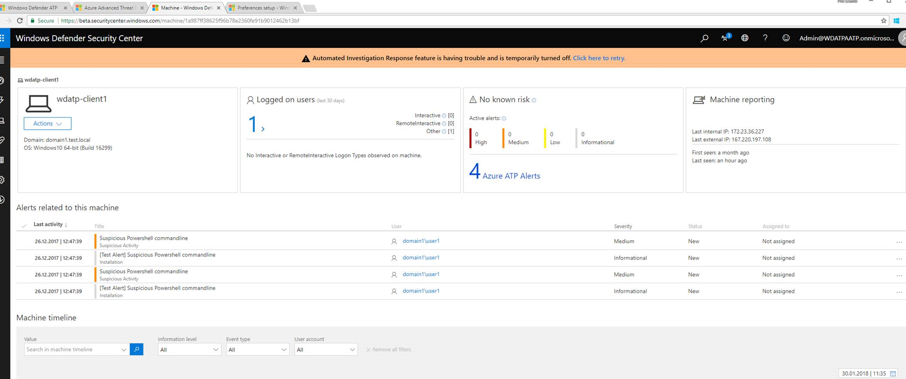

---
# required metadata

title: Azure Advanced Threat Protection integration with Windows Defender ATP | Microsoft Docs
description: How to integrate Azure Advanced Threat Protection with Windows Defender ATP for full threat detection coverage
keywords:
author: mlottner
ms.author: mlottner
manager: mbaldwin
ms.date: 9/12/2018
ms.topic: conceptual
ms.prod:
ms.service: azure-advanced-threat-protection
ms.technology:
ms.assetid: f6f3ed75-d6bb-4966-a9a7-5339c4f3ebac

# optional metadata

#ROBOTS:
#audience:
#ms.devlang:
ms.reviewer: itargoet
ms.suite: ems
#ms.tgt_pltfrm:
#ms.custom:

---

*Applies to: Azure Advanced Threat Protection*

# Integrating Azure ATP with Windows Defender ATP

Azure Advanced Threat Protection enables you to integrate Azure ATP with Windows Defender ATP, for an even more complete threat protection solution. While Azure ATP monitors the traffic on your domain controllers, Windows Defender ATP monitors your endpoints, together providing a single interface from which you can protect your environment.

By integrating Windows Defender ATP into Azure ATP, you can leverage the full power of both services and secure your environment, including:

- Azure ATP sensors and standalone sensors: Can sit directly on your domain controllers or port mirror from your domain controllers to ATP, to capture and parse network traffic of multiple protocols (such as Kerberos, DNS, RPC, NTLM, and others) for authentication, authorization, and information gathering. 

-   Endpoint behavioral sensors: Embedded in Windows 10, these sensors collect and process behavioral signals from the operating system (for example, process, registry, file, and network communications) and sends this sensor data to your private, isolated, cloud instance of Windows Defender ATP.

- Cloud security analytics: Leveraging big-data, machine-learning, and unique Microsoft view across the Windows ecosystem (such as the [Microsoft Malicious Software Removal Tool](https://www.microsoft.com/download/malicious-software-removal-tool-details.aspx)), enterprise cloud products (such as Office 365), and online assets (such as Bing and SmartScreen URL reputation), behavioral signals are translated into insights, detections, and recommended responses to advanced threats.

- Threat intelligence: Generated by Microsoft hunters, security teams, and augmented by threat intelligence provided by partners, threat intelligence enables Windows Defender ATP to identify attacker tools, techniques, and procedures, and generate alerts when these are observed in collected sensor data.

Azure ATP technology detects multiple suspicious activities, focusing on several phases of the cyber-attack kill chain including:

- Reconnaissance, during which attackers gather information on how the environment is built, what the different assets are, and which entities exist. They generally building their plan for the next phases of the attack.

- Lateral movement cycle, during which an attacker invests time and effort in spreading their attack surface inside your network.

- Domain dominance (persistence), during which an attacker captures the information allowing them to resume their campaign using various sets of entry points, credentials, and techniques.

At the same time, Windows Defender ATP leverages Microsoft technology and expertise to detect sophisticated cyber-attacks, providing:

- Behavior-based, cloud-powered, advanced attack detection  Finds the attacks that made it past all other defenses (post breach detection), provides actionable, correlated alerts for known and unknown adversaries trying to hide their activities on endpoints.

- Rich timeline for forensic investigation and mitigation  Easily investigate the scope of breach or suspected behaviors on any machine through a rich machine timeline. File, URLs, and network connection inventory across the network. Gain additional insight using deep collection and analysis (“detonation”) for any file or URLs.

- Built in unique threat intelligence knowledge base  Unparalleled threat optics provides actor details and intent context for every threat intel-based detection – combining first and third-party intelligence sources.

## Prerequisites

To enable this feature, you need a license for both Azure ATP and Windows Defender ATP. 

## How to integrate Azure ATP with Windows Defender ATP

1. Click **Configuration**, and under **Data sources** select **Windows Defender ATP**. Then click the link to **Workspace management**. This is only available if you have a license for Windows Defender ATP and you already performed the on-boarding process for Windows Defender ATP. 

2. In your workspace, click the settings cog.

 
 
3. Set the integration to **On**. 

 

4. In the [Windows Defender ATP portal](https://beta.securitycenter.windows.com/preferences/advanced), go to **Settings**, **Advanced features** and set **Azure ATP integration** to **ON**. 

 

5. To check the status of the integration, in the Azure ATP workspace portal, go to **Settings** and then **Windows Defender ATP integration**. You can see the status of the integration; if something is wrong you see an error. You can also see which workspace is integrated with Windows Defender ATP.

## How it works

After Azure ATP and Windows Defender ATP are fully integrated, in the Azure ATP workspace portal, in the mini-profile pop-up and in the entity profile page, each entity that exists in Windows Defender ATP includes a badge to show that it is integrated with Windows Defender ATP. 

 

If the entity contains alerts in Windows Defender ATP, there is a number next to the badge to let you know how many alerts were raised.

 

If you click on the badge, you are brought to the Windows Defender ATP portal where you can view and mitigate the alerts. If the entity is not recognized by Windows Defender ATP, the badge is grayed out. 

 

In the Windows Defender ATP portal, when you click on an endpoint, you can view Azure ATP alerts. If you click on the alerts for this entity in Windows Defender ATP, the entity's profile page opens in Azure ATP. 
 
 > [!NOTE]
 > Currently, Azure ATP integration with Windows Defender ATP supports only users and machines from the on-premises AD. Users from Azure AD and virtual machines that are managed in Azure will not be displayed as part of the integration 

## See Also

- [Investigating lateral movement paths with Azure ATP](use-case-lateral-movement-path.md)
- [Azure ATP sizing tool](http://aka.ms/aatpsizingtool)
- [Azure ATP architecture](atp-architecture.md)
- [Install ATP](install-atp-step1.md)
- [Check out the ATP forum!](https://aka.ms/azureatpcommunity)

