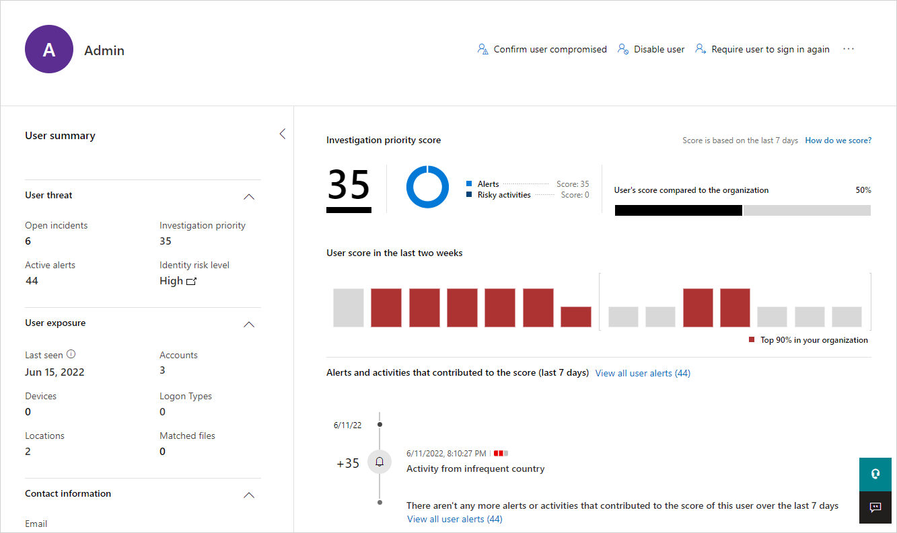
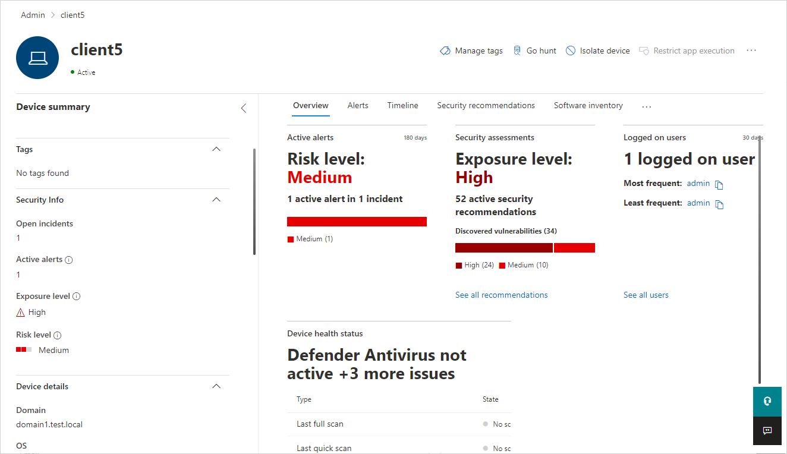

# Investigate assets

Microsoft Defender for Identity in Microsoft 365 Defender provides evidence when users, computers, and devices have performed suspicious activities or show signs of being compromised.  This article gives investigation suggestions to help you determine the risk to your organization, decide how to remediate, and determine the best way to prevent similar future attacks.

## Investigation steps for suspicious users

For information on how to view user profiles in Microsoft 365 Defender, see [Investigate users](/microsoft-365/security/defender/investigate-users).

If an alert or incident indicates that a user may be suspicious or compromised, check and investigate the user profile for the following details and activities:

1. Who is the [user](#check-the-entity-profile)?
    1. Is the user a [sensitive user](entity-tags.md) (such as admin, or on a watchlist, etc.)?
    1. What is their role within the organization?
    1. Are they significant in the organizational tree?

1. Suspicious activities to investigate:
    1. Does the user have other opened alerts in [!INCLUDE [Product short](includes/product-short.md)], or in other security tools such as Microsoft Defender for Endpoint, Microsoft Defender for Cloud and/or Microsoft Defender for Cloud Apps?
    1. Did the user have failed logons?
    1. Which resources did the user access?
    1. Did the user access high value resources?
    1. Was the user supposed to access the resources they accessed?
    1. Which devices did the user sign in to?
    1. Was the user supposed to sign in to those devices?
    1. Is there a [lateral movement path](/defender-for-identity/understand-lateral-movement-paths) (LMP) between the user and a sensitive user?

Use the answers to these questions to determine if the account appears compromised or if the suspicious activities imply malicious actions.

## Investigation steps for suspicious devices

To access the device profile page, select the specific devices mentioned in the alert that you wish to investigate. To assist your investigation, alert evidence lists all devices and users connected to each suspicious activity.

Check and investigate the device profile for the following details and activities:

- What happened around the time of the suspicious activity?  
    1. Which user was logged in to the device?
    1. Does that user normally log into or access the source or destination device?
    1. Which resources were accessed? By which users?
      - If resources were accessed, were they high-value resources?
    1. Was the user supposed to access those resources?
    1. Did the user that accessed the device perform other suspicious activities?

- More suspicious activities to investigate:
    1. Were other alerts opened around the same time as this alert in [!INCLUDE [Product short](includes/product-short.md)], or in other security tools such as Microsoft Defender for Endpoint, Microsoft Defender for Cloud and/or Microsoft Defender for Cloud Apps?
    1. Were there failed logons?
    1. Were any new programs deployed or installed?

Use the answers to these questions to determine if the device appears compromised or if the suspicious activities imply malicious actions.

## Check the entity profile

The entity profile provides you with a comprehensive entity page, designed for full deep-dive investigation of users, computers, devices, and the resources they have access to along with their history. The profile page takes advantage of the new [!INCLUDE [Product short](includes/product-short.md)] logical activity translator that can look at a group of activities occurring (aggregated up to a minute) and group them into a single logical activity to give you a better understanding of the actual activities of your users.

To access an entity profile page, select the name of the entity, such as a username, in the security alert timeline. You can also see a mini-version of the entity profile in the security alert page by hovering over the entity name.

The entity profile lets you view entity activities, view directory data, and view [lateral movement paths](understand-lateral-movement-paths.md) for the entity.

## Check entity tags

[!INCLUDE [Product short](includes/product-short.md)] pulls tags out of Active Directory to give you a single interface for monitoring your Active Directory users and entities.
These tags provide you with information about the entity from Active Directory, including:

- Partial: This user, computer or group wasn't synced from the domain, and was partially resolved via a global catalog. Some attributes aren't available.
- Unresolved: This computer wasn't resolved to a valid entity in the active directory forest. No directory information is available.
- Deleted: The entity was deleted from Active Directory.
- Disabled: The entity is disabled in Active Directory.
- Locked: The entity entered a wrong password too many times and is locked.
- Expired: The entity is expired in Active Directory.
- New: The entity was created less than 30 days ago.

## Keep an eye on sensitive users and groups

[!INCLUDE [Product short](includes/product-short.md)] imports user and group information from Azure Active Directory, enabling you to identify which users are automatically considered sensitive because they're members of the following groups in Active Directory:

- Administrators
- Power Users
- Account Operators
- Server Operators
- Print Operators
- Backup Operators
- Replicators
- Remote Desktop Users
- Network Configuration Operators
- Incoming Forest Trust Builders
- Domain Admins
- Domain Controllers
- Group Policy Creator Owners
- read-only Domain Controllers
- Enterprise Read-only Domain Controllers
- Schema Admins
- Enterprise Admins

In addition, you can **manually tag** entities as sensitive within [!INCLUDE [Product short](includes/product-short.md)]. This is important because some [!INCLUDE [Product short](includes/product-short.md)] detections, such as sensitive group modification detection and lateral movement path, rely on an entity's sensitivity status. If you manually tag additional users or groups as sensitive, such as board members, company executives, and sales directors, [!INCLUDE [Product short](includes/product-short.md)] will consider them sensitive. For more information, see [Defender for Identity entity tags in Microsoft 365 Defender](entity-tags.md).

## Review lateral movement paths

[!INCLUDE [Product short](includes/product-short.md)] can help you prevent attacks that use lateral movement paths. Lateral movement is when an attacker proactively uses non-sensitive accounts to gain access to sensitive accounts.

If a lateral movement path exists for an entity, in the entity profile page, you'll be able to select the **Lateral movement paths** tab. The diagram that is displayed provides you with a map of the possible paths to your sensitive user.

For more information, see [Investigating lateral movement paths with [!INCLUDE [Product short](includes/product-short.md)]](understand-lateral-movement-paths.md).

## Check honeytoken status

Before you move on with your investigation, it's important to know if the entity is a honeytoken. You can tag accounts and entities as honeytokens in [!INCLUDE [Product short](includes/product-short.md)]. When you open the entity profile or mini-profile of an account or entity you tagged as a honeytoken, you'll see the honeytoken badge. When investigating, the honeytoken badge alerts you that the activity under review was performed by an account that you tagged as a honeytoken. For more information, see [Honeytoken tags](entity-tags.md#honeytoken-tags).

## Next steps

- [Microsoft Defender for Identity Lateral Movement Paths (LMPs)](understand-lateral-movement-paths.md)

## Learn more

- Try our interactive guide: [Investigate and respond to attacks with Microsoft Defender for Identity](https://mslearn.cloudguides.com/guides/Investigate%20and%20respond%20to%20attacks%20with%20Microsoft%20Defender%20for%20Identity)