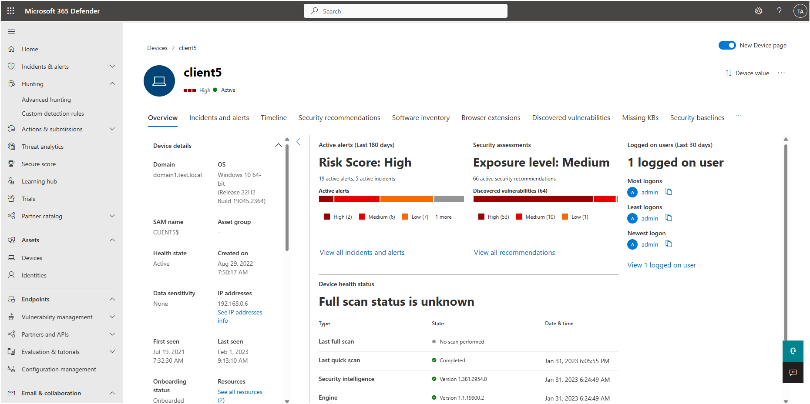

# Investigate assets

Microsoft Defender for Identity in Microsoft 365 Defender provides evidence when users, computers, and devices have performed suspicious activities or show signs of being compromised.  This article gives investigation suggestions to help you determine the risk to your organization, decide how to remediate, and determine the best way to prevent similar future attacks.

## Investigation steps for suspicious users

> [!NOTE]
> For information on how to view user profiles in Microsoft 365 Defender, see [Investigate users](/microsoft-365/security/defender/investigate-users).

If an alert or incident indicates that a user may be suspicious or compromised, check and investigate the user profile for the following details and activities:

1. Who is the user?
    1. Is the user a [sensitive user](entity-tags.md) (such as admin, or on a watchlist, etc.)?
    1. What is their role within the organization?
    1. Are they significant in the organizational tree?

1. Suspicious activities to investigate:
    1. Does the user have other opened alerts in Defender for Identity, or in other security tools such as Microsoft Defender for Endpoint, Microsoft Defender for Cloud and/or Microsoft Defender for Cloud Apps?
    1. Did the user have failed logons?
    1. Which resources did the user access?
    1. Did the user access high value resources?
    1. Was the user supposed to access the resources they accessed?
    1. Which devices did the user sign in to?
    1. Was the user supposed to sign in to those devices?
    1. Is there a [lateral movement path](/defender-for-identity/understand-lateral-movement-paths) (LMP) between the user and a sensitive user?

Use the answers to these questions to determine if the account appears compromised or if the suspicious activities imply malicious actions.

You can find identity information in the following views: 

- Identities page 
- Alerts queue 
- Any individual alert/incident 
- Device page 
- Activity log 
- Advanced hunting queries  
- Action center 
   

### Identity details

When you investigate a specific identity, you'll see the:

- [Overview](/microsoft-365/security/defender/investigate-users#overview)  
   the Overview including identity details such as the Azure Active Directory (Azure AD) Identity risk level, the number of devices the user is signed in to, when the user was first and last seen, the user's accounts and more important information.  
   In addition, you can see the incidents and alerts visual view, investigation priority score, organization tree, entity tags and scored activities timeline.
- [Active Alerts](/microsoft-365/security/defender/investigate-users#alerts) tab  
   The alerts tab contains active alerts involving the user from the last 180 days in this tab. Information like alert severity and the time the alert was generated is available in this tab.
- [Observed in organization](/microsoft-365/security/defender/investigate-users#observed-in-organization) tab  
   This tab contains:
   - Devices - The devices the identity signed in to, including most and least used in the last 180 days.
   - Locations - The observed locations for the identity in the last 30 days.
   - Groups - all observed on-premises groups for the identity.
   - Lateral movement paths - all profiled lateral movement paths from the on-premises environment.
      
- [Identity timeline](/microsoft-365/security/defender/investigate-users#timeline) tab  
   The timeline represents activities and alerts observed from a user's identity in the last 30 days. It unifies the user's identity entries across Microsoft Defender for Identity, Microsoft Defender for Cloud Apps, and Microsoft Defender for Endpoint workloads. By using the timeline, you can focus on activities a user performed or were performed on them in specific timeframes.
   
- [Remediation actions](/microsoft-365/security/defender/investigate-users#remediation-actions)  
   You can respond to compromised users by disabling their accounts or resetting their password. After taking action on users, you can check on the activity details in the action center.
   
For more information about investigate an Identity in the Microsoft 365 Defender portal, see [Investigate users](/microsoft-365/security/defender/investigate-users).

## Investigation steps for suspicious devices

To access the device profile page, select the specific devices mentioned in the alert that you wish to investigate. To assist your investigation, alert evidence lists all devices and users connected to each suspicious activity.

Check and investigate the device profile for the following details and activities:

- What happened around the time of the suspicious activity?  
    1. Which user was logged in to the device?
    1. Does that user normally log into or access the source or destination device?
    1. Which resources were accessed? By which users?
      - If resources were accessed, were they high-value resources?
    1. Was the user supposed to access those resources?
    1. Did the user that accessed the device perform other suspicious activities?

- More suspicious activities to investigate:
    1. Were other alerts opened around the same time as this alert in Defender for Identity, or in other security tools such as Microsoft Defender for Endpoint, Microsoft Defender for Cloud and/or Microsoft Defender for Cloud Apps?
    1. Were there failed logons?
    1. Were any new programs deployed or installed?

Use the answers to these questions to determine if the device appears compromised or if the suspicious activities imply malicious actions.

For more information about investigate a device in the Microsoft 365 Defender portal, see [Investigate devices](/microsoft-365/security/defender-endpoint/investigate-machines).

## Next steps

- [Microsoft Defender for Identity Lateral Movement Paths (LMPs)](understand-lateral-movement-paths.md)
- [Investigate users in Microsoft 365 Defender](/microsoft-365/security/defender/investigate-users?view=o365-worldwide)

- [Investigate incidents in Microsoft 365 Defender](/microsoft-365/security/defender/investigate-incidents)
   
## Learn more

- Try our interactive guide: [Investigate and respond to attacks with Microsoft Defender for Identity](https://mslearn.cloudguides.com/guides/Investigate%20and%20respond%20to%20attacks%20with%20Microsoft%20Defender%20for%20Identity)

