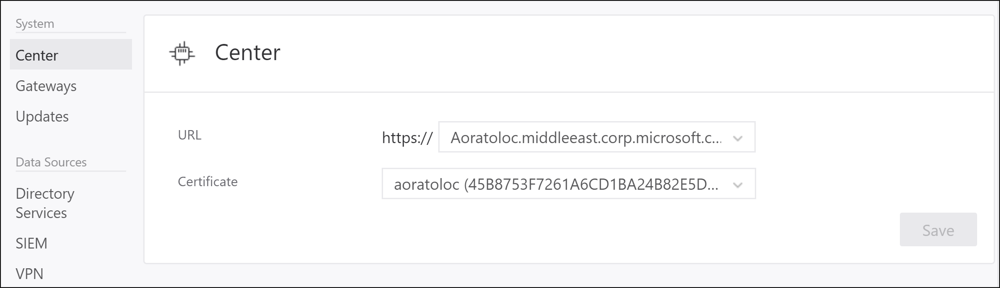

---
# required metadata

title: Change Azure Threat Protection ATP Center config | Microsoft Docs
description: Describes how to change the IP address, port, console URL or certificate of your ATP Center.
keywords:
author: rkarlin
ms.author: rkarlin
manager: mbaldwin
ms.date: 11/7/2017
ms.topic: article
ms.prod:
ms.service: advanced-threat-analytics
ms.technology:
ms.assetid: 93b27f15-f7e5-49bb-870a-d81d09dfe9fc

# optional metadata

#ROBOTS:
#audience:
#ms.devlang:
ms.reviewer: bennyl
ms.suite: ems
#ms.tgt_pltfrm:
#ms.custom:

---

*Applies to: Azure Threat Protection *

# Modifying the ATP Center configuration

After the initial deployment, modifications to the ATP Center should be made carefully. Use the following procedures when updating the console URL, and the certificate.

## The ATP Console URL

The URL is used in the following scenarios:

-   This is the URL used by the ATP Gateways to communicate with the ATP Center.

- Installation of ATP Gateways – When an ATP Gateway is installed, it registers itself with the ATP Center. This registration process is accomplished by connecting to the ATP Console. If you enter an FQDN for the ATP Console URL, ensure that the ATP Gateway can resolve the FQDN to the IP address bound to the ATP Console.

-   Alerts – When ATP sends out a SIEM or email alert, it includes a link to the suspicious activity. The host portion of the link is the ATP Console URL setting.

-   If you installed a certificate from your internal Certification Authority (CA), match the URL to the subject name in the certificate. This prevents users from getting a warning message when connecting to the ATP Console.

-   Using an FQDN for the ATP Console URL allows you to modify the IP address that is used by ATP Console without breaking previous alerts  or downloading the ATP Gateway package again. You only need to update the DNS with the new IP address.

1. Make sure the new URL you want to use resolves to the IP address of the ATP Console.

2. In the ATP settings, under **Center**, enter the new URL. At this point, the ATP Center service still uses the original URL. 

 

  > [!NOTE]
  > If you entered a custom IP address, you cannot click **Activate** until you installed the IP address on the ATP Center.
    
3. Wait for the ATP Gateways to sync. They now have two potential URLs through which to access the ATP Console. As long as the ATP Gateway can connect using the original URL, it does not try the new one.

4. After all the ATP Gateways synced with the updated configuration, activate the new URL. When you activate the new URL, the ATP Gateways will now use the new URL to access the ATP Center. After connecting to the ATP Center service, the ATP Gateway will pull down the latest configuration and will have only the new URL for the ATP Console. 

> [!NOTE]
> -   If an ATP Gateway was offline while you activated the new URL, and never got the updated configuration, manually update the configuration JSON file on the ATP Gateway.
> -   If you need to deploy a new ATP Gateway after activating the new URL, you need to download the ATP Gateway Setup package again.

## The ATP Center certificate

> [!WARNING]
> - The process of renewing an existing certificate is not supported. The only way to renew a certificate is by creating a new certificate and configuring ATP to use the new certificate.

Replace the certificate by following this process:

1. Before the current certificate expires, create a new certificate and make sure it's installed on the ATP Center server.   It is recommended that you choose a certificate from an internal certificate authority, but it is also possible to create a new self-signed certificate. For more information, see [New-SelfSignedCertificate](https://technet.microsoft.com/itpro/powershell/windows/pkiclient/new-selfsignedcertificate).

2. In the ATP settings, under **Center**, select this newly created certificate. At this point, the ATP Center service is still bound to the original certificate. 

 

3. Wait for the ATP Gateways to sync. They now have two potential certificates that are valid for mutual authentication. As long as the ATP Gateway can connect using the original certificate, it does not try the new one.

4. After all the ATP Gateways synced with the updated configuration, activate the new certificate that the ATP Center service is bound to. When you activate the new certificate, the ATP Center service binds to the new certificate. ATP Gateways now use the new certificate to authenticate with the ATP Center. After connecting to the ATP Center service, the ATP Gateway will pull down the latest configuration and will have only the new certificate for the ATP Center. 

> [!NOTE]
> -   If an ATP Gateway was offline while you activated the new certificate, and never got the updated configuration, manually update the configuration JSON file on the ATP Gateway.
> -   The certificate that you are using must be trusted by the ATP Gateways.
> -   The certificate is also used for the ATP Console, so it should match the ATP Console address to avoid browser warnings.
> -   If you need to deploy a new ATP Gateway after activating the new certificate, you need to download the ATP Gateway Setup package again.

 
## See Also
- [Working with the ATP Console](working-with-ata-console.md)
- [Check out the ATP forum!](https://aka.ms/ata-forum)
