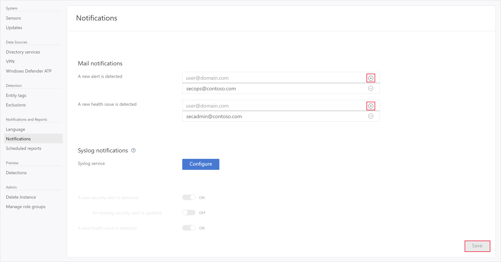

---
# required metadata

title: Set Azure Advanced Threat Protection notifications | Microsoft Docs
description: Describes how to set Azure ATP security alerts so you are notified when suspicious activities are detected.
keywords:
author: shsagir
ms.author: shsagir
manager: rkarlin
ms.date: 10/04/2018
ms.topic: conceptual
ms.collection: M365-security-compliance
ms.service: azure-advanced-threat-protection
ms.assetid: 4308f03e-b2a7-4e38-a750-540ff94faa81

# optional metadata

#ROBOTS:
#audience:
#ms.devlang:
ms.reviewer: itargoet
ms.suite: ems
#ms.tgt_pltfrm:
#ms.custom:

---

# Set Azure ATP notifications

Azure ATP can notify you when it detects a suspicious activity and issues a security alert or a health alert via email. 

To receive notifications to a specific email address, set the following parameters:

1. In the Azure ATP portal, select the settings option on the toolbar and select **Configuration**.

   

2. Click **Notifications**.
3. Under **Mail notifications**, specify which notifications should be sent via email - they can be sent for new alerts (suspicious activities) and new health issues. 
 
   > [!NOTE]
   > Email alerts for suspicious activities are only sent when the suspicious activity is created.
 
4. Click **Save**.

   

## See Also

- [Configure event collection](configure-event-collection.md)

- [Set Syslog settings](setting-syslog.md)
- [Check out the Azure ATP forum!](https://aka.ms/azureatpcommunity)
